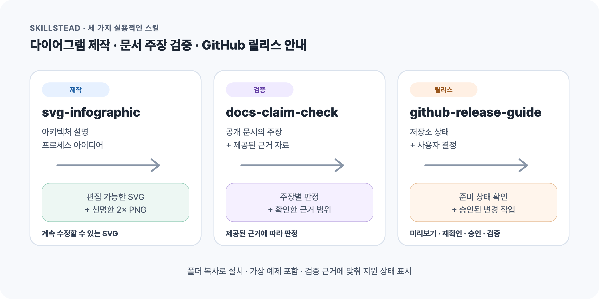
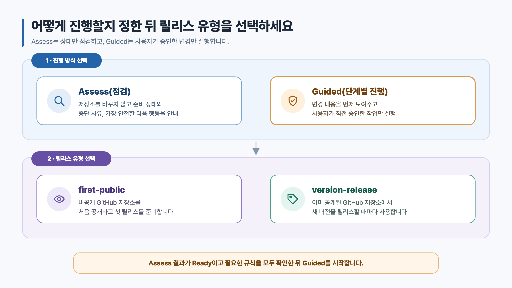
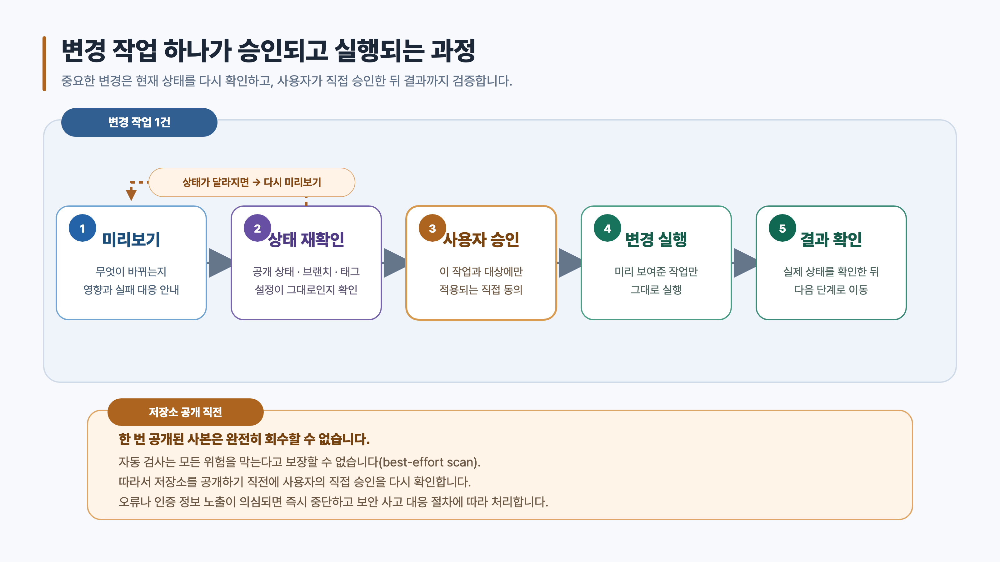

# Skillstead

[English](./README.md) · **한국어**

코딩 에이전트와 함께 쓸 수 있는 세 가지 스킬을 모았습니다. 기술 다이어그램을 만들고, 공개 문서의 주장을
근거와 대조하고, GitHub 릴리스를 준비할 때 필요한 스킬을 골라 설치할 수 있습니다.

> [!TIP]
> **Skillstead = skill + homestead.** 코딩 에이전트가 실제 저장소에서 사용할 수 있는 스킬을 모아 두는
> 작은 도구 모음입니다. 각 스킬이 지원하는 실행 환경은 실제 검증 결과가 있을 때만 표시합니다.

## 필요한 스킬을 선택하세요

| 우선순위 | 스킬 | 이런 작업에 적합 | 지원 실행 환경 | 성숙도 |
| --- | --- | --- | --- | --- |
| 1 | [`svg-infographic`](./skills/svg-infographic) | 아키텍처 설명, 작업 흐름, 비교 자료를 수정 가능한 SVG와 검증된 2× PNG로 제작 | Claude Code | Stable |
| 2 | [`docs-claim-check`](./skills/docs-claim-check) | 공개 문서의 주장이 제공된 근거로 뒷받침되는지 확인 | Claude Code | Beta |
| 3 | [`github-release-guide`](./skills/github-release-guide) | 비공개 GitHub 저장소의 첫 공개 전환 또는 공개 후 매 버전 릴리스를 점검하고 단계별로 안내 | Supported: Claude Code + Codex | Beta |

각 skill은 독립적으로 사용할 수 있는 self-contained package입니다. 전체 catalog를 설치할 필요 없이,
사용할 skill의 폴더 전체만 복사하면 됩니다. 개인용·프로젝트용 설치 경로, 고정 버전 설치, 깨끗한
업데이트 방법, Windows 명령과 실행 환경별 지원 상태는 [`docs/INSTALL.md`](./docs/INSTALL.md)에서
확인할 수 있습니다.

## 1. svg-infographic

기술 다이어그램을 이미지로만 만들면 나중에 문구나 구조를 수정하기 어렵습니다. `svg-infographic`은 먼저
배치를 계산해 수정 가능한 SVG를 만들고, 원본을 점검한 뒤 크기가 검증된 2× PNG도 함께 내보냅니다.

아키텍처, 클라우드 구성도, 작업 및 승인 흐름, 변경 전후 비교, 로드맵, 계층 구조, 정성적 비교표,
한국어 기술 요약 자료를 만들 때 적합합니다.

- 상세: [`skills/svg-infographic`](./skills/svg-infographic)
- 결과 예시: [영문·한국어 다이어그램 14개 갤러리](./examples/svg-infographic/README.ko.md)
- 예시: `svg-infographic으로 이 전환 계획을 수정 가능한 기술 다이어그램으로 만들어 줘.`

## 2. docs-claim-check

릴리스 문서는 근거가 부족하거나 오래됐는데도 확정된 사실처럼 읽힐 수 있습니다. `docs-claim-check`는
확인 가능한 문장을 주장 단위로 나누고, 제공된 자료의 범위 안에서 검증됨(`verified`), 근거 부족
(`unsupported`), 오래됐을 가능성 있음(`stale-suspected`), 사람의 확인 필요(`needs-human`) 중 하나로
판정합니다.

README, 설치 안내, 릴리스 노트, 공지문을 공개하기 전에 사용할 수 있습니다. 문서의 주장을 판정하는
도구이므로 점검 중 명령을 실행하지 않으며, 수정안 작성이나 코드·보안 검토를 대신하지 않습니다.

- 상세: [`skills/docs-claim-check`](./skills/docs-claim-check)
- 결과 예시: [가상 AcmeTask 자료와 실제 판정 예시](./examples/docs-claim-check/README.ko.md)
- 예시: `docs-claim-check로 이 릴리스 노트의 주장을 제공한 태그와 CI 결과에 대조해 줘.`

## 3. github-release-guide

GitHub 릴리스에는 문서 수정뿐 아니라 저장소 공개 전환, 브랜치와 태그, 설정, GitHub Release 공개처럼
되돌리기 어려운 작업도 포함됩니다. `github-release-guide`는 먼저 저장소를 바꾸지 않고 준비 상태를
점검합니다. 준비가 끝나면 변경할 내용과 영향을 하나씩 보여주고, 현재 상태를 다시 확인한 뒤 사용자가
직접 승인한 작업만 실행합니다.

V1은 두 시점에 사용할 수 있습니다. 비공개 github.com 저장소를 처음 공개 상태로 전환할 때 사용하고,
공개된 뒤에는 새로운 버전을 릴리스할 때마다 다시 사용할 수 있습니다. 저장소 생성, 패키지 저장소 공개,
바이너리 서명, 클라우드 배포, 보안 감사, 강제 전송, 커밋 기록 다시 쓰기는 수행하지 않습니다.

| 진행 방식과 릴리스 유형 선택 | 변경 작업의 승인 과정 |
| --- | --- |
|  |  |

- 자세한 안내: [`github-release-guide` 한국어 README](./skills/github-release-guide/README.ko.md)
- 검증 자료와 다이어그램: [가상 시나리오, 정답표, 실행 결과](./examples/github-release-guide/README.ko.md)
- Assess 예시: `github-release-guide를 Assess 방식으로 사용해서 이 공개 저장소의 이번 버전 릴리스를 점검해 줘.`
- Guided 예시: `github-release-guide를 Guided 방식으로 사용해서 이 비공개 저장소의 첫 공개를 준비해 줘. 먼저 Assess하고, 준비됐으면 첫 변경만 미리 보여줘. 그 작업을 내가 직접 승인하기 전에는 저장소를 변경하지 마.`
- 저장소를 공개하기 직전에는 복제된 사본을 완전히 회수할 수 없다는 점과 자동 검사의 한계를 설명하고,
  공개 전환에 대한 사용자의 직접 승인을 별도로 확인합니다.

## Playbooks (maintainer 참고 자료)

[`playbooks/public-release`](./playbooks/public-release)에는 비공개 저장소를 공개로 전환하고 이후를
검증할 때 쓰는 범용 체크리스트와 템플릿(public-release playbook)이 있습니다. 설치형 스킬이 아니라
maintainer용 참고 문서이며, 어떤 스킬을 설치하더라도 이 파일들은 필요하지 않습니다.
`github-release-guide` 스킬은 이 playbook의 규칙을 자체 패키지 안에 mirror합니다. 문서는 현재
한국어 기준이며 English 판은 준비 중입니다.

## 공개 스킬의 품질 기준

모든 공개 스킬은 다음 기준을 만족해야 합니다.

- 무엇을 하고 하지 않는지 분명한 동작 범위
- 실제 고객이나 비공개 자료를 사용하지 않은 가상 검증 자료
- 검증한 범위를 넘지 않는 실행 환경 지원 및 성숙도 표시
- 인증 정보, 비공개 출처, 개인 컴퓨터 경로가 포함되지 않은 공개 파일
- 결과 특성에 맞는 반복 가능한 검증 방법

실행 환경 지원 상태는 카탈로그 전체가 아니라 스킬별로 표시합니다. `github-release-guide`는 Claude Code와
Codex의 핵심 행동 일치 검증, disposable 저장소의 실제 첫 공개 E2E, `v0.5.0` 고정 버전의 프로젝트 설치와
발견 확인, final strict claim audit를 모두 통과했습니다. 기록된 검증 범위에서 두 실행 환경을 모두
`Supported`로 표시합니다.

## 현재 제한

- `svg-infographic`의 브라우저 렌더링은 macOS에서 검증했습니다. Windows와 Linux 경로는 문서화했지만 아직
  직접 검증하지 않았습니다.
- `docs-claim-check`는 제공된 자료 안에서 문서 주장을 판정하며 검증 명령을 직접 실행하지 않습니다.
- `github-release-guide` v1은 비공개 github.com 저장소의 첫 공개 전환과, 공개 후 반복되는 각 버전 릴리스를
  다룹니다.
- 자동 검사 결과가 깨끗하더라도 저장소에 보안 위험이 전혀 없다고 보장할 수는 없습니다.

## 라이선스

[Apache-2.0](./LICENSE).
