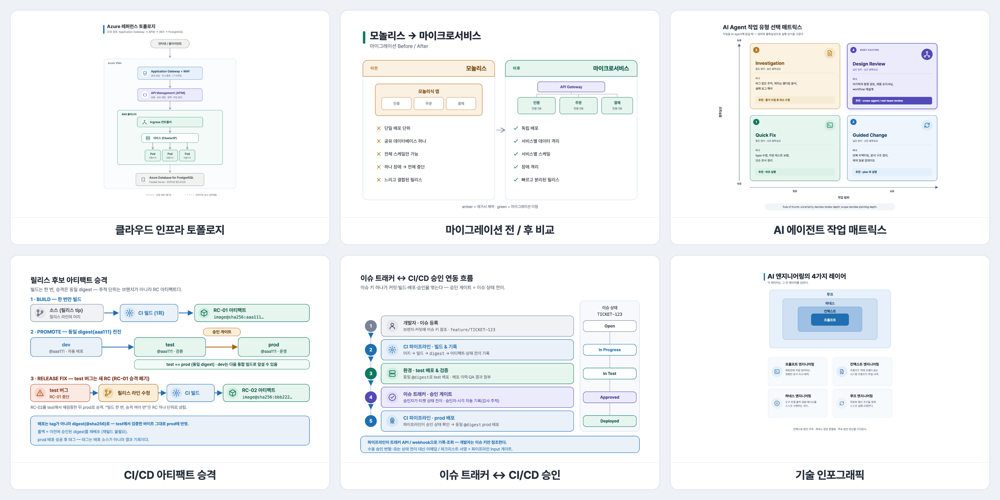

<!-- English: [README.md](./README.md) -->

# Skillstead

Agentic coding workflow에 붙여 쓰는 실용적이고 portable한 skill catalog입니다.

> [!TIP]
> **Skillstead = skill + homestead.** coding agent가 사용할 실용적인 skill을 하나씩 모아 두는 작은 터전이라는 뜻입니다. 첫 skill은 `svg-infographic`입니다.

첫 번째 skill은 아주 구체적인 문제를 해결합니다: 텍스트 설명을 깔끔한 기술 다이어그램과 인포그래픽 파일로 바꾸기.

첫 release는 Claude Code 설치 경로부터 지원합니다. [`svg-infographic`](./skills/svg-infographic)은 아키텍처 설명, 마이그레이션 계획, 프로세스 흐름, 의사결정 매트릭스, 기술 개념을 편집 가능한 SVG와 선명한 2x PNG로 만들어 줍니다. 문서, 제안서, 슬라이드, 소셜 포스트에 바로 넣을 수 있는 형태를 목표로 합니다.

[](./examples/svg-infographic/README.ko.md)

## 왜 만들었나

Claude 앱에서는 시각 자료를 만들기 쉽지만, Claude Code에서는 저장소 안에 실제 제작 파일이 남아야 합니다. 문서와 HTML에 바로 넣을 수 있고, 필요하면 PPTX/슬라이드 workflow에서 재사용하기 쉬운 SVG가 필요합니다. 공유 이미지나 썸네일이 필요할 때를 위한 PNG export도 같이 있으면 좋고요.

`svg-infographic`은 agent가 그런 제작 자산을 안정적으로 만들도록 돕는 workflow입니다. 결과물은 flat하고 구조적이며, repo에 넣어 관리하기 좋고, 한국어/CJK 렌더링까지 확인하도록 설계했습니다.

## 만들 수 있는 것

| 용도 | 예시 |
| --- | --- |
| 아키텍처 / 클라우드 토폴로지 | Azure / AWS 요청 경로, 네트워크 구역, 서비스, 데이터베이스 |
| 기술 인포그래픽 | 레이어 모델, capability map, 한 장짜리 설명 자료 |
| Before / After 비교 | 마이그레이션, 현대화, 개선 전후 비교 |
| 프로세스 / 데이터 플로우 | RAG 파이프라인, 승인 흐름, 시스템 handoff |
| 로드맵 / 타임라인 | 제품 단계, 마일스톤, 현재 상태 |
| 의사결정 / 우선순위 매트릭스 | 2×2 quadrant map, 범위·불확실성 그리드, 트레이드오프 뷰 |
| 한국어 시각 자산 | 문서, HTML, 슬라이드용 CJK-safe SVG와 preview/social용 PNG |

전체 [예제 갤러리](./examples/svg-infographic/README.ko.md)에서 여러 archetype을 다루는 10개 예제 — architecture, migration, workflow, decision matrix, CI/CD 승격, 승인 흐름 등 — 를 영문·한글 버전과 생성 프롬프트로 확인할 수 있습니다. 위 preview는 대표 6개를 추린 montage입니다.

## 빠른 시작

현재 Claude Code package를 설치합니다:

```bash
git clone --depth 1 https://github.com/kyungseo/skillstead.git /tmp/skillstead
mkdir -p ~/.claude/skills
cp -R /tmp/skillstead/skills/svg-infographic ~/.claude/skills/
```

**프로젝트 단위**로 설치할 수도 있습니다(repo의 `.claude/skills/`에 두면 팀원이 clone만으로 사용). 프로젝트 단위 설치, Windows PowerShell, 버전 고정 설치, 업데이트, 제거 방법은 [`docs/INSTALL.md`](./docs/INSTALL.md)에 있습니다.

이후 Claude Code agent에게 이렇게 요청합니다:

```text
svg-infographic으로 Azure 토폴로지를 그려줘: Application Gateway -> APIM -> AKS -> PostgreSQL.
```

```text
svg-infographic으로 이 before/after 마이그레이션 계획을 슬라이드용 기술 인포그래픽으로 바꿔줘.
```

더 좋은 결과를 원하면 대상 독자, 핵심 메시지, 사용처, SVG만 필요한지 SVG + 2× PNG가 필요한지를 함께 적어 주세요.

결과물은 다음 두 파일을 기본으로 합니다:

- `*.svg` — 핵심 산출물: 문서·HTML·PPTX workflow에서 재사용 가능한 편집형 vector asset
- `*.png` — 공유 이미지, 썸네일, 소셜 포스트용 선명한 2× preview/export

**2× PNG**는 SVG `viewBox`의 두 배 해상도로 렌더링한 PNG입니다. 문서·README·소셜 이미지에 넣었을 때 더 선명하게 보이도록 하는 export입니다.

## Skill 목록

현재는 검증된 첫 skill부터 시작합니다. 같은 수준의 evidence와 example 품질 기준을 만족하는 skill만 추가합니다.

| Skill | 지원 runtime | Status | 설명 |
| --- | --- | --- | --- |
| [`svg-infographic`](./skills/svg-infographic) | Claude Code | Beta | flat하고 구조적인 SVG 인포그래픽을 만들고 PNG로 export합니다. |

## 품질 기준

포함된 예제는 모두 직접 만든 synthetic, non-client 예제입니다. 각 예제는 SVG + 2× PNG로 제공되고 다음을 확인합니다:

- 텍스트 넘침 없음
- 한국어/CJK 글자 깨짐 없음
- SVG/PNG 크기 일치
- SVG 접근성 메타데이터 포함
- host-specific path 또는 client path 없음

## 현재 범위

Skillstead는 multi-agent skill catalog를 지향합니다. v0.1.0 release는 Claude Code 설치 경로와 browser 기반 PNG export workflow가 검증된 상태라 Claude Code first로 제공합니다. Codex / Codex CLI와 다른 agent runtime 지원은 수요와 export 경로가 확인되면 다시 검토합니다.

`svg-infographic`은 flat하고 구조적인 시각 자료에 초점을 둡니다. 사진 중심 마케팅 그래픽, 통계 차트, 손그림/크레용 스타일, 마스코트·캐릭터 일러스트는 의도적으로 범위 밖에 둡니다.

## 라이선스

[Apache-2.0](./LICENSE).
