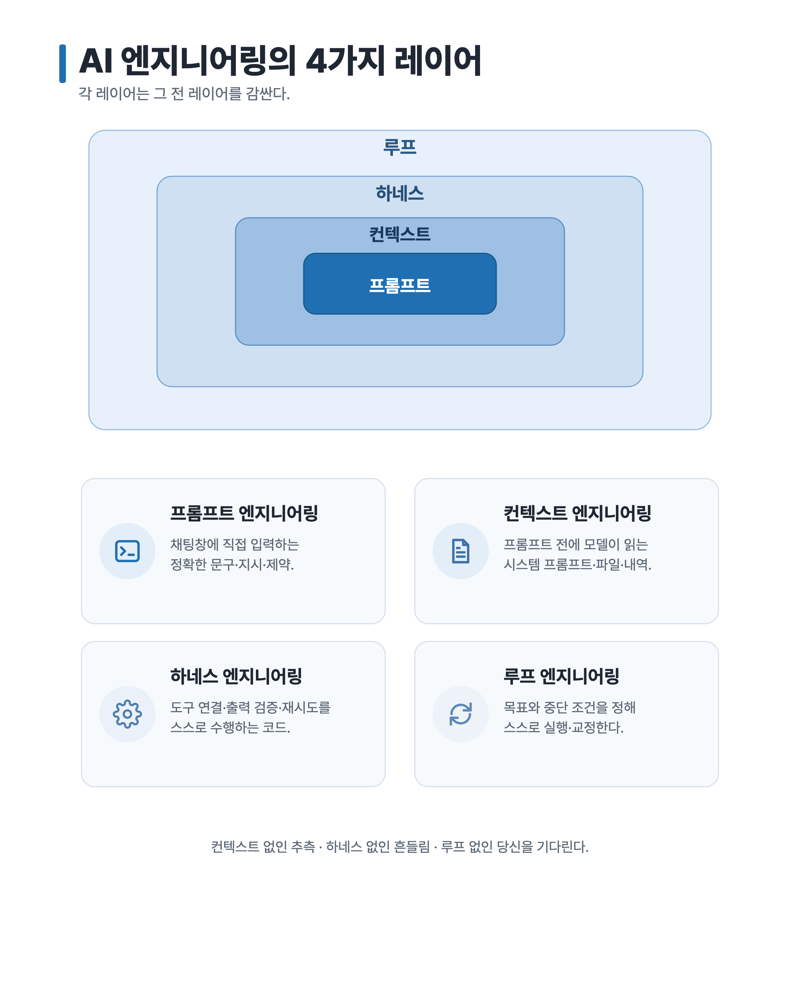
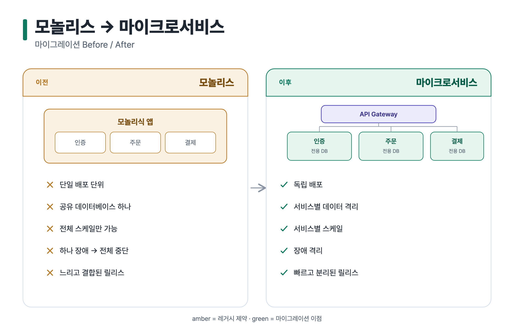

<!-- English: [README.md](./README.md) -->

# Agent Skills

AI 코딩 에이전트를 위한 작고 실용적인 skill 모음 — 각 skill을 개별적으로 읽고, 설치하고, 공유하기 쉽게 패키징한다.

각 skill은 실전에서 막히는 구체적인 capability gap을 메우고, 설치 전에 결과를 확인할 수 있도록 예제 artifact를 함께 제공한다. 첫 skill의 출력 예제(영문 + 한글)는 [`examples/svg-infographic/`](./examples/svg-infographic)를 참고한다.

> **한국어 / CJK 렌더링 우선 지원.** 첫 skill은 한국어를 비롯한 CJK 텍스트에 맞춘 font stack과 glyph 확인으로 SVG 인포그래픽을 작성한다 — 많은 다이어그램/인포그래픽 도구가 깨지는 지점이다.

## 미리보기

<table>
<tr>
<td width="34%"><a href="./examples/svg-infographic/technical-infographic"></a></td>
<td width="46%"><a href="./examples/svg-infographic/before-after-migration"></a></td>
</tr>
</table>

더 많은 예제는 [example gallery](./examples/svg-infographic) — 6가지 archetype(온니언, before/after, 플로우, 로드맵, 토폴로지, self-demo)을 영문·한글 각각, 생성 프롬프트와 함께 제공한다.

## Skills

| Skill | Agent | Status | 요약 |
| --- | --- | --- | --- |
| [`svg-infographic`](./skills/svg-infographic) | Claude Code | Beta | technical/structured SVG 인포그래픽을 작성하고 선명한 PNG artifact로 export한다. |

## 네이밍 규칙

Skill 이름은 maker나 brand가 아니라 기능 trigger를 앞세운다 — 에이전트의 skill selector에서 안정적으로 매칭되게 하기 위함이다.

```text
<medium-or-capability>-<job>
```

예시: `svg-infographic`, `review-pr`, `docs-redline`.

Brand identity는 skill 이름이 아니라 repository metadata, README, 소셜 포스트에서 강조한다.

## 사용법

Claude Code에서 말로 다이어그램을 요청하면 된다 — 매칭되는 요청에 skill이 자동 트리거되거나, 이름으로 직접 호출한다:

```text
svg-infographic으로 Azure 토폴로지를 그려줘: AGW → APIM → AKS → PostgreSQL.
```

편집 가능한 `.svg`(원본)와 슬라이드·문서·소셜용 선명한 2× `.png`가 나온다. 각 [예제](./examples/svg-infographic)에 실제 프롬프트가 있다.

## 설치

repo를 clone하고 원하는 skill 폴더 하나만 복사한다 — 원격 스크립트를 실행하지 않는다. 전체 가이드(Windows PowerShell, 업데이트, 제거): [`docs/INSTALL.md`](./docs/INSTALL.md).

**최신 설치** (macOS / Linux):

```bash
git clone --depth 1 https://github.com/kyungseo/agent-skills.git /tmp/agent-skills
mkdir -p ~/.claude/skills && cp -R /tmp/agent-skills/skills/svg-infographic ~/.claude/skills/
```

**버전 고정 설치**(재현 가능): `--branch <tag>` 추가, 예 `--branch v0.1.0`.

## 범위

- **Claude Code 우선.** Codex / Codex CLI 지원은 수요와 browser 기반 export 경로 검증 전까지 보류한다.
- **clone + copy 설치.** GitHub clone + copy(latest 또는 pinned tag) — [`docs/INSTALL.md`](./docs/INSTALL.md) 참고. 설치 스크립트, plugin/marketplace, 정식 버저닝 정책은 비용을 정당화하기 전까지 범위 밖이다.

## 라이선스

[Apache-2.0](./LICENSE).
