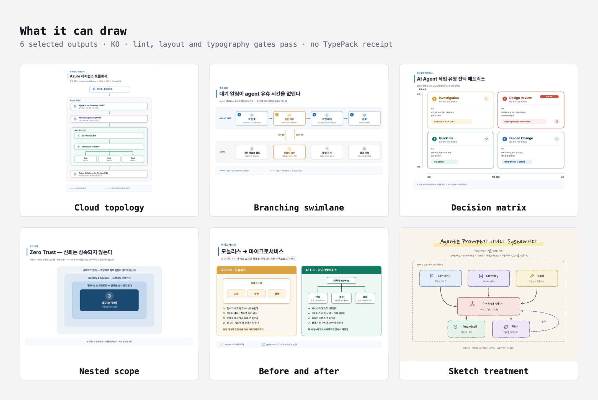
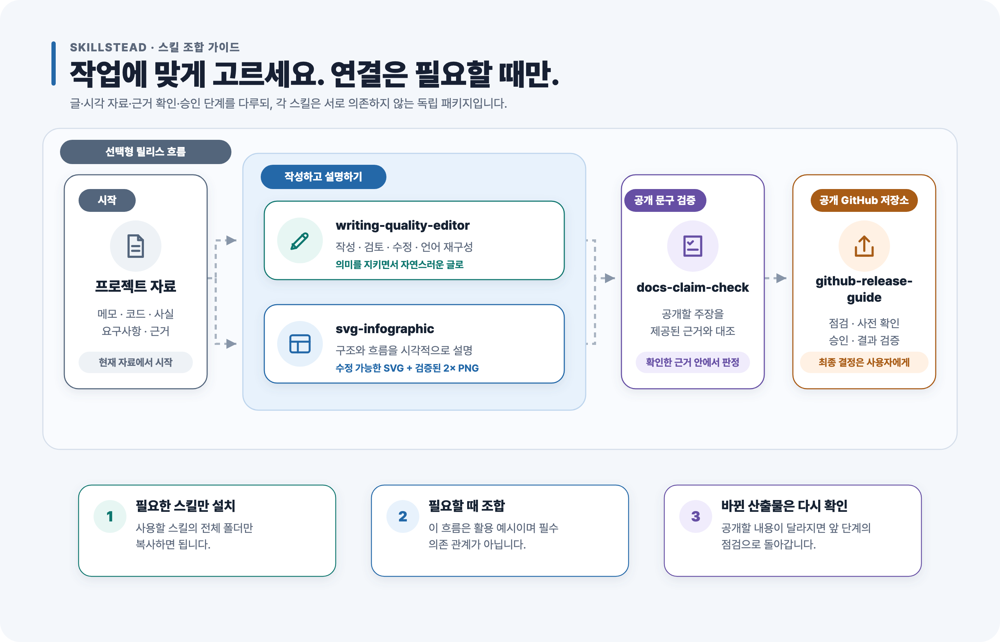
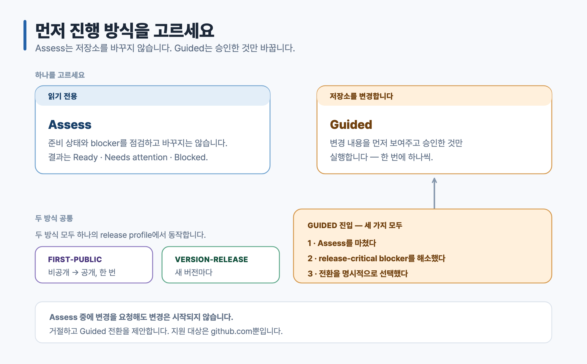
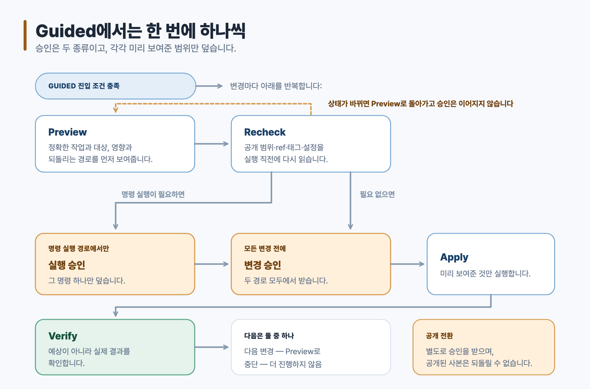

# Skillstead

[English](./README.md) · **한국어**

에이전트와 함께 쓸 수 있는 실용적인 스킬을 모았습니다. 인물 사진의 캐릭터 초상화, 기술
다이어그램 제작, 공개 문서의 주장 검증, GitHub 릴리스 준비와 자연스럽고 정확한 글쓰기에 필요한 스킬을
골라 설치할 수 있습니다.

> [!TIP]
> **Skillstead = skill + homestead.** 코딩 에이전트가 실제 저장소에서 사용할 수 있는 스킬을 모아 두는
> 작은 도구 모음입니다. 각 스킬이 지원하는 실행 환경은 실제 검증 결과가 있을 때만 표시합니다.

## 처음이라면 여기서 시작하세요

1. 지금 하려는 일에 맞는 [스킬 하나를 선택합니다](#필요한-스킬을-선택하세요). 각 스킬은 독립적으로
   사용할 수 있습니다.
2. [설치 안내](./docs/INSTALL.ko.md)에 따라 선택한 버전의 스킬 폴더 전체를 복사합니다.
3. 스킬별 README에서 내 작업과 가까운 요청 예시를 골라 가지고 있는 자료에 맞게 바꿉니다.
4. 릴리스처럼 영향이 큰 작업에 결과를 사용하기 전에는 해당 스킬의 지원 범위와 제한을 확인합니다.

특정 문서를 찾고 있다면 [문서 안내](./docs/README.ko.md)에서 사용자 문서와 유지관리자용 참고 문서를
나누어 볼 수 있습니다.

## 하이라이트

### SVG 갤러리

`svg-infographic`은 일반적인 아키텍처 구성도보다 다양한 결과를 만들 수 있습니다. 위 여섯 가지는 형태가
서로 얼마나 다른지를 기준으로 고른 것입니다. lint·layout·typography gate를 통과하며, TypePack receipt
체계보다 먼저 만들어졌기 때문에 receipt는 주장하지 않습니다. contact sheet는 locale별 artifact 주위에
영문 evidence frame을 유지하며, live gallery 페이지 전체는 한국어로 전환됩니다. 갤러리에는 receipt를
갖춘 TypePack 9종이 함께 있습니다. [live gallery 열기](https://kyungseo.github.io/skillstead/gallery/) 또는
[legacy 예제와 검증된 TypePack 카탈로그 확인하기](./examples/svg-infographic/README.ko.md).

### 하나만 사용하거나 릴리스 흐름으로 연결하세요

각 스킬은 독립적으로 설치하고 사용할 수 있습니다. 더 넓은 과정이 필요하다면 `writing-quality-editor`로
글을 작성하고 다듬고, `svg-infographic`으로 구조를 시각화하고, `docs-claim-check`로 공개할 주장을
근거에 대조하고, `github-release-guide`로 승인이 필요한 릴리스 결정을 진행할 수 있습니다. 반드시 이
순서대로 모두 사용해야 하는 것은 아닙니다. 필요한 스킬부터 사용하고, 산출물이 바뀌면 앞 단계의 결과를
다시 확인하면 됩니다. `street-portrait-artist`는 인물 사진을 캐릭터 초상화로 만드는 별도의
창작 workflow이며, 이 릴리스 흐름에 참여할 필요가 없습니다.

## 필요한 스킬을 선택하세요

| 스킬 | 이런 작업에 적합 | 버전 | 지원 실행 환경 | 성숙도 |
| --- | --- | --- | --- | --- |
| [`svg-infographic`](./skills/svg-infographic/README.ko.md) | 아키텍처 설명, 작업 흐름, 비교 자료를 수정 가능한 SVG와 검증된 2× PNG로 제작 | `0.11.0` | Supported: Claude Code + Codex | Stable |
| [`docs-claim-check`](./skills/docs-claim-check/README.ko.md) | 공개 문서의 주장이 제공된 근거로 뒷받침되는지 확인 | `0.9.1` | Claude Code | Beta |
| [`github-release-guide`](./skills/github-release-guide/README.ko.md) | 비공개 GitHub 저장소의 첫 공개 전환 또는 공개 후 매 버전 릴리스를 점검하고 단계별로 안내 | `0.9.0` | Supported: Claude Code + Codex | Stable |
| [`writing-quality-editor`](./skills/writing-quality-editor/README.ko.md) | 사용자 문서를 처음부터 작성하거나 자연스럽게 다듬고, 사실·의도·목소리·운영 제약을 보존하면서 영어↔한국어 내용을 재구성 | `0.13.0` | Supported: Claude Code + Codex | Beta |
| [`street-portrait-artist`](./skills/street-portrait-artist/README.ko.md) | 인물 사진을 특징 관계에 기반한 Street Caricature 또는 Romance Watercolor 캐릭터 초상화로 재해석 | `0.1.1` | Supported: ChatGPT + Codex | Experimental |

각 스킬은 필요한 파일을 모두 갖춘 독립 패키지입니다. 전체 목록을 설치할 필요 없이, 사용할 스킬의
폴더만 통째로 복사하면 됩니다. 개인용·프로젝트용 설치 경로, 고정 버전 설치, 깨끗한 업데이트 방법,
Windows 명령과 실행 환경별 지원 상태는 [`docs/INSTALL.ko.md`](./docs/INSTALL.ko.md)에서
확인할 수 있습니다.

위 표의 `버전`은 카탈로그 전체가 아니라 스킬별 버전입니다. 의미와 변경 방식은
[`docs/VERSIONING.ko.md`](./docs/VERSIONING.ko.md)에서 확인할 수 있습니다.

자연스러운 요청, `WQE` 줄임말, 여러 스킬이 함께 필요한 요청의 예시는 저장소 전용
[`intent와 invocation 계약`](./examples/intent-invocation-contract/README.ko.md)에서 확인할 수 있습니다.

GitHub의 **Latest** 배지는 가장 최근에 발행된 개별 스킬 릴리스를 가리킵니다. 카탈로그 버전을 뜻하지
않습니다.

## 스킬별 상세 안내

### svg-infographic

기술 다이어그램을 이미지로만 만들면 나중에 문구나 구조를 수정하기 어렵습니다. `svg-infographic`은 먼저
배치를 계산해 수정 가능한 SVG를 만들고, 원본을 점검한 뒤 크기가 검증된 2× PNG도 함께 내보냅니다.

아키텍처, 클라우드 구성도, 작업 및 승인 흐름, 변경 전후 비교, 로드맵, 계층 구조, 정성적 비교표,
한국어 기술 요약 자료를 만들 때 적합합니다.

- 자세한 안내: [`svg-infographic` 한국어 README](./skills/svg-infographic/README.ko.md)
- live gallery: [대표 결과와 검증된 TypePack 카탈로그](https://kyungseo.github.io/skillstead/gallery/)
- 결과 예시: [legacy 예제와 검증된 TypePack 카탈로그](./examples/svg-infographic/README.ko.md)
- 스킬 이름을 쓰는 예시: `svg-infographic으로 이 전환 계획을 수정 가능한 기술 다이어그램으로 만들어 줘.`
- 자연스럽게 요청하는 예시: `이 전환 계획을 수정 가능한 기술 SVG와 검증된 2× PNG로 만들어 줘. 파일을 만들기 전에 출력 경로를 보여 줘.`

### docs-claim-check

릴리스 문서는 근거가 부족하거나 오래됐는데도 확정된 사실처럼 읽힐 수 있습니다. `docs-claim-check`는
확인 가능한 문장을 주장 단위로 나누고, 제공된 자료의 범위 안에서 검증됨(`verified`), 근거 부족
(`unsupported`), 오래됐을 가능성 있음(`stale-suspected`), 사람의 확인 필요(`needs-human`) 중 하나로
판정합니다.

README, 설치 안내, 릴리스 노트, 공지문을 공개하기 전에 사용할 수 있습니다. 문서의 주장을 판정하는
도구이므로 점검 중 명령을 실행하지 않으며, 수정안 작성이나 코드·보안 검토를 대신하지 않습니다.

- 자세한 안내: [`docs-claim-check` 한국어 README](./skills/docs-claim-check/README.ko.md)
- 검증 자료: [가상 AcmeTask 자료와 실제 판정 예시](./examples/docs-claim-check/README.ko.md)
- 스킬 이름을 쓰는 예시: `docs-claim-check로 이 릴리스 노트의 주장을 제공한 태그와 CI 결과에 대조해 줘.`
- 자연스럽게 요청하는 예시: `이 README의 주장이 아래 근거로 뒷받침되는지 확인해 줘. 결과만 알려 주고 문서는 다시 쓰지 마.`

### github-release-guide

GitHub 릴리스에는 문서 수정뿐 아니라 저장소 공개 전환, 브랜치와 태그, 설정, GitHub Release 공개처럼
되돌리기 어려운 작업도 포함됩니다. `github-release-guide`는 먼저 저장소를 바꾸지 않고 준비 상태를
점검합니다. 준비가 끝나면 변경할 내용과 영향을 하나씩 보여주고 현재 상태를 다시 확인한 뒤, 승인을 두
범위로 나눠 받습니다 — 저장소 명령을 실행하는 승인과 저장소를 변경하는 승인. 승인한 작업만 실행하고
실제 결과를 확인합니다.

V1은 두 시점에 사용할 수 있습니다. 비공개 github.com 저장소를 처음 공개 상태로 전환할 때 사용하고,
공개된 뒤에는 새로운 버전을 릴리스할 때마다 다시 사용할 수 있습니다. 저장소 생성, 패키지 저장소 공개,
바이너리 서명, 클라우드 배포, 보안 감사, 강제 전송, 커밋 기록 다시 쓰기는 수행하지 않습니다.

**먼저 진행 방식을 고릅니다.** Assess는 아무것도 바꾸지 않고 점검하며, Guided는 Assess를 마치고
release-critical blocker를 해소한 뒤 전환을 명시적으로 선택했을 때만 시작합니다.

**그다음 Guided에서는 한 번에 하나씩.** 승인은 두 범위로 나뉩니다 — 명령 실행 승인과 저장소 변경 승인은
서로를 대신하지 않습니다.

- 자세한 안내: [`github-release-guide` 한국어 README](./skills/github-release-guide/README.ko.md)
- 검증 자료와 다이어그램: [가상 시나리오, 정답표, 실행 결과](./examples/github-release-guide/README.ko.md)
- 자연스럽게 준비 상태를 묻는 예시: `이 공개 GitHub 저장소가 다음 버전을 릴리스할 준비가 됐는지 확인해 줘. 점검만 하고 저장소는 변경하지 마.`
- Assess 예시: `github-release-guide를 Assess 방식으로 사용해서 이 공개 저장소의 이번 버전 릴리스를 점검해 줘.`
- Guided 예시: `github-release-guide를 Guided 방식으로 사용해서 이 비공개 저장소의 첫 공개를 준비해 줘. 먼저 Assess하고, 준비됐으면 첫 변경만 미리 보여줘. 그 작업을 내가 직접 승인하기 전에는 저장소를 변경하지 마.`
- 저장소를 공개하기 직전에는 복제된 사본을 완전히 회수할 수 없다는 점과 자동 검사의 한계를 설명하고,
  공개 전환에 대한 사용자의 직접 승인을 별도로 확인합니다.

### writing-quality-editor

글을 처음 쓸 때부터 지나치게 틀에 박히거나, 원문을 문장별로 옮긴 번역처럼 작성될 수 있습니다.
`writing-quality-editor`는 신뢰할 수 있는 작성 자료 또는 검토한 공개 자료에서 새 문서를 곧바로 작성하거나
기존 글을 다듬습니다.
사실, 의도, 작성자 목소리, 명령, 조건, 제약, 위험과 다음 행동을 보존하면서 숙련된 작성자나 편집자가
쓴 글처럼 자연스럽게 만듭니다.

문장 표현이나 자연스러움을 고칠 때는 독자가 실제로 막히는 가장 작은 완결 구간부터 수정하고 나머지는
그대로 둡니다. 임의 변경, 승인 없는 변경, 사전 고지 없는 변경 중 어느 의미인지 모호한 표현은 그대로
남겨 사람의 판단을 요청하고, 안전하게 판단할 수 있는 다른 부분만 계속 다듬습니다.

`Adapt` mode는 원문의 문장 구조를 그대로 복사하지 않고 영어와 한국어 독자에게 맞는 글로 다시
씁니다. 정보 순서, 문장 호흡, 관용 표현과 설명 밀도는 바꿀 수 있지만, 주장을 새로 만들거나 모호함을
숨기지는 않습니다. AI 탐지기 회피와 작성 주체·출처 은폐는 명시적으로 하지 않습니다.

- 자세한 안내: [`writing-quality-editor` 한국어 README](./skills/writing-quality-editor/README.ko.md)
- 검증 자료: [검증 시나리오 36개와 별도 정답표](./examples/writing-quality-editor/README.ko.md)
- 스킬 이름을 쓰는 예시: `writing-quality-editor를 사용해 아래 문서를 자연스럽게 다듬어 줘. 원문의 핵심 사실, 조건과 요구 사항은 그대로 유지해 줘.`
- 줄임말을 쓰는 예시: `WQE로 이 온보딩 안내서를 검토해 줘. 문제를 찾되 아직 문장은 수정하지 마.`
- 자연스럽게 요청하는 예시: `이 README를 검토해 줘. 아직 문장은 수정하지 마.` · `아래 자료에서 확인할 수 있는 내용만 바탕으로 새 README를 작성해 줘.` · `이 영어 릴리스 노트를 한국어 독자가 자연스럽게 읽을 수 있도록 다시 써 줘. 의미와 조건은 바꾸지 마.`
- 필요할 때만 mode를 지정하는 예시: `writing-quality-editor를 Assess mode로 사용해 이 릴리스 노트를 검토해 줘. 수정안은 작성하지 마.`

### street-portrait-artist

`street-portrait-artist`는 head frame, 이목구비 간격, 표정과 하나의 primary anchor처럼 눈에 보이는 관계를
먼저 분석한 뒤 그립니다. 같은 identity grammar에서 다정하고 거의 무채색인 `Street Caricature`와 서정적인
pen-and-watercolor `Romance Watercolor`라는 두 가지 해석을 만듭니다.

한 장 이상의 선명한 인물 사진을 제공합니다. 사용자가 별도로 게시하거나 보관해 달라고 요청하지 않는 한 제공한
사진·분석·결과는 해당 작업 안에서만 사용합니다.

- 자세한 안내: [`street-portrait-artist` 한국어 README](./skills/street-portrait-artist/README.ko.md)
- 공개 가능한 gallery: [합성 원본으로 만든 Twin Portrait 예시 두 쌍](./examples/street-portrait-artist/README.ko.md)
- 스킬 이름을 쓰는 예시: `street-portrait-artist를 사용해 첨부한 사진을 다정한 Street Caricature로 만들어 줘.`
- 자연스럽게 요청하는 예시: `이 사진을 섬세한 펜과 수채화 캐릭터 초상화로 바꿔 줘. 턱선, 헤어라인과 표정은 알아볼 수 있게 유지해 줘.`

## Playbook 모음 (유지관리자 참고 자료)

[`playbooks/public-release`](./playbooks/public-release/README.ko.md)에는 비공개 저장소를 공개로 전환하고 이후를
검증할 때 쓰는 범용 체크리스트와 템플릿이 있습니다. 설치형 스킬이 아니라 유지관리자용 참고 문서이며,
어떤 스킬을 설치하더라도 이 파일들은 필요하지 않습니다.
`github-release-guide` 스킬은 이 playbook의 규칙을 자체 패키지 안에도 포함합니다. 영문 문서를
최종 기준으로 관리하며, `.ko.md` 파일은 같은 내용을 담는 한국어 문서입니다. 의미가 달라지는 수정은
두 언어 문서에 같은 pull request로 반영합니다.

[`playbooks/skill-development`](./playbooks/skill-development/README.ko.md)는 스킬을 설계하고 검증하며
독립적으로 검토하고 릴리스하거나 지원을 종료하는 저장소 표준입니다. 패키지 템플릿은 예약 이름인
`sample-skill`을 바꾸기 전에는 설치할 수 없도록 설계했습니다. 릴리스 검사가 집행하는 지원 종료와
major transition 추적 증거 규격은 [`docs/VALIDATION.ko.md`](./docs/VALIDATION.ko.md)에 있습니다.

## 공개 스킬의 품질 기준

모든 공개 스킬은 다음 기준을 만족해야 합니다.

- 무엇을 하고 하지 않는지 분명한 동작 범위
- 실제 고객이나 비공개 자료를 사용하지 않은 가상 검증 자료
- 검증한 범위를 넘지 않는 실행 환경 지원 및 성숙도 표시
- 인증 정보, 비공개 출처, 개인 컴퓨터 경로가 포함되지 않은 공개 파일
- 결과 특성에 맞는 반복 가능한 검증 방법

실행 환경 지원 상태는 카탈로그 전체가 아니라 스킬별로 표시합니다.

`svg-infographic`은 Claude Code와 Codex의 완전히 새로운 작업에서 같은 고정 요구사항 3종을 수행해
결과의 핵심 내용과 품질 기준이 일치하는지 확인했습니다. 프로젝트 단위 설치와 발견, 렌더링 전 source
lint, 정확한 2× 브라우저 출력, 한국어/CJK 글자, 영역 포함 관계, 연결선 표현과 샌드박스 경계에서
브라우저 실행이 막힐 때의 fail-closed 복구까지 검증했습니다. Codex 검증에는 macOS Codex CLI와
Windows 11 ARM64 VM에서 시작한 새 Codex App 작업이 포함됩니다. 이 기록된 범위에서 Claude Code와
Codex를 `Supported`로 표시합니다.

`github-release-guide`는 Claude Code와 Codex의 핵심 행동 일치 검증, 일회용 저장소의 실제 첫 공개
E2E, `v0.5.0` 고정 버전의 프로젝트 설치와 발견 확인과 최종 공개 문구 검증을 모두 통과했습니다.
기록된 검증 범위에서 두 실행 환경을 모두 `Supported`로 표시합니다.

`writing-quality-editor`는 네 가지 mode의 동작 검증, 저장소 문서에 대한 실제 적용, 공개된 `v0.7.0`
고정 버전의 새 프로젝트 설치와 스킬 발견 확인을 통과했습니다. 기록된 검증 범위에서 Claude Code와
Codex를 `Supported`로 표시하며, 성숙도는 Beta로 유지합니다.

`street-portrait-artist`는 공개 가능한 합성 원본으로 만든 `Twin Portrait` 두 사례를 통해 의도한 visual
direction과 privacy boundary를 기록했습니다. 이후 공개된 `0.1.0` package를 새로 설치한 ChatGPT와 Codex에서 합성 인물 사진을
입력해 skill discovery·호출·reference-image 생성·fail-visible size fallback·output delivery를 확인했습니다. 이 기록된
범위에서 두 runtime을 `Supported`로 표시합니다. 얼굴 유사성과 보강된 visual behavior를 여러 인물에서 회귀 검증하지
않았으므로 성숙도는 Experimental로 유지합니다.

## 현재 제한

- `svg-infographic`의 브라우저 렌더링은 macOS와 Windows 11 ARM64 VM에서 검증했습니다. 이 결과를
  모든 Windows 장치나 파일 시스템에 일반화하지 않으며, Linux 렌더링 경로는 문서화했지만 아직 직접
  검증하지 않았습니다.
- `docs-claim-check`는 제공된 자료 안에서 문서 주장을 판정하며 검증 명령을 직접 실행하지 않습니다.
- `github-release-guide` v1은 비공개 github.com 저장소의 첫 공개 전환과, 공개 후 반복되는 각 버전 릴리스를
  다룹니다.
- `github-release-guide`에서 점검 결과가 깨끗하다는 말은 확인한 범위에서 문제를 발견하지 못했다는 뜻일
  뿐입니다. 점검 대상 저장소에 민감 정보나 보안 위험이 전혀 없다는 보장은 아닙니다.
- `writing-quality-editor`는 특정 언어에 고정되지 않도록 설계했지만, 초기 현지화 검증 자료는
  영어↔한국어(한국어 결과는 `ko-KR`)만 다룹니다. 다른 언어 조합까지 실제 동작을 검증했다고 주장하지
  않습니다.
- `street-portrait-artist`의 likeness와 이미지 품질은 실행마다 달라질 수 있고 exact pixel export는 사용 중인
  image surface에 의존하므로 최종 작품을 사람이 검토해야 합니다. 기록된 ChatGPT와 Codex 지원은 서로 다른 image
  generation 실행에서 exact dimensions나 일관된 시각 품질을 보장하지 않습니다.
- 에이전트의 결과는 실행마다 달라질 수 있습니다. `writing-quality-editor`는 구조를 유지하는 국소 편집과
  모호한 표현의 판단 보류를 기본값으로 삼지만, 모든 실행에서 표시하지 않은 구간까지 바뀌는 일이 전혀
  없다고 보장하지는 않습니다. 중요한 문서는 게시하거나 사용하기 전에 최종 변경 사항을 직접 확인하세요.

## 라이선스

[Apache-2.0](./LICENSE).
