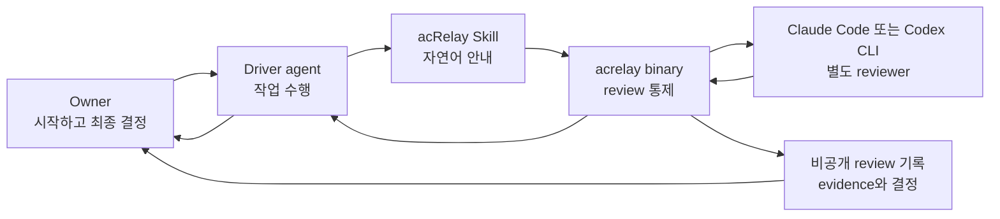
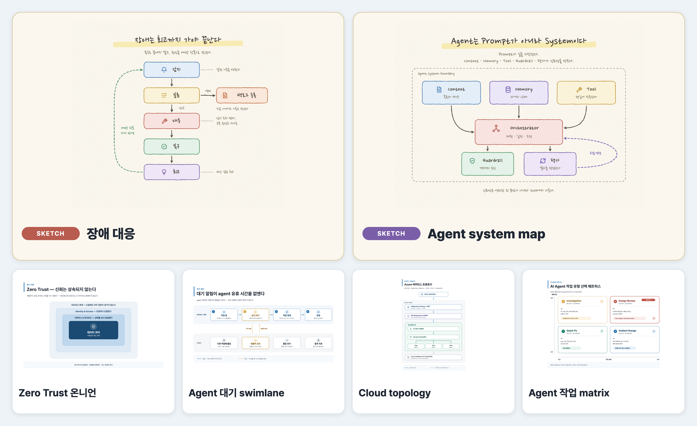

# Skillstead

[English](./README.md) · **한국어**

코딩 에이전트와 함께 쓸 수 있는 실용적인 스킬을 모았습니다. Governed review, 기술 다이어그램 제작,
공개 문서의 주장 검증, GitHub 릴리스 준비, 자연스럽고 정확한 글쓰기에 필요한 스킬을 골라 설치할 수 있습니다.

> [!TIP]
> **Skillstead = skill + homestead.** 코딩 에이전트가 실제 저장소에서 사용할 수 있는 스킬을 모아 두는
> 작은 도구 모음입니다. 각 스킬이 지원하는 실행 환경은 실제 검증 결과가 있을 때만 표시합니다.

## 하이라이트

### acRelay로 one-shot red-team 시작

Agent가 계획, 문서 또는 구현을 마치면 owner가 결정하기 전에 별도의 Claude Code
또는 Codex CLI가 반대 관점에서 검토하게 할 수 있습니다. Skill은 이 workflow를
자연어 요청으로 시작하게 하고, 독립된 acRelay engine은 회차 제한, evidence와
응답 기록, 중단된 실행 복구와 사람 owner의 Close 권한을 지킵니다.
사용은 단순하지만 그 아래의 계약은 정교합니다.

```mermaid
flowchart LR
    O["Owner<br/>시작하고 최종 결정"] --> D["Driver agent<br/>작업 수행"]
    D --> S["acRelay Skill<br/>자연어 안내"]
    S --> E["acrelay binary<br/>review 통제"]
    E --> R["Claude Code 또는 Codex CLI<br/>별도 reviewer"]
    R --> E
    E --> P["비공개 review 기록<br/>evidence와 결정"]
    E --> D
    P --> O
    D --> O
```

acRelay가 없으면 3회 review 동안 요청을 보내고 결과를 돌려받느라 최대 6번을
수동으로 복사·붙여넣어야 합니다. acRelay를 사용하면 검토한 revision, finding,
driver 응답과 owner 결정을 하나의 비공개 기록에 함께 남길 수 있습니다. Objective
하나의 formal round는 1–5회(기본 3회)라서 review가 끝없는 token 소모 논쟁으로
이어지지 않습니다.

acRelay는 Skillstead의 collaboration flagship preview입니다. 두 runtime에서
설치, Skill 인식과 review 시작부터 종료 준비 확인까지 완주하기 전에는
`검증 대기`로 표시합니다.
[Skill과 engine이 어떻게 연결되는지 확인하세요.](./skills/acrelay/README.ko.md)

### SVG 갤러리

`svg-infographic`은 일반적인 아키텍처 구성도보다 다양한 결과를 만들 수 있습니다. 손으로 그린 느낌의
장애 대응 흐름과 에이전트 시스템 구성도, 클라우드 토폴로지, 의사결정 매트릭스, 변경 전후 비교,
로드맵과 한국어 기술 요약 자료를 제공합니다. [영문·한국어 예시 14개를 확인하세요.](./examples/svg-infographic/README.ko.md)

### 하나만 사용하거나 릴리스 흐름으로 연결하세요

각 스킬은 독립적으로 설치하고 사용할 수 있습니다. 더 넓은 과정이 필요하다면 `writing-quality-editor`로
글을 작성하고 다듬고, `svg-infographic`으로 구조를 시각화하고, `docs-claim-check`로 공개할 주장을
근거에 대조하고, `github-release-guide`로 승인이 필요한 릴리스 결정을 진행할 수 있습니다. 반드시 이
순서대로 모두 사용해야 하는 것은 아닙니다. 필요한 스킬부터 사용하고, 산출물이 바뀌면 앞 단계의 결과를
다시 확인하면 됩니다.

## 필요한 스킬을 선택하세요

| 스킬 | 이런 작업에 적합 | 지원 실행 환경 | 성숙도 |
| --- | --- | --- | --- |
| [`acrelay`](./skills/acrelay) | 별도로 설치한 acRelay engine으로 Skillstead의 flagship red-team workflow 시작 | 검증 대기 | Alpha preview |
| [`svg-infographic`](./skills/svg-infographic) | 아키텍처 설명, 작업 흐름, 비교 자료를 수정 가능한 SVG와 검증된 2× PNG로 제작 | Claude Code | Stable |
| [`docs-claim-check`](./skills/docs-claim-check) | 공개 문서의 주장이 제공된 근거로 뒷받침되는지 확인 | Claude Code | Beta |
| [`github-release-guide`](./skills/github-release-guide) | 비공개 GitHub 저장소의 첫 공개 전환 또는 공개 후 매 버전 릴리스를 점검하고 단계별로 안내 | Supported: Claude Code + Codex | Stable |
| [`writing-quality-editor`](./skills/writing-quality-editor) | 사용자 문서를 처음부터 작성하거나 자연스럽게 다듬고, 사실·의도·목소리·운영 제약을 보존하면서 영어↔한국어 내용을 재구성 | Supported: Claude Code + Codex | Beta |

각 스킬은 필요한 파일을 모두 갖춘 독립 패키지입니다. 전체 목록을 설치할 필요 없이, 사용할 스킬의
폴더만 통째로 복사하면 됩니다. 개인용·프로젝트용 설치 경로, 고정 버전 설치, 깨끗한 업데이트 방법,
Windows 명령과 실행 환경별 지원 상태는 [`docs/INSTALL.ko.md`](./docs/INSTALL.ko.md)에서
확인할 수 있습니다.

## 스킬별 상세 안내

### acrelay

`acrelay`는 독립된
[acRelay engine](https://github.com/kyungseo/acrelay)을 감싼 얇은 Skill입니다.
Engine은 acRelay 전용 daemon, server 또는 database 없이 실행 파일 하나로
배포됩니다. Skill은 이 engine을 자연어로 사용하게 합니다. 설치된 command를
확인하고, 무엇을 어떤 reviewer에게 맡길지 묻고, 외부로 보낼 수 있는 정보를
확인한 뒤 engine이 기록하는 workflow를 따릅니다.

Finding과 driver 응답 기록, objective별 1–5회(기본 3회) 제한, 중단된 실행 복구,
종료 준비 요약, 선택한 session data 정리와 owner의 명시적인 review 종료는 Skill이
아니라 binary가 담당합니다.

Command가 없거나 version이 맞지 않으면 필요한 조치를 설명하고 중단합니다.
acRelay를 우회해 reviewer를 직접 호출하지 않습니다.

이 Skill은 아직 검증 중이며 지원 package로 공개하지 않았습니다. 필요한 파일이
모두 들어 있는지와 command가 없거나 version이 다를 때의 안내는 지금 확인할 수
있습니다. Claude Code와 Codex에서 설치하고 스킬이 인식되는지 확인한 뒤 첫 review를 시작해 종료
준비 확인까지 완주하는 검증은 아직 남아 있습니다.

- 자세한 안내: [`acrelay` 한국어 README](./skills/acrelay/README.ko.md)
- 설치: [`docs/INSTALL.ko.md`](./docs/INSTALL.ko.md#acrelay-alpha-preview-설치)
- Engine 문서: [acRelay](https://github.com/kyungseo/acrelay)
- 계획: `acRelay로 Claude가 이 계획을 red-team하게 해줘. 최대 3회차 안에서 진행하고 마지막에 owner가 결정할 내용만 보여줘.`
- 파일 하나: `acRelay로 Codex가 이 파일을 review하게 해줘. 공식 review 기록은 비공개로 보관하고 Close 전에는 멈춰줘.`
- 구현 결과: `acRelay로 현재 checkout한 구현 파일들을 승인된 계획에 맞춰 review해줘.`
- 같은 vendor의 별도 session: `지금 Claude Code에서 작업 중이야. acRelay로 별도의 Claude Code CLI reviewer를 사용하고 두 context에 같은 맹점이 있을 수 있다는 점도 기록해줘.`

따라서 주로 agent 하나만 사용하는 사람도 별도의 CLI reviewer를 통해 red-team을
가동할 수 있습니다. 지원하는 경우 같은 vendor의 별도 session도 사용할 수
있습니다. 다만 이는 host-native subagent 지원이 아닙니다. Host가 만든 subagent
결과를 직접 받아들이는 기능은 안정적인 host interface와 결과 형식이 마련될
때까지 지원하지 않으며 다른 경로로 조용히 우회하지 않습니다.

### svg-infographic

기술 다이어그램을 이미지로만 만들면 나중에 문구나 구조를 수정하기 어렵습니다. `svg-infographic`은 먼저
배치를 계산해 수정 가능한 SVG를 만들고, 원본을 점검한 뒤 크기가 검증된 2× PNG도 함께 내보냅니다.

아키텍처, 클라우드 구성도, 작업 및 승인 흐름, 변경 전후 비교, 로드맵, 계층 구조, 정성적 비교표,
한국어 기술 요약 자료를 만들 때 적합합니다.

- 자세한 안내: [`svg-infographic` 한국어 README](./skills/svg-infographic/README.ko.md)
- 결과 예시: [영문·한국어 다이어그램 14개 갤러리](./examples/svg-infographic/README.ko.md)
- 예시: `svg-infographic으로 이 전환 계획을 수정 가능한 기술 다이어그램으로 만들어 줘.`

### docs-claim-check

릴리스 문서는 근거가 부족하거나 오래됐는데도 확정된 사실처럼 읽힐 수 있습니다. `docs-claim-check`는
확인 가능한 문장을 주장 단위로 나누고, 제공된 자료의 범위 안에서 검증됨(`verified`), 근거 부족
(`unsupported`), 오래됐을 가능성 있음(`stale-suspected`), 사람의 확인 필요(`needs-human`) 중 하나로
판정합니다.

README, 설치 안내, 릴리스 노트, 공지문을 공개하기 전에 사용할 수 있습니다. 문서의 주장을 판정하는
도구이므로 점검 중 명령을 실행하지 않으며, 수정안 작성이나 코드·보안 검토를 대신하지 않습니다.

- 자세한 안내: [`docs-claim-check` 한국어 README](./skills/docs-claim-check/README.ko.md)
- 검증 자료: [가상 AcmeTask 자료와 실제 판정 예시](./examples/docs-claim-check/README.ko.md)
- 예시: `docs-claim-check로 이 릴리스 노트의 주장을 제공한 태그와 CI 결과에 대조해 줘.`

### github-release-guide

GitHub 릴리스에는 문서 수정뿐 아니라 저장소 공개 전환, 브랜치와 태그, 설정, GitHub Release 공개처럼
되돌리기 어려운 작업도 포함됩니다. `github-release-guide`는 먼저 저장소를 바꾸지 않고 준비 상태를
점검합니다. 준비가 끝나면 변경할 내용과 영향을 하나씩 보여주고, 현재 상태를 다시 확인한 뒤 사용자가
직접 승인한 작업만 실행합니다.

V1은 두 시점에 사용할 수 있습니다. 비공개 github.com 저장소를 처음 공개 상태로 전환할 때 사용하고,
공개된 뒤에는 새로운 버전을 릴리스할 때마다 다시 사용할 수 있습니다. 저장소 생성, 패키지 저장소 공개,
바이너리 서명, 클라우드 배포, 보안 감사, 강제 전송, 커밋 기록 다시 쓰기는 수행하지 않습니다.

| 진행 방식과 릴리스 유형 선택 | 변경 작업의 승인 과정 |
| --- | --- |
|  |  |

- 자세한 안내: [`github-release-guide` 한국어 README](./skills/github-release-guide/README.ko.md)
- 검증 자료와 다이어그램: [가상 시나리오, 정답표, 실행 결과](./examples/github-release-guide/README.ko.md)
- Assess 예시: `github-release-guide를 Assess 방식으로 사용해서 이 공개 저장소의 이번 버전 릴리스를 점검해 줘.`
- Guided 예시: `github-release-guide를 Guided 방식으로 사용해서 이 비공개 저장소의 첫 공개를 준비해 줘. 먼저 Assess하고, 준비됐으면 첫 변경만 미리 보여줘. 그 작업을 내가 직접 승인하기 전에는 저장소를 변경하지 마.`
- 저장소를 공개하기 직전에는 복제된 사본을 완전히 회수할 수 없다는 점과 자동 검사의 한계를 설명하고,
  공개 전환에 대한 사용자의 직접 승인을 별도로 확인합니다.

### writing-quality-editor

글을 처음 쓸 때부터 지나치게 틀에 박히거나, 원문을 문장별로 옮긴 번역처럼 작성될 수 있습니다.
`writing-quality-editor`는 신뢰할 수 있는 작성 자료 또는 검토한 공개 자료에서 새 문서를 곧바로 작성하거나
기존 글을 다듬습니다.
사실, 의도, 작성자 목소리, 명령, 조건, 제약, 위험과 다음 행동을 보존하면서 숙련된 작성자나 편집자가
쓴 글처럼 자연스럽게 만듭니다.

`Adapt` mode는 원문의 문장 구조를 그대로 복사하지 않고 영어와 한국어 독자에게 맞는 글로 다시
씁니다. 정보 순서, 문장 호흡, 관용 표현과 설명 밀도는 바꿀 수 있지만, 주장을 새로 만들거나 모호함을
숨기지는 않습니다. AI 탐지기 회피와 작성 주체·출처 은폐는 명시적으로 하지 않습니다.

- 자세한 안내: [`writing-quality-editor` 한국어 README](./skills/writing-quality-editor/README.ko.md)
- 검증 자료: [검증 시나리오 21개와 별도 정답표](./examples/writing-quality-editor/README.ko.md)
- 권장 프롬프트 예시: `writing-quality-editor를 사용해 아래 문서를 자연스럽게 다듬어 줘. 원문의 핵심 사실, 조건과 요구 사항은 그대로 유지해 줘.`
- Intent 중심 프롬프트 예시: `이 README를 검토해 줘. 아직 문장은 수정하지 마.` · `아래 자료에서 확인할 수 있는 내용만 바탕으로 새 README를 작성해 줘.` · `이 영어 릴리스 노트를 한국어 독자가 자연스럽게 읽을 수 있도록 다시 써 줘. 의미와 조건은 바꾸지 마.`
- 선택적 mode 지정 프롬프트 예시: `writing-quality-editor를 Assess mode로 사용해 이 릴리스 노트를 검토해 줘. 수정안은 작성하지 마.`

## Playbooks (maintainer 참고 자료)

[`playbooks/public-release`](./playbooks/public-release/README.ko.md)에는 비공개 저장소를 공개로 전환하고 이후를
검증할 때 쓰는 범용 체크리스트와 템플릿이 있습니다. 설치형 스킬이 아니라 유지관리자용 참고 문서이며,
어떤 스킬을 설치하더라도 이 파일들은 필요하지 않습니다.
`github-release-guide` 스킬은 이 playbook의 규칙을 자체 패키지 안에도 포함합니다. English 문서를
최종 기준으로 관리하며, `.ko.md` 파일은 같은 내용을 담는 한국어 문서입니다. 의미가 달라지는 수정은
두 언어 문서에 같은 pull request로 반영합니다.

## 공개 스킬의 품질 기준

모든 공개 스킬은 다음 기준을 만족해야 합니다.

- 무엇을 하고 하지 않는지 분명한 동작 범위
- 실제 고객이나 비공개 자료를 사용하지 않은 가상 검증 자료
- 검증한 범위를 넘지 않는 실행 환경 지원 및 성숙도 표시
- 인증 정보, 비공개 출처, 개인 컴퓨터 경로가 포함되지 않은 공개 파일
- 결과 특성에 맞는 반복 가능한 검증 방법

실행 환경 지원 상태는 카탈로그 전체가 아니라 스킬별로 표시합니다. `github-release-guide`는 Claude Code와
Codex의 핵심 행동 일치 검증, disposable 저장소의 실제 첫 공개 E2E, `v0.5.0` 고정 버전의 프로젝트 설치와
발견 확인과 최종 공개 문구 검증을 모두 통과했습니다. 기록된 검증 범위에서 두 실행 환경을 모두
`Supported`로 표시합니다.

`writing-quality-editor`는 네 가지 mode의 동작 검증, 저장소 문서에 대한 실제 적용, 공개된 `v0.7.0`
고정 버전의 새 프로젝트 설치와 스킬 발견 확인을 통과했습니다. 기록된 검증 범위에서 Claude Code와
Codex를 `Supported`로 표시하며, 성숙도는 Beta로 유지합니다.

## 현재 제한

- `acrelay`는 아직 공개하지 않은 Alpha preview입니다. Claude Code와 Codex에서
  설치하고 스킬이 인식되는지 확인한 뒤 첫 review를 시작해 종료 준비 확인까지 완주하는 검증이
  남아 있습니다. Exact acRelay `v0.1.0-alpha.1`에서만 동작합니다. 현재 미리
  build한 engine은 macOS Apple Silicon용이며, Linux와 Windows core lane은
  검증했습니다. Platform별 reviewer 검증과 필요한 patch는 다음 지원 확대
  단계로 계획하고 있습니다.
- `svg-infographic`의 브라우저 렌더링은 macOS에서 검증했습니다. Windows와 Linux 경로는 문서화했지만 아직
  직접 검증하지 않았습니다.
- `docs-claim-check`는 제공된 자료 안에서 문서 주장을 판정하며 검증 명령을 직접 실행하지 않습니다.
- `github-release-guide` v1은 비공개 github.com 저장소의 첫 공개 전환과, 공개 후 반복되는 각 버전 릴리스를
  다룹니다.
- `github-release-guide`에서 점검 결과가 깨끗하다는 말은 확인한 범위에서 문제를 발견하지 못했다는 뜻일
  뿐입니다. 점검 대상 저장소에 민감 정보나 보안 위험이 전혀 없다는 보장은 아닙니다.
- `writing-quality-editor`는 특정 언어에 고정되지 않도록 설계했지만, 초기 현지화 검증 자료는
  영어↔한국어(한국어 결과는 `ko-KR`)만 다룹니다. 다른 언어 조합까지 실제 동작을 검증했다고 주장하지
  않습니다.

## 라이선스

[Apache-2.0](./LICENSE).
