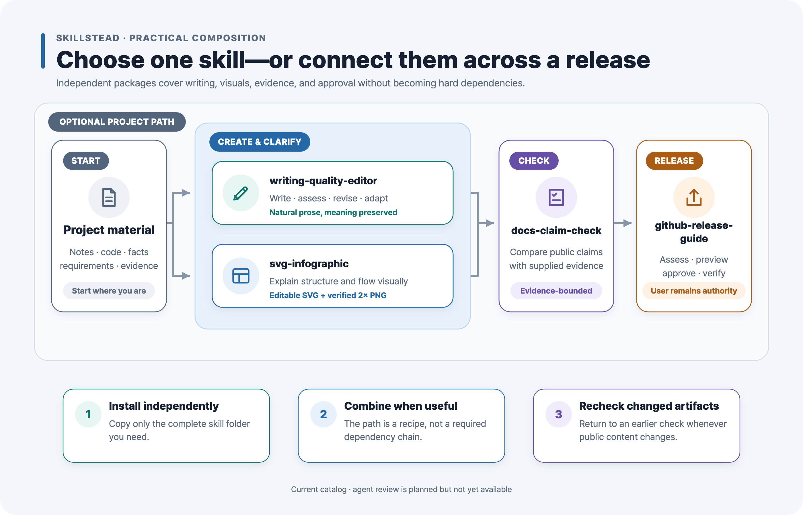
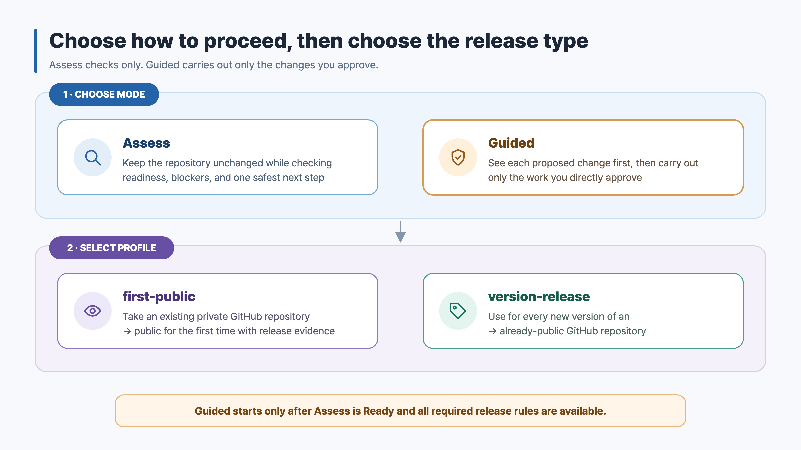
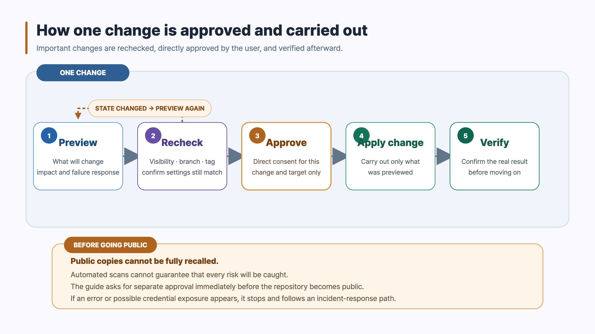

# Skillstead

**English** · [한국어](./README.ko.md)

Practical, portable skills for agentic coding workflows — create clearer artifacts, check public claims,
guide safer GitHub releases, and turn rough or translated text into natural, precise writing.

> [!TIP]
> **Skillstead = skill + homestead.** A small, durable place for skills that coding agents can carry into
> real repositories. Each public support claim is tied to examples and runtime evidence.

## Highlights

### Explore the SVG gallery

`svg-infographic` covers more than conventional architecture boxes. The gallery includes sketch-style incident
flows, agent-system maps, cloud topology, decision matrices, migration views, roadmaps, and Korean/CJK-ready
technical one-pagers. [Browse the 14-example English/Korean gallery.](./examples/svg-infographic)

### Use one skill—or combine them across a release

Each skill installs and works independently. When a project needs a wider path, use
`writing-quality-editor` for clear prose, `svg-infographic` for visual explanation, `docs-claim-check` for
evidence-bounded public claims, and `github-release-guide` for approval-gated release decisions. This is not a
required pipeline: start with the skill you need, skip the others, and recheck an earlier artifact when it changes.

> [!NOTE]
> **Planned: agent review.** A future agent-review capability is being explored for structured feedback between
> coding agents. It is not implemented, installable, or included in the current runtime and maturity claims.

## Choose a skill

| Skill | Best for | Runtime support | Maturity |
| --- | --- | --- | --- |
| [`svg-infographic`](./skills/svg-infographic) | Turning architecture notes, process flows, comparisons, and technical concepts into editable SVG + verified 2× PNG | Claude Code | Stable |
| [`docs-claim-check`](./skills/docs-claim-check) | Checking whether public documentation claims are supported by supplied evidence | Claude Code | Beta |
| [`github-release-guide`](./skills/github-release-guide) | Guiding a private repository's first public transition and every later version release, with separate approval before each change | Supported: Claude Code + Codex | Stable |
| [`writing-quality-editor`](./skills/writing-quality-editor) | Composing and revising user-facing text, plus natural English↔Korean adaptation, without inventing or changing facts, intent, voice, or operational constraints | Validation pending | Beta |

Each skill is self-contained and can be installed independently. You do not need to install the entire
catalog—copy only the complete folder for the skill you want to use. See
[`docs/INSTALL.md`](./docs/INSTALL.md) for global/project paths, pinned tags, clean updates, Windows commands,
and the per-skill runtime matrix.

## Skill details

### svg-infographic

Technical diagrams often begin as prose and end as hard-to-edit screenshots. `svg-infographic` computes a
layout before drawing, authors structured SVG, checks the source, then exports a dimension-verified 2× PNG.

Use it for architecture and cloud topology, process or approval flows, before/after migrations, roadmaps,
layer models, qualitative matrices, and Korean/CJK-ready technical one-pagers.

- Friendly guide: [`svg-infographic` README](./skills/svg-infographic/README.md)
- Examples: [14-example English/Korean gallery](./examples/svg-infographic)
- Example prompt: `Use svg-infographic to turn this migration plan into an editable technical infographic.`

### docs-claim-check

Release-facing docs can sound certain even when their evidence is partial or stale. `docs-claim-check` splits
objective statements into atomic claims and labels each one `verified`, `unsupported`, `stale-suspected`, or
`needs-human` within an explicit reviewed-input scope.

Use it before publishing a README, install guide, release note, or announcement. It is advisory only: the
contract runs no commands during assessment and does not generate fixes, code review, or security verdicts.

- Friendly guide: [`docs-claim-check` README](./skills/docs-claim-check/README.md)
- Validation material: [synthetic AcmeTask fixture and worked assessment](./examples/docs-claim-check)
- Example prompt: `Use docs-claim-check to assess these release-note claims against the supplied tag and CI evidence.`

### github-release-guide

GitHub releases combine documentation work with changes to visibility, branches, tags, settings, and GitHub
Releases that can be difficult to undo. `github-release-guide` first checks readiness without changing the
repository. It then shows each proposed change, checks the current state again, asks for direct approval, and
verifies the result before moving on.

V1 can be used at two points: when an existing private github.com repository becomes public for the first time,
and whenever that public repository publishes a new version afterward. It does not bootstrap repositories,
publish packages, sign binaries, deploy cloud services, claim a security audit, force-push, or rewrite history.

| Choose the mode and profile | Follow the approval safety loop |
| --- | --- |
|  |  |

- Friendly guide: [`github-release-guide` README](./skills/github-release-guide/README.md)
- Validation material and diagrams: [synthetic scenarios, answer key, and worked outputs](./examples/github-release-guide)
- Assess example: `Use github-release-guide in Assess mode for this public repository's upcoming version release.`
- Guided example: `Use github-release-guide in Guided mode to prepare this private repository for first publication. Start with Assess, then show only the first proposed change. Do not change the repository until I approve that exact step.`
- Safety boundary: immediately before a repository becomes public, the guide explains what cannot be undone and
  asks the user to approve that visibility change separately. The release decision remains with the user.

### writing-quality-editor

Writing can start generic, over-structured, or translated sentence by sentence.
`writing-quality-editor` composes new documents directly from reliable briefs or reviewed public sources and
improves existing prose so it reads like careful work by a skilled writer or editor while preserving facts, intent,
author voice, commands, conditions, limitations, risks, and next actions.

Its `Adapt` mode rewrites between English and Korean for the target-language reader instead of copying the source
sentence structure. It may change information order, sentence rhythm, idioms, and explanation density, but it
does not invent claims or hide ambiguity. AI-detector gaming and provenance concealment are explicit non-goals.

- Friendly guide: [`writing-quality-editor` README](./skills/writing-quality-editor/README.md)
- Validation material: [21 scenarios and a separate answer key](./examples/writing-quality-editor)
- Recommended prompt example: `Use writing-quality-editor to make the document below read naturally. Preserve its core facts, conditions, and requirements.`
- Intent-focused prompt examples: `Review this README. Do not revise the prose yet.` · `Write a new README using only information supported by the material below.` · `Rewrite this English release note so it reads naturally to Korean readers. Preserve its meaning and conditions.`
- Optional mode-control example: `Use writing-quality-editor in Assess mode to review this release note. Do not draft revisions.`

## Playbooks (maintainer reference)

[`playbooks/public-release`](./playbooks/public-release/README.md) contains the canonical public-release playbook:
generic checklists and templates for taking a private repository public and verifying it afterward. These are
reference documents for maintainers — not installable skills, and installing any skill never requires them.
The `github-release-guide` skill mirrors the playbook's rules inside its own self-contained package. English is
canonical, and each document has a Korean mirror with the `.ko.md` suffix. Update both languages in the same pull
request whenever the meaning changes.

## Quality and evidence bar

Every public skill must have:

- a clear description of what it does and does not do,
- synthetic, non-client validation material,
- runtime support and maturity labels limited to what was actually tested,
- public paths free of credentials, private provenance, and host-specific data,
- and a repeatable validation path appropriate to its output.

Runtime support is per skill, not catalog-wide. Claude Code support for the first two skills is unchanged.
`github-release-guide` has passed clean Claude Code/Codex material-parity checks, the disposable first-public
live E2E, pinned `v0.5.0` project installation and discovery smoke, and the final strict claim audit. It is
`Supported` for Claude Code and Codex within that recorded evidence scope.

## Current limitations

- `svg-infographic` browser rendering is verified on macOS; Windows/Linux render paths remain documented but
  unverified.
- `docs-claim-check` is advisory and evidence-bound; it does not execute verification commands.
- `github-release-guide` v1 is github.com-only. It covers the one-time private-to-public transition and each
  version release after the repository is public.
- `writing-quality-editor` is designed as locale-neutral, but its initial localization fixtures cover only
  English↔Korean (`ko-KR` for Korean output). Clean merge-commit installation and discovery passed, but runtime
  support remains unclaimed until pinned `v0.7.0` verification and the post-release public-claim closeout finish.
- A clean release or secret scan is best-effort, not proof that a repository has no security risk.

## License

[Apache-2.0](./LICENSE).
