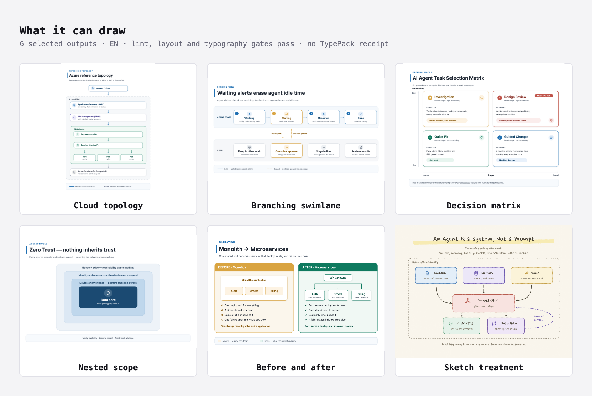
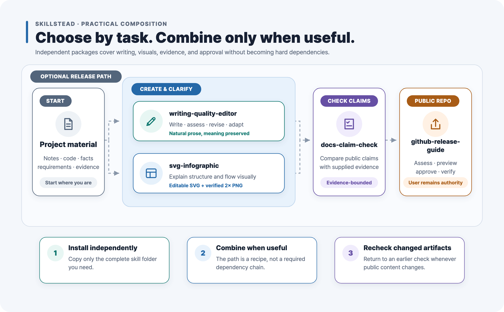
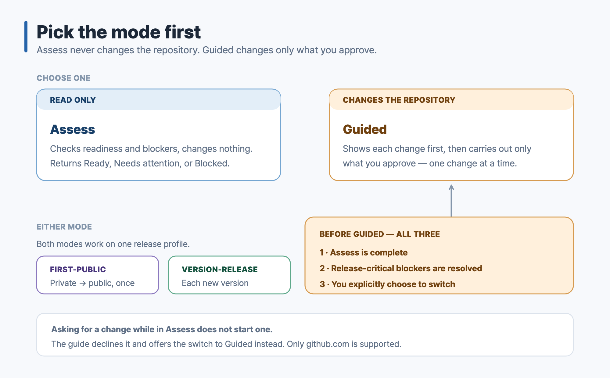
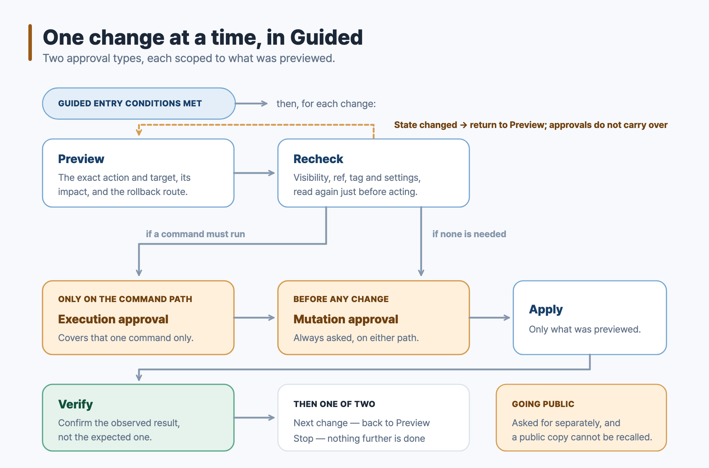

# Skillstead

**English** · [한국어](./README.ko.md)

Practical, portable skills for agentic coding workflows — create clearer artifacts, check public claims,
guide safer GitHub releases, and turn rough or translated text into natural, precise writing.

> [!TIP]
> **Skillstead = skill + homestead.** A small, durable place for skills that coding agents can carry into
> real repositories. Each public support claim is tied to examples and runtime evidence.

## Start here

1. [Choose one skill](#choose-a-skill) for the task in front of you. Each skill works independently.
2. Follow the [installation guide](./docs/INSTALL.md) to copy that skill's complete folder at a pinned version.
3. Open the skill's README, copy a request that is close to your task, and adapt it to your material.
4. Check the skill's stated limits before relying on the result in a release or other consequential workflow.

Looking for a particular guide? The [documentation index](./docs/README.md) separates user guides from
maintainer references.

## Highlights

### Explore the SVG gallery

`svg-infographic` covers more than conventional architecture boxes. The six above were chosen for how
differently they are shaped; they clear the lint, layout and typography gates, and they predate the TypePack
receipts, so no receipt is claimed for them. The gallery behind the image carries the nine TypePacks with their
receipts alongside these. [Open the gallery](./gallery/index.html), or
[browse the legacy examples and the verified TypePack catalog](./examples/svg-infographic).

### Use one skill—or combine them across a release

Each skill installs and works independently. When a project needs a wider path, use
`writing-quality-editor` for clear prose, `svg-infographic` for visual explanation, `docs-claim-check` for
evidence-bounded public claims, and `github-release-guide` for approval-gated release decisions. This is not a
required pipeline: start with the skill you need, skip the others, and recheck an earlier artifact when it changes.

## Choose a skill

| Skill | Best for | Version | Runtime support | Maturity |
| --- | --- | --- | --- | --- |
| [`svg-infographic`](./skills/svg-infographic) | Turning architecture notes, process flows, comparisons, and technical concepts into editable SVG + verified 2× PNG | `0.9.0` | Supported: Claude Code + Codex | Stable |
| [`docs-claim-check`](./skills/docs-claim-check) | Checking whether public documentation claims are supported by supplied evidence | `0.9.1` | Claude Code | Beta |
| [`github-release-guide`](./skills/github-release-guide) | Guiding a private repository's first public transition and every later version release, with separate approval before each change | `0.9.0` | Supported: Claude Code + Codex | Stable |
| [`writing-quality-editor`](./skills/writing-quality-editor) | Composing and revising user-facing text, plus natural English↔Korean adaptation, without inventing or changing facts, intent, voice, or operational constraints | `0.11.0` | Supported: Claude Code + Codex | Beta |

Each skill is self-contained and can be installed independently. You do not need to install the entire
catalog—copy only the complete folder for the skill you want to use. See
[`docs/INSTALL.md`](./docs/INSTALL.md) for global/project paths, pinned tags, clean updates, Windows commands,
and the per-skill runtime matrix.

The `Version` column above is per skill, not a catalog version. See
[`docs/VERSIONING.md`](./docs/VERSIONING.md) for what it means and how it changes.

For more examples—including natural requests, the `WQE` shorthand, and requests that involve more than one
skill—see the repository-only
[`intent and invocation contract`](./examples/intent-invocation-contract).

GitHub's **Latest** badge identifies the most recently published individual skill release. It does not represent
a catalog version.

## Skill details

### svg-infographic

Technical diagrams often begin as prose and end as hard-to-edit screenshots. `svg-infographic` computes a
layout before drawing, authors structured SVG, checks the source, then exports a dimension-verified 2× PNG.

Use it for architecture and cloud topology, process or approval flows, before/after migrations, roadmaps,
layer models, qualitative matrices, and Korean/CJK-ready technical one-pagers.

- Friendly guide: [`svg-infographic` README](./skills/svg-infographic/README.md)
- Examples: [legacy examples and the verified TypePack catalog](./examples/svg-infographic)
- Name the skill: `Use svg-infographic to turn this migration plan into an editable technical infographic.`
- Or ask naturally: `Turn this migration plan into an editable technical SVG and verified 2× PNG. Show the output path before creating files.`

### docs-claim-check

Release-facing docs can sound certain even when their evidence is partial or stale. `docs-claim-check` splits
objective statements into atomic claims and labels each one `verified`, `unsupported`, `stale-suspected`, or
`needs-human` within an explicit reviewed-input scope.

Use it before publishing a README, install guide, release note, or announcement. It is advisory only: the
contract runs no commands during assessment and does not generate fixes, code review, or security verdicts.

- Friendly guide: [`docs-claim-check` README](./skills/docs-claim-check/README.md)
- Validation material: [synthetic AcmeTask fixture and worked assessment](./examples/docs-claim-check)
- Name the skill: `Use docs-claim-check to assess these release-note claims against the supplied tag and CI evidence.`
- Or ask naturally: `Check whether these README claims are supported by the evidence below. Report findings only; do not rewrite the document.`

### github-release-guide

GitHub releases combine documentation work with changes to visibility, branches, tags, settings, and GitHub
Releases that can be difficult to undo. `github-release-guide` first checks readiness without changing the
repository. It then shows each proposed change, checks the current state again, and asks for approval in two
distinct scopes — running a repository command, and changing the repository — before verifying the result and
moving on.

V1 can be used at two points: when an existing private github.com repository becomes public for the first time,
and whenever that public repository publishes a new version afterward. It does not bootstrap repositories,
publish packages, sign binaries, deploy cloud services, claim a security audit, force-push, or rewrite history.

**First, pick the mode.** Assess inspects without changing anything; Guided starts only after Assess is
complete, release-critical blockers are resolved, and you explicitly choose to switch.

**Then, in Guided, one change at a time.** Approval is asked in two distinct scopes: running a command is
approved separately from changing the repository, and neither implies the other.

- Friendly guide: [`github-release-guide` README](./skills/github-release-guide/README.md)
- Validation material and diagrams: [synthetic scenarios, answer key, and worked outputs](./examples/github-release-guide)
- Natural readiness check: `Check whether this public GitHub repository is ready for its next version release. Inspect only and do not change it.`
- Assess example: `Use github-release-guide in Assess mode for this public repository's upcoming version release.`
- Guided example: `Use github-release-guide in Guided mode to prepare this private repository for first publication. Start with Assess, then show only the first proposed change. Do not change the repository until I approve that exact step.`
- Safety boundary: immediately before a repository becomes public, the guide explains what cannot be undone and
  asks the user to approve that visibility change separately. The release decision remains with the user.

### writing-quality-editor

Writing can start generic, over-structured, or translated sentence by sentence.
`writing-quality-editor` composes new documents directly from reliable briefs or reviewed public sources and
improves existing prose so it reads like careful work by a skilled writer or editor while preserving facts, intent,
author voice, commands, conditions, limitations, risks, and next actions.

For wording and naturalness requests, it now starts with the smallest complete span that has a concrete reader
problem and leaves the surrounding text unchanged. Ambiguous discretion, approval, or notification wording stays unchanged
for human judgment while other safe edits continue.

Its `Adapt` mode rewrites between English and Korean for the target-language reader instead of copying the source
sentence structure. It may change information order, sentence rhythm, idioms, and explanation density, but it
does not invent claims or hide ambiguity. AI-detector gaming and provenance concealment are explicit non-goals.

- Friendly guide: [`writing-quality-editor` README](./skills/writing-quality-editor/README.md)
- Validation material: [28 scenarios and a separate answer key](./examples/writing-quality-editor)
- Name the skill: `Use writing-quality-editor to make the document below read naturally. Preserve its core facts, conditions, and requirements.`
- Use the shorthand: `Use WQE to review this onboarding guide. Identify problems, but do not revise it yet.`
- Or ask naturally: `Review this README. Do not revise the prose yet.` · `Write a new README using only information supported by the material below.` · `Rewrite this English release note so it reads naturally to Korean readers. Preserve its meaning and conditions.`
- Specify a mode only when needed: `Use writing-quality-editor in Assess mode to review this release note. Do not draft revisions.`

## Playbooks (maintainer reference)

[`playbooks/public-release`](./playbooks/public-release/README.md) contains the canonical public-release playbook:
generic checklists and templates for taking a private repository public and verifying it afterward. These are
reference documents for maintainers — not installable skills, and installing any skill never requires them.
The `github-release-guide` skill mirrors the playbook's rules inside its own self-contained package. English is
canonical, and each document has a Korean mirror with the `.ko.md` suffix. Update both languages in the same pull
request whenever the meaning changes.

[`playbooks/skill-development`](./playbooks/skill-development/README.md) defines the repository standard for
designing, validating, independently reviewing, releasing, and retiring a skill. Its package template is
deliberately non-installable until the reserved `sample-skill` identity is replaced. The tracked retirement and
major-transition evidence enforced by the release gates is specified in
[`docs/VALIDATION.md`](./docs/VALIDATION.md).

## Quality and evidence bar

Every public skill must have:

- a clear description of what it does and does not do,
- synthetic, non-client validation material,
- runtime support and maturity labels limited to what was actually tested,
- public paths free of credentials, private provenance, and host-specific data,
- and a repeatable validation path appropriate to its output.

Runtime support is per skill, not catalog-wide.

`svg-infographic` has passed the same three frozen, fresh-context briefs on Claude Code and Codex. The checks
covered project-local discovery, source lint before rendering, exact 2× browser export, Korean/CJK text,
containment, connector semantics, and fail-closed recovery when browser launch crossed a sandbox boundary.
Codex evidence includes macOS Codex CLI and a fresh Codex App task in a Windows 11 ARM64 VM. It is
`Supported` for Claude Code and Codex within that recorded evidence scope.

`github-release-guide` has passed clean Claude Code/Codex material-parity checks, the disposable first-public
live E2E, pinned `v0.5.0` project installation and discovery smoke, and the final strict claim audit. It is
`Supported` for Claude Code and Codex within that recorded evidence scope.

`writing-quality-editor` has passed its four-mode behavior set, repository dogfood, and fresh installation and
skill discovery from the published `v0.7.0` tag. It is `Supported` for Claude Code and Codex within that recorded
evidence scope; maturity remains Beta.

## Current limitations

- `svg-infographic` browser rendering is verified on macOS and in the recorded Windows 11 ARM64 VM.
  This does not claim every Windows machine or filesystem; Linux rendering remains documented but unverified.
- `docs-claim-check` is advisory and evidence-bound; it does not execute verification commands.
- `github-release-guide` v1 is github.com-only. It covers the one-time private-to-public transition and each
  version release after the repository is public.
- For `github-release-guide`, a clean assessment only means that no issue was found within the inspected scope;
  it does not prove that the repository being assessed has no secrets, private information, or security risks.
- `writing-quality-editor` is designed as locale-neutral, but its initial localization fixtures cover only
  English↔Korean (`ko-KR` for Korean output). Other locale pairs are not yet claimed as behaviorally validated.
- Agent output is non-deterministic. `writing-quality-editor` defaults to local-first edits and holds ambiguous
  wording for review, but it cannot guarantee that every run avoids preference-driven changes outside the marked
  spans. Review the final delta before publishing or relying on an important document.

## License

[Apache-2.0](./LICENSE).
