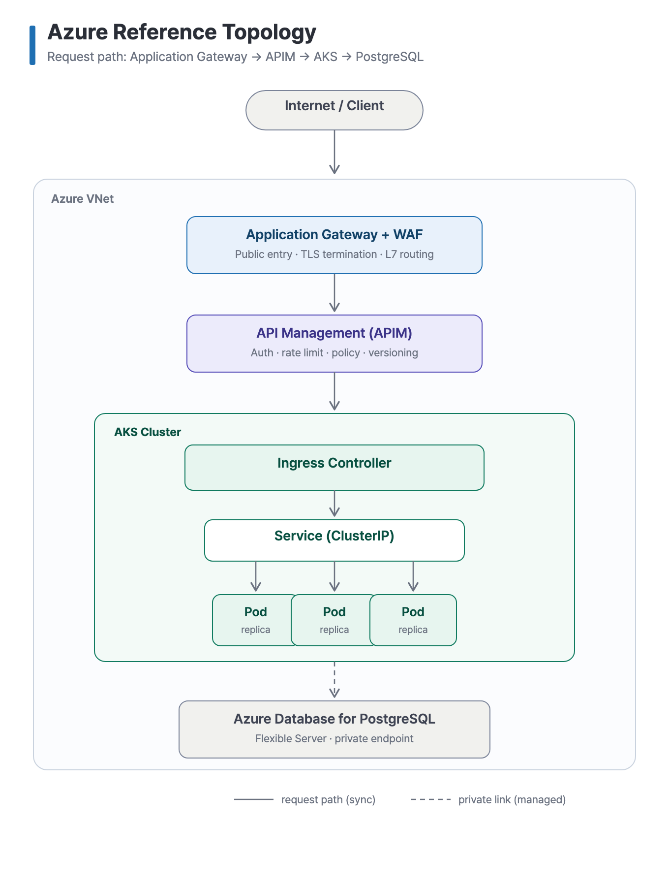
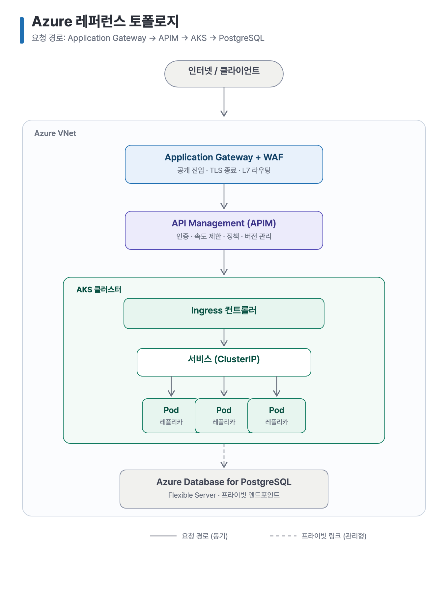

<!-- 한국어는 아래 -->

# Example: Cloud Infrastructure Topology

An Azure reference topology for a typical web request path — produced by `svg-infographic`, in English and Korean.

| English | 한국어 |
| --- | --- |
|  |  |

Files: `*.en.svg` / `*.en.png` / `*.ko.svg` / `*.ko.png` — SVG is the editable source, PNG is the 2x export.

## Prompt

```text
Use svg-infographic to draw an Azure reference topology as a vertical request-path
diagram: Internet/Client → Application Gateway (WAF; TLS termination, L7 routing)
→ API Management (auth, rate limit, policy, versioning) → an AKS cluster containing
Ingress Controller → Service (ClusterIP) → three replica Pods → Azure Database for
PostgreSQL (Flexible Server, private endpoint). Wrap AGW/APIM/AKS/Postgres in an
Azure VNet frame. Solid arrows for the request path, a dashed arrow for the private
DB link. Muted technical style. Export SVG + 2x PNG.
```

Swap Azure for AWS (ALB → API Gateway → EKS → RDS) and the same prompt shape works.

---

# 예제: 클라우드 인프라 토폴로지

전형적인 웹 요청 경로를 나타낸 Azure 레퍼런스 토폴로지. `svg-infographic`으로 영문·한글 두 본을 만들었다.

## 프롬프트

```text
svg-infographic으로 Azure 레퍼런스 토폴로지를 세로 요청 경로 다이어그램으로 그려줘:
인터넷/클라이언트 → Application Gateway(WAF; TLS 종료, L7 라우팅) → API Management
(인증, 속도 제한, 정책, 버전 관리) → AKS 클러스터(Ingress 컨트롤러 → Service(ClusterIP)
→ 레플리카 Pod 3개) → Azure Database for PostgreSQL(Flexible Server, 프라이빗 엔드포인트).
AGW/APIM/AKS/Postgres를 Azure VNet 프레임으로 감싸줘. 요청 경로는 실선 화살표, DB 프라이빗
링크는 점선 화살표로. muted technical 스타일. SVG + 2x PNG로 export해줘.
```

Azure 대신 AWS(ALB → API Gateway → EKS → RDS)로 바꿔도 같은 프롬프트 구조로 동작한다.
