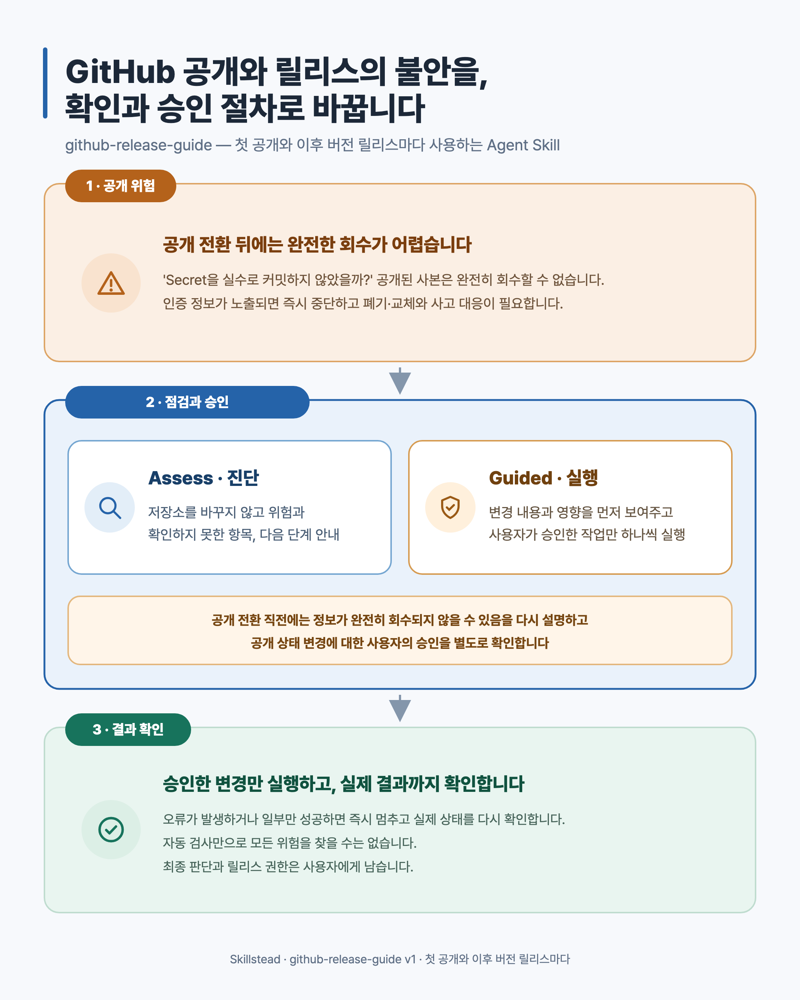

# github-release-guide 예제

[English](./README.md) · **한국어**

이 디렉터리에는 [`github-release-guide`](../../skills/github-release-guide/README.ko.md)가 약속한 대로
동작하는지 확인하기 위한 가상 예제와 다이어그램이 있습니다. 실제 저장소나 고객 자료는 사용하지 않았으며,
스킬을 설치할 때 이 예제 폴더까지 복사할 필요는 없습니다.

각 파일의 용도는 다음과 같습니다.

- [`fixtures/scenarios.md`](./fixtures/scenarios.md) — 가상 저장소 상태와 사용자 요청
- [`fixtures/expected-outcomes.md`](./fixtures/expected-outcomes.md) — 준비 상태 판정, 중단 사유, 승인,
  변경 및 복구에서 기대하는 결과를 정리한 정답표
- [`fixtures/runtime-assess-state.md`](./fixtures/runtime-assess-state.md)와
  [`fixtures/runtime-missing-reference-state.md`](./fixtures/runtime-missing-reference-state.md) — 정답을 보지 않은
  새 실행 환경에서도 같은 핵심 결과가 나오는지 확인하는 입력
- [`fixtures/runtime-safety-critical-state.md`](./fixtures/runtime-safety-critical-state.md) — 승인 뒤 상태 변경,
  저장소 공개 전 별도 동의, 원격 저장소 전송(push) 승인 범위, 태그 충돌, 강제 전송(force-push) 거부를
  다루는 안전 예제 5개
- [`fixtures/validation-evidence.md`](./fixtures/validation-evidence.md) — 각 시나리오를 어떤 방식으로 확인했고
  어디까지 검증했는지 기록한 표
- [`example-assessment.md`](./example-assessment.md) — `Assess` 전체 결과 예제
- [`example-guided-preview.md`](./example-guided-preview.md) — 저장소 공개 전환을 승인받기 전에 보여주는 예제
- [`release-announcement/`](./release-announcement/) — 한국어 LinkedIn 릴리스 게시용 세로형 SVG와 2× PNG.
  의도적으로 영문 대응본을 만들지 않았습니다.

## 이 스킬이 하는 일

| 방식 | 결과 |
| --- | --- |
| `Assess`(점검) | 저장소를 바꾸지 않고 준비 상태, 확인된 사실, 아직 모르는 정보, 필요한 결정, 건너뛸 때의 위험과 가장 안전한 다음 행동 하나를 알려줍니다. |
| `Guided`(단계별 진행) | 변경할 내용과 영향을 먼저 보여주고 현재 상태를 다시 확인합니다. 사용자가 직접 승인한 작업 하나만 실행한 뒤 실제 결과를 검증합니다. |

V1은 github.com에 이미 존재하는 비공개 저장소를 처음 공개 상태로 전환할 때 사용하고, 공개된 뒤에는 새
버전을 릴리스할 때마다 반복해서 사용할 수 있습니다. 저장소 생성, Git 초기화, 패키지 저장소 공개,
바이너리 서명, 클라우드 배포, 보안 감사, 강제 전송과 커밋 기록 다시 쓰기는 지원 범위에 포함되지 않습니다.

예제에 나오는 `northwind-labs/fieldnotes-fixture`는 설명을 위해 만든 이름이며 실제 저장소나 제품이 아닙니다.

## 한눈에 보는 진행 방식

| 진행 방식과 릴리스 유형 선택 | 변경 작업의 승인 과정 |
| --- | --- |
|  |  |

위 두 절차 다이어그램은 수정 가능한 SVG와 크기가 검증된 2× PNG로 제공합니다. 영문판과 한국어판은 같은
구조를 사용하므로 두 언어에서 정보의 위치와 흐름이 같습니다.

### 한국어 릴리스 게시 이미지

이 세로형 이미지는 한국어 LinkedIn 게시를 위해 만든 단일 언어 자산이므로 영문 대응본이 없는 것이
의도된 상태입니다. EN/KO mirror parity 검사에서는 이 폴더를 예외로 처리하되, 릴리스 전 출처·인증 정보·
호스트 경로·민감 정보 검사에는 반드시 포함합니다.
