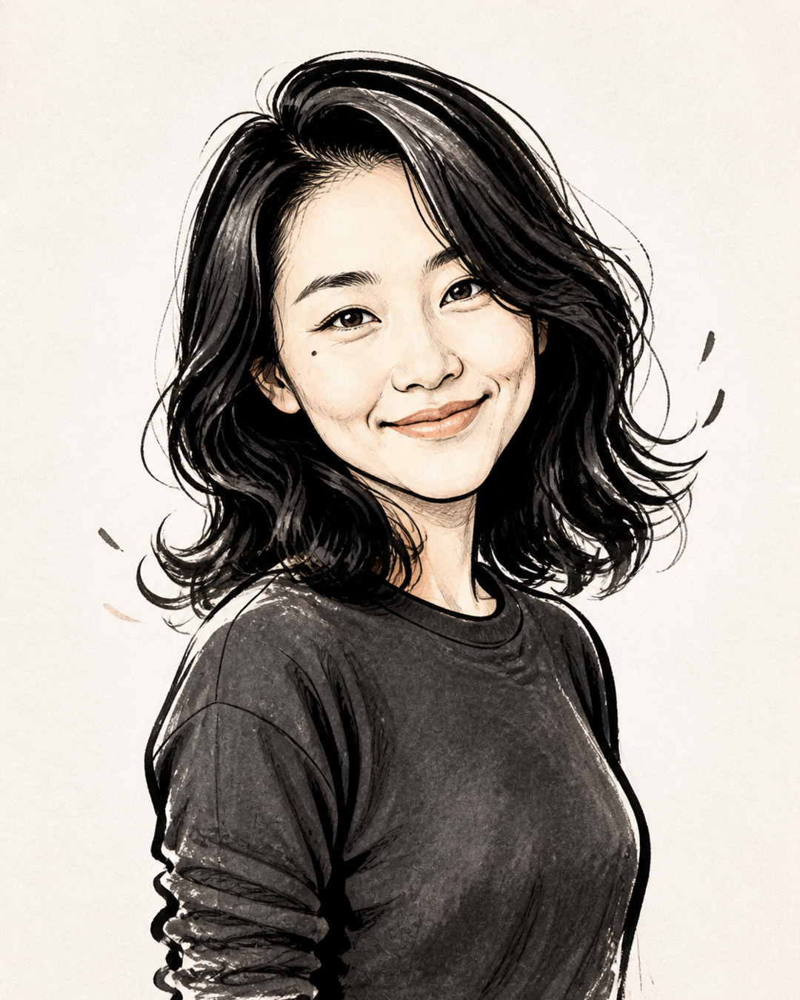
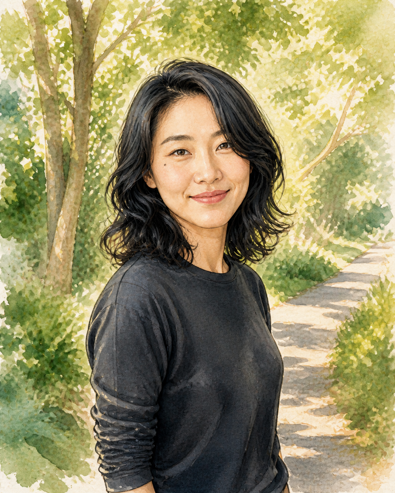
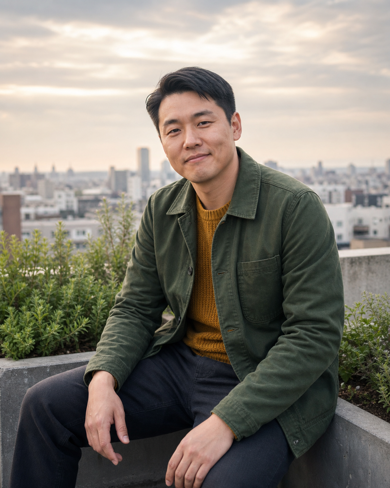
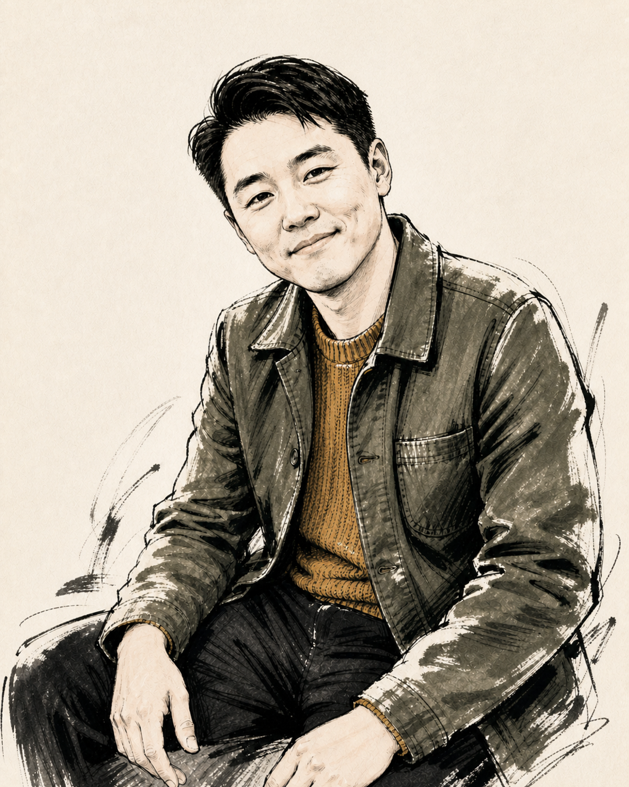
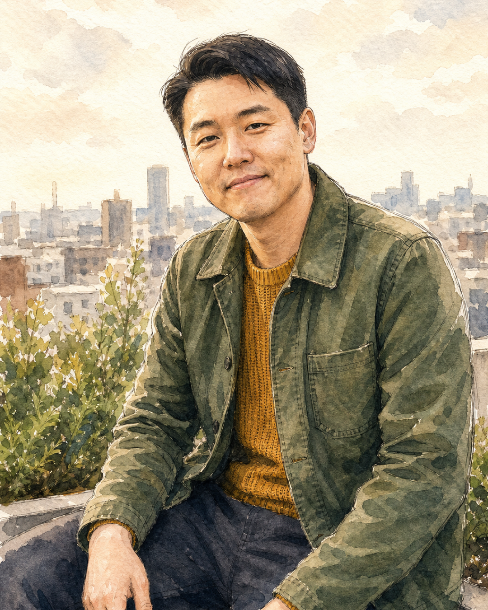

# Street Portrait Artist 예시

[English](./README.md) · **한국어**

이 repository-only gallery는 공개 가능한 합성 원본으로 만든 `Twin Portrait` 두 사례를 보여 줍니다. Woodland Path pair는
대표 visual example이고, Rooftop Garden pair는 같은 workflow가 특정 성별·머리 모양·head frame·표정·환경에만 의존하지
않는지 확인하는 generalization example입니다.

이 gallery는 설치되는 skill package에 포함되지 않으며 runtime 지원이나 deterministic output을 입증하지 않습니다.

## Featured — Woodland Path

| 합성 원본 | Street Caricature | Romance Watercolor |
| --- | --- | --- |
|  |  |  |

### Impression Map

- `Head frame`: compact하고 둥근 chin으로 좁아지는 부드러운 oval-to-heart frame.
- `T-axis`: 완만한 arch의 eyebrow, 자연스러운 크기의 almond eye와 곧고 좁은-to-medium nose.
- `Mouth-chin rhythm`: 넓은 closed-lip smile, 비대칭 cheek lift, 잔잔한 dimple과 compact chin.
- `Outer anchors`: 어깨 길이의 wavy black hair, 깊은 side part, 열린 cheek의 beauty mark, charcoal top과 편안한
  three-quarter pose.
- `Primary anchor`: 크게 흐르는 hair arc와 반대편 열린 cheek의 beauty mark·dimple·quiet smile이 만드는 대응.

### 해석 기록

`Street Caricature`는 hair sweep을 확장하고 단순화하며 웃는 cheek arc를 강화하고 chin을 압축하는 하나의
action-reaction 설계를 사용했습니다. 얼굴에는 따뜻한 종이를 드러내고 거의 무채색인 ink와 graphite로 형태를 잡으며,
머리카락은 과감한 검정 면으로 처리하고 피부나 의상에는 넓은 색 면을 쓰지 않습니다.

`Romance Watercolor`는 같은 hair-to-cheek 비대칭과 굽은 woodland path를 유지합니다. 얼굴의 정밀한 pen contour,
투명한 green-gold wash, granulation, paper gap과 lost edge로 환경보다 인물을 선명하게 남깁니다.

## Generalization — Rooftop Garden

| 합성 원본 | Street Caricature | Romance Watercolor |
| --- | --- | --- |
|  |  |  |

### Impression Map

- `Head frame`: 아래쪽 rhythm이 compact한 넓고 부드러운 사각형 얼굴.
- `T-axis`: 약간 넓게 떨어진 눈과 compact한 곧은 코 위로 흐르는 선명한 diagonal side-part arc.
- `Mouth-chin rhythm`: 한쪽 cheek과 dimple이 올라가는 조용한 비대칭 closed-mouth smile.
- `Outer anchors`: 짧게 넘긴 머리, moss색 chore jacket, mustard knit collar와 편안하게 앉은 pose.
- `Primary anchor`: diagonal hair arc와 작고 한쪽으로 치우친 dimple smile의 대응.

### 해석 기록

`Street Caricature`는 넓은 사각형 frame을 부드러운 사다리꼴로 다시 구성하고 얼굴 요소 사이 간격을 압축하며,
비대칭 smile이 cheek과 eye에 함께 반응하도록 만들었습니다. 얼굴은 대부분 종이로 열어 두고 black ink와 graphite로
구조를 잡으며, 빈 배경 위에서 의상의 outer anchor만 극소량의 차분한 olive·ochre로 받칩니다.

`Romance Watercolor`는 같은 특징 관계를 유지하면서 얼굴 plane을 단순화하고 머리카락·의상을 큰 덩어리로 묶었습니다.
얼굴 주변에는 정밀한 pen contour를 남기고, 투명 wash·granulation·lost edge와 느슨한 옥상 도시 환경으로 analog 마감을
만듭니다.

## Provenance와 Claim Boundary

- 두 원본은 모두 가상의 합성 성인입니다. 실존 인물의 사진이나 likeness를 identity input으로 사용하지 않았습니다.
- 각 pair에서 identity를 제공한 입력은 gallery에 포함된 해당 합성 원본뿐입니다. 별도의 합성 drawing은 Rooftop Garden
  Street Caricature의 일반적인 brush-pen·paper 물성에만 참고했으며 그 인물과 구도는 제외했습니다.
- PNG 여섯 개는 모두 실제 `1080 x 1350 px`로 검증했습니다.
- 이 example은 likeness 보장, deterministic regeneration 또는 모든 product runtime의 지원을 입증하지 않습니다.

Repository-only intent·behavior fixture는 [`intent-contract.md`](./intent-contract.md)와
[`fixtures/`](./fixtures/)에 유지합니다.
