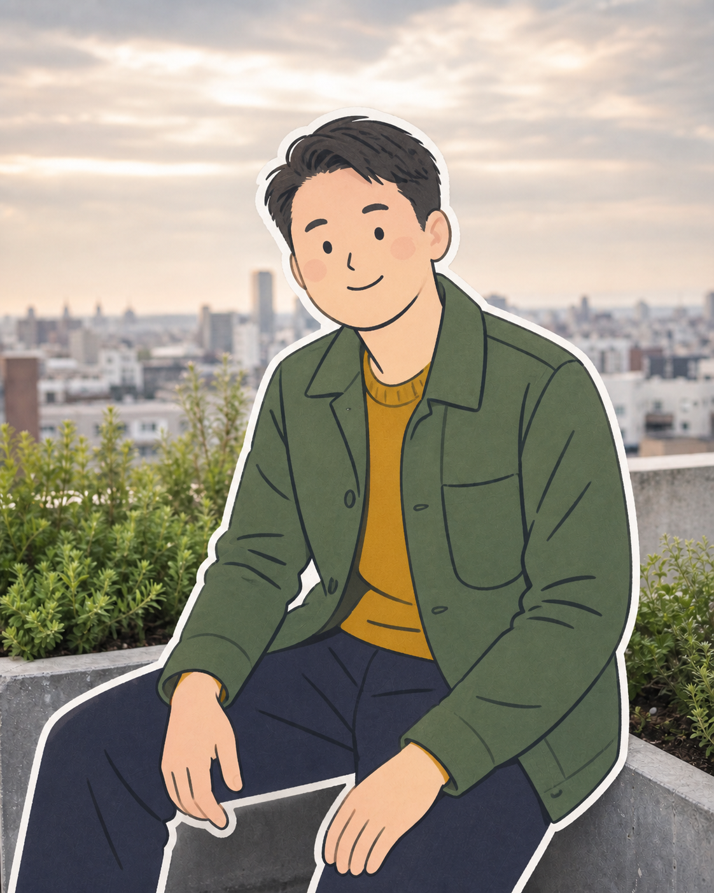

# Street Portrait Artist Examples

**English** · [한국어](./README.ko.md)

This repository-only gallery uses two public-safe synthetic sources. It demonstrates two `Twin Portrait` cases and
one `Paper-Cut Illustration` made from the Rooftop Garden source. The Woodland Path pair is the featured visual
example. The Rooftop Garden results check another gender, hairstyle, head frame, expression, and environment.

The gallery does not ship in the installable skill package and does not establish runtime support or deterministic
output.

## Featured — Woodland Path

| Synthetic source | Street Caricature | Romance Watercolor |
| --- | --- | --- |
|  |  |  |

### Impression Map

- `Head frame`: softly elongated oval-to-heart frame tapering to a compact rounded chin.
- `T-axis`: gently arched brows, natural-sized almond eyes, and a straight narrow-to-medium nose.
- `Mouth-chin rhythm`: broad closed-lip smile, asymmetric cheek lift, subtle dimples, and a compact chin.
- `Outer anchors`: shoulder-length wavy black hair, deep side part, exposed-cheek beauty mark, charcoal top, and relaxed
  three-quarter pose.
- `Primary anchor`: the large sweeping hair arc answered by the open opposite cheek carrying the beauty mark, dimple,
  and quiet smile.

### Interpretation Notes

`Street Caricature` expands and simplifies the hair sweep, strengthens the smiling cheek arc, and compacts the chin as
one action-reaction design. Warm paper remains visible through the face; near-monochrome ink and graphite carry the
image, with decisive black hair masses and no broad skin or clothing color.

`Romance Watercolor` keeps the same hair-to-cheek asymmetry and the curving woodland path. Precise facial pen contours,
transparent green-gold washes, granulation, paper gaps, and lost edges keep the person clearer than the environment.

## Generalization — Rooftop Garden

| Synthetic source | Street Caricature | Romance Watercolor |
| --- | --- | --- |
|  |  |  |

### Impression Map

- `Head frame`: broad, softly square face with a compact lower rhythm.
- `T-axis`: a clean diagonal side-part arc over slightly wide-set eyes and a compact straight nose.
- `Mouth-chin rhythm`: a quiet asymmetric closed-mouth smile with one lifted cheek and dimple.
- `Outer anchors`: short swept hair, moss chore jacket, mustard knit collar, and a relaxed seated pose.
- `Primary anchor`: the diagonal hair arc answered by the small one-sided dimple smile.

### Interpretation Notes

`Street Caricature` rebuilds the broad square frame as a softened trapezoid, compresses the facial intervals, and lets
the asymmetric smile echo through the cheek and eye. The face stays mostly open paper; black ink and graphite define
the structure, while tiny muted olive and ochre clothing accents support the outer anchors against a blank background.

`Romance Watercolor` keeps the same feature relationships while simplifying planes and grouping hair and clothing. Fine
pen contours remain precise around the face; transparent washes, granulation, lost edges, and a loose rooftop-city
environment carry the analog finish.

### Paper-Cut Illustration — 0.2.0

| Synthetic source | Paper-Cut Illustration |
| --- | --- |
|  |  |

The `0.2.0` example turns the person into a flat-color cartoon with dot-and-oval eyes, a short mouth line, loose
contours, and a visible paper edge while retaining the main seated pose, hands, clothing colors, and rooftop setting.
It is a full-frame generation rather than a verified masked edit: the background pixels changed, and the
`1122 x 1402 px` result differs from the `1080 x 1350 px` source.

## Provenance And Claim Boundary

- Both source portraits are synthetic fictional adults. No real person's portrait or likeness was used as their
  identity input.
- Each pair uses only its included source as identity-bearing input. A separate synthetic drawing informed only the
  Rooftop Garden Street Caricature's generic brush-pen and paper qualities; its person and composition were excluded.
- The Paper-Cut result uses the included Rooftop Garden source as identity-bearing input. A task-scoped supplied
  picture informed only the generic cartoon treatment; it is not included and did not supply identity or composition.
- The six original source and Twin Portrait PNG files are verified `1080 x 1350 px`; the Paper-Cut result is
  `1122 x 1402 px`.
- These examples do not prove guaranteed likeness, deterministic regeneration, or support in every product runtime.

Repository-only intent and behavior fixtures remain in [`intent-contract.md`](./intent-contract.md) and
[`fixtures/`](./fixtures/).

`0.2.0` consistency, Editorial Watercolor, and local-edit behavior use additional
[development scenarios](./fixtures/enhancement-scenarios.md) and a separate
[answer key](./fixtures/enhancement-expected-outcomes.md). The Twin Portrait images remain historical evidence of the
original modes; the Paper-Cut result is the bounded new-mode example described in the validation record.

Read the [development observations and limits](./fixtures/enhancement-validation.md).
