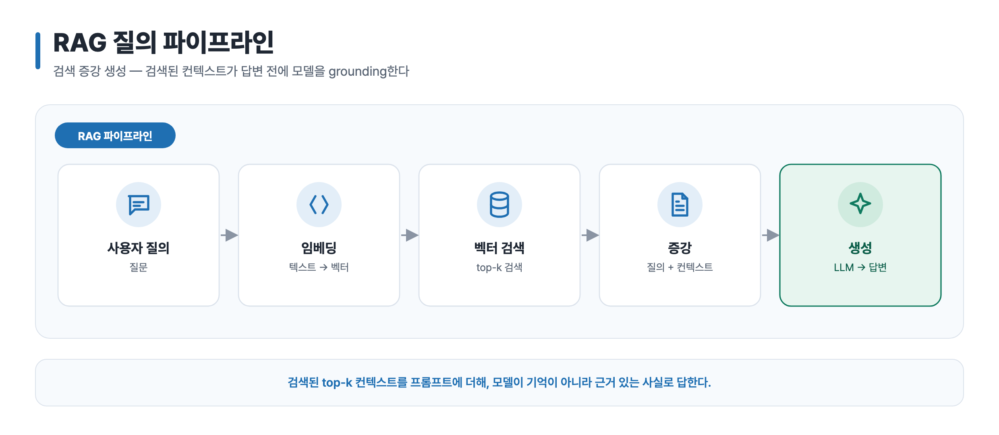
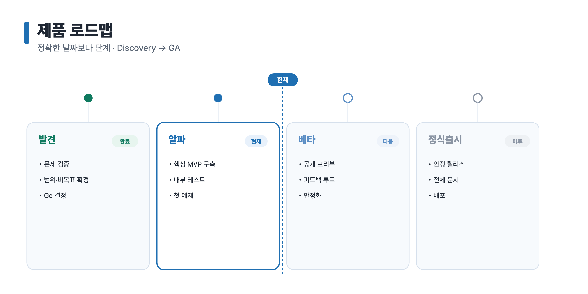
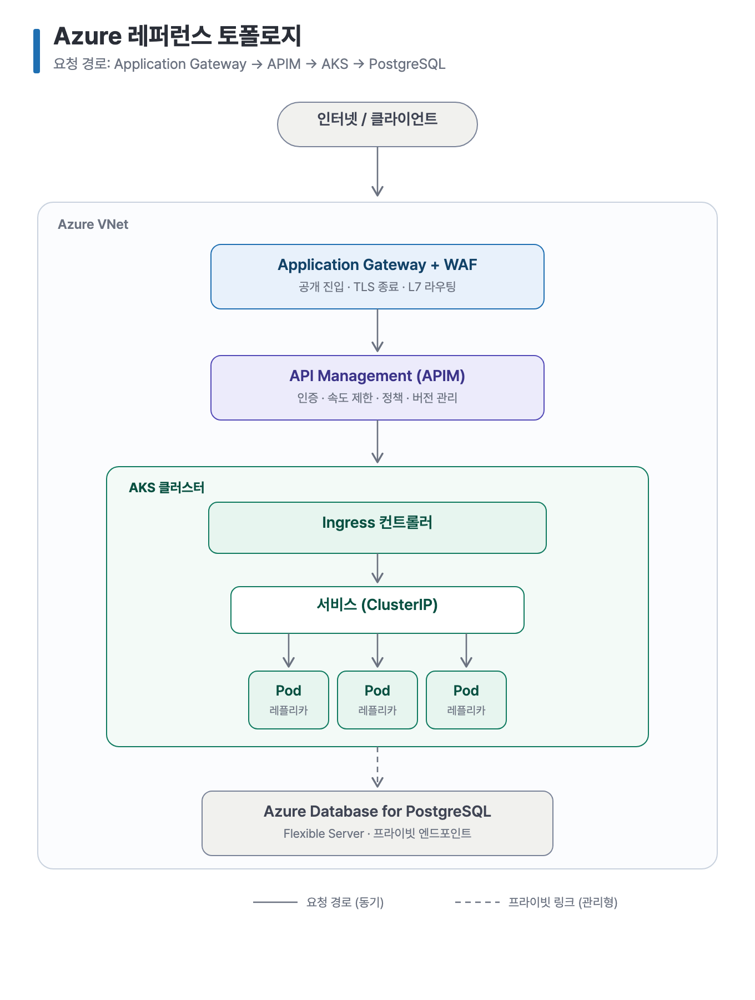
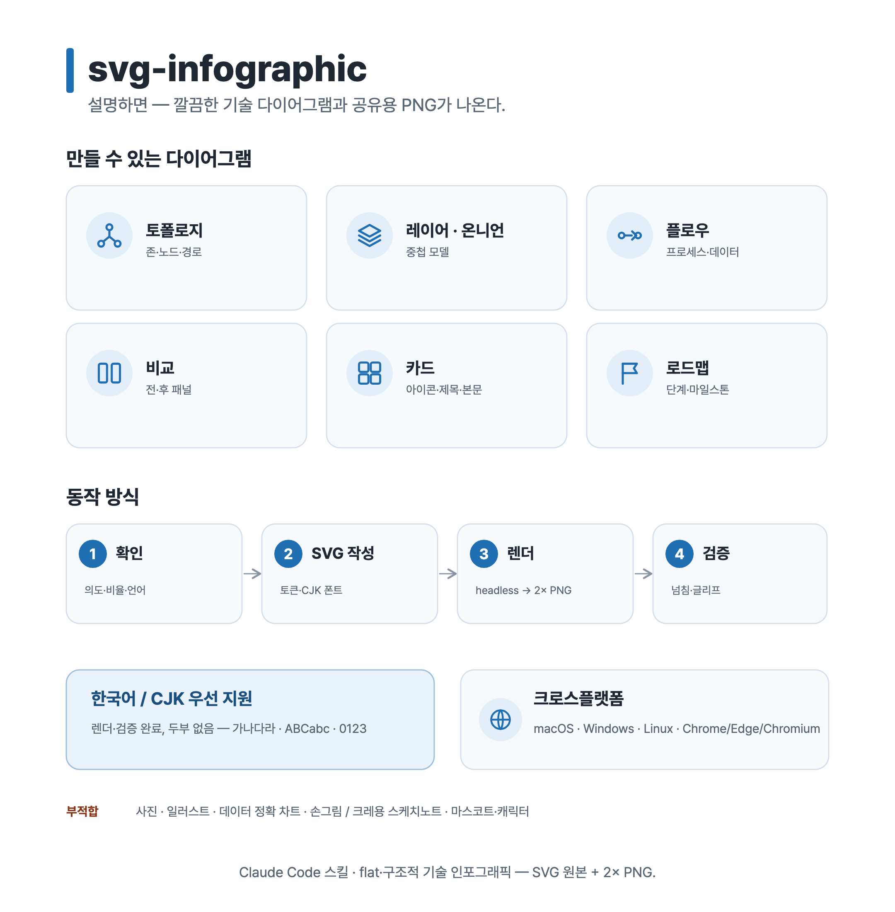
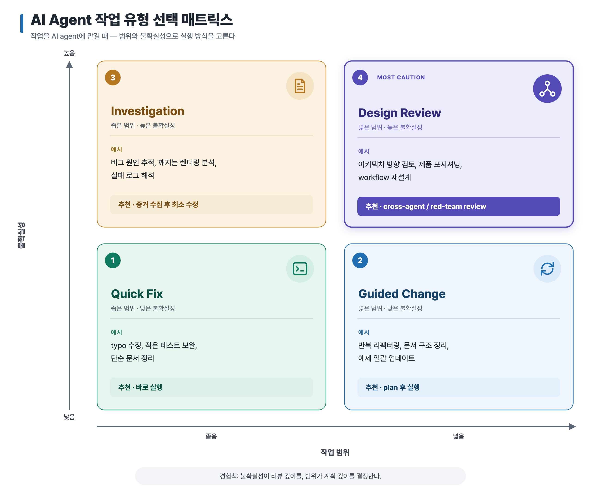
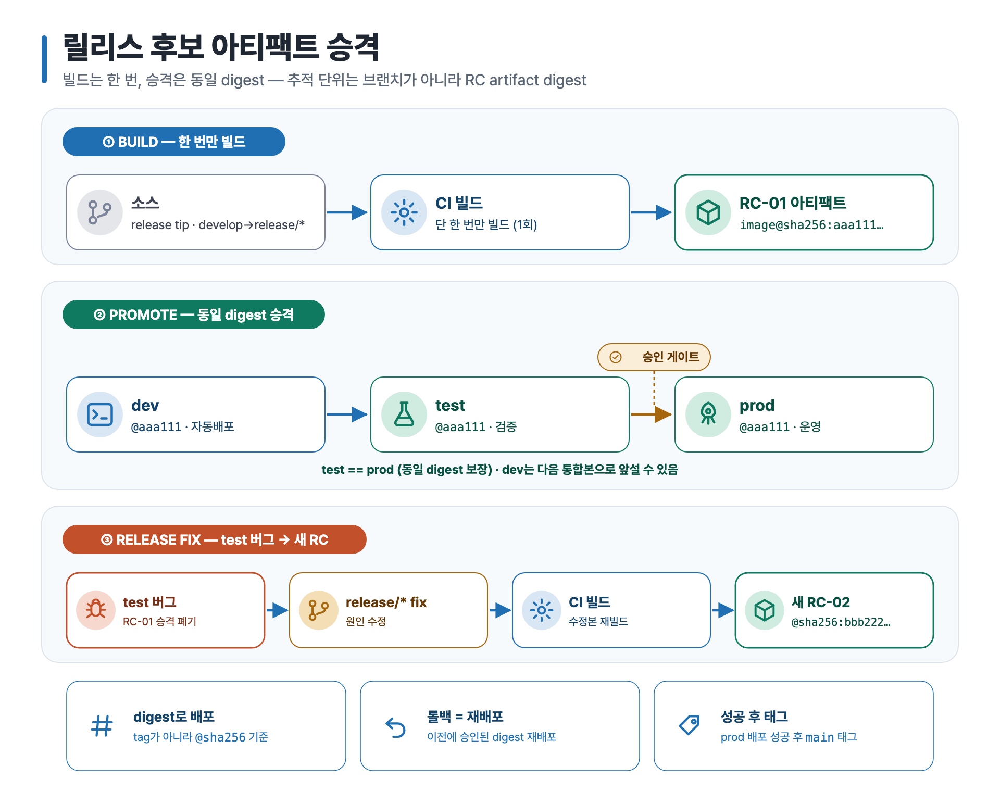
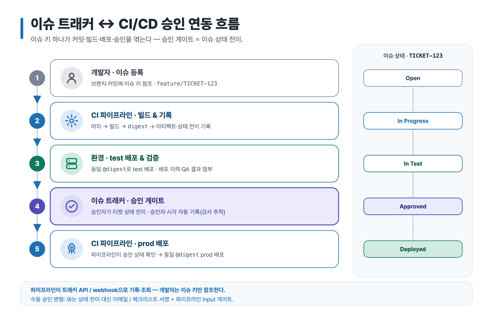
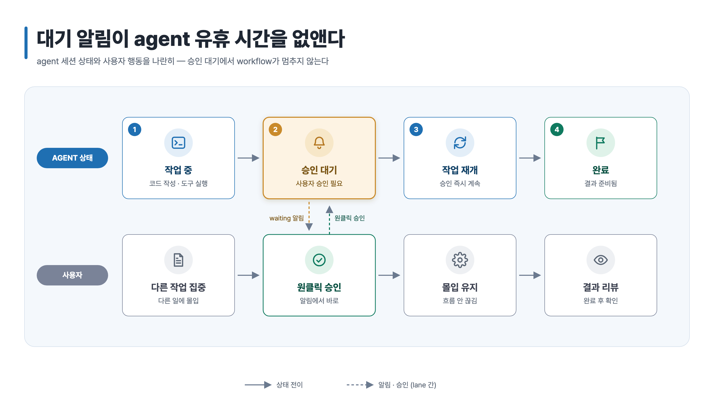
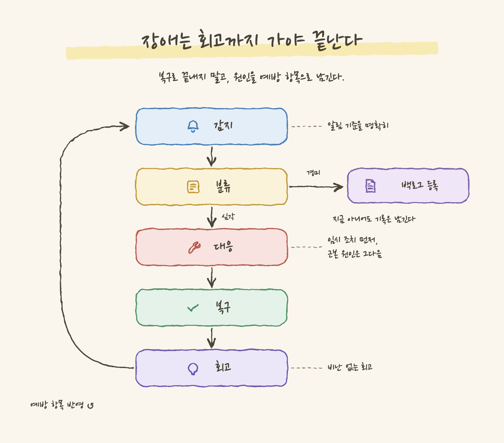

# 예제 — svg-infographic

[English](./README.md) · **한국어**

[`svg-infographic`](../../skills/svg-infographic) skill의 실제 산출물입니다. 각 예제는 flat하고 구조적인 시각 자료로, 원본 SVG + 2× PNG를 영문·한글 두 본과 생성 프롬프트와 함께 제공합니다.

모든 예제는 직접 만든 합성 예제이며, 고객·기밀과 무관합니다. 함께 보면 skill이 다루는 여러 archetype을 커버합니다.

_위 preview는 대표 6개를 추린 montage입니다. 아래에 13개 예제 전체를 정리했습니다._

## 갤러리

### 1. 기술 인포그래픽 — flagship

개념 인포그래픽: 중첩/온니언 모델 + 아이콘 카드.

→ [`technical-infographic/`](./technical-infographic) · English + 한국어

### 2. 마이그레이션 전 / 후 비교

비교 archetype: 동일 높이 두 패널, 의미 색상, ✓/✕ 포인트.

→ [`before-after-migration/`](./before-after-migration) · English + 한국어

### 3. 프로세스 / 데이터 플로우

플로우 archetype: 아이콘과 화살표가 있는 좌→우 노드(RAG 질의 파이프라인).

→ [`process-flow/`](./process-flow) · English + 한국어

### 4. 로드맵 / 타임라인

타임라인 archetype: 단계, 상태 점, "now" 마커, 마일스톤 카드.

→ [`roadmap/`](./roadmap) · English + 한국어

### 5. 클라우드 인프라 토폴로지

아키텍처/토폴로지: 구역, 아이콘 배지가 있는 컴포넌트, 요청 경로 화살표.

→ [`cloud-infra-topology/`](./cloud-infra-topology) · English + 한국어

### 6. 스킬 개요 — self-demo

skill이 스스로를 소개: 만드는 다이어그램 종류, 동작 방식, 범위.

→ [`skill-overview/`](./skill-overview) · English + 한국어

### 7. AI 코드 리뷰 루프

플로우 archetype(기능 데모): 강조된 "핵심 단계", legend, 점선 피드백 루프가 있는 좌→우 카드 — AI-in-the-loop PR 리뷰 사이클.

→ [`ai-code-review-loop/`](./ai-code-review-loop) · English + 한국어

### 8. AI 에이전트 작업 선택 매트릭스

의사결정 매트릭스 archetype: 축 라벨과 방향 화살표가 있는 2×2 사분면 그리드, 사분면마다 번호 배지 + 아이콘, 추천 pill, 강조 사분면 하나 — 범위와 불확실성으로 AI 에이전트 실행 모드 선택.

→ [`agent-task-matrix/`](./agent-task-matrix) · English + 한국어

### 9. CI/CD 아티팩트 승격

파이프라인 archetype: 빌드는 한 번, 동일 digest를 승격하는 릴리스 모델을 3개 밴드로 — 빌드, 승격(dev → test → prod, 승인 게이트), 릴리스 수정(test 버그가 새 RC를 만듦).

→ [`ci-cd-artifact-promotion/`](./ci-cd-artifact-promotion) · English + 한국어

### 10. 이슈 트래커 ↔ CI/CD 승인 연동 흐름

플로우 + 상태 rail archetype: 이슈 키가 커밋 → 빌드 → test → 승인 → prod 배포를 엮고, 병렬 이슈-상태 rail(Open → In Progress → In Test → Approved → Deployed)과 함께 승인 게이트를 상태 전이로 모델링.

→ [`issue-tracker-cicd-approval-flow/`](./issue-tracker-cicd-approval-flow) · English + 한국어

### 11. Zero Trust 온니언 모델

Nested/온니언 archetype: layout pass에서 균일 inset으로 계산한 동심 링 4개, 밝음→진함 색 진행, 각 링 상단 strip의 라벨, 강조된 최소 권한 데이터 코어.

→ [`zero-trust-onion/`](./zero-trust-onion) · English + 한국어

### 12. Agent 대기 알림 swimlane

플로우 archetype의 swimlane 변형: agent 세션 상태와 사용자 행동을 두 lane으로, stage column을 동일 좌표로 정렬하고, "승인 대기" 단계 강조, 라벨 붙은 점선 cross-lane 화살표(알림은 아래로, 원클릭 승인은 위로).

→ [`agent-waiting-swimlane/`](./agent-waiting-swimlane) · English + 한국어

### 13. 장애 대응 루프 — sketch 프리셋

첫 **sketch 프리셋** 예제("정돈된 손그림"): 종이 배경, subset embed한 한글 손글씨 폰트, rough 스트로크, 밑줄형 형광펜 — 배치는 여전히 계산된 그대로. 감지 → 분류 → 대응 → 복구 → 회고 루프와 경미 이슈의 백로그 분기.

→ [`incident-response-sketch/`](./incident-response-sketch) · English + 한국어

## 품질 기준 (모든 예제 통과)

- [x] SVG와 PNG 크기 일치 (PNG는 SVG viewBox의 정확히 2×)
- [x] 텍스트 넘침 없음, 박스 안 세로 중앙 정렬
- [x] tofu 없음 — 한국어/CJK 글자 정상 렌더
- [x] 접근성용 `<title>` / `<desc>` 포함
- [x] 소스에 host-specific 또는 client path 없음
- [x] 아이콘 렌더(깨진 `<use>` 없음), 나란한 박스는 gutter 확보

## 렌더 smoke test (OS별)

번들된 [`scripts/render.sh`](../../skills/svg-infographic/scripts/render.sh)가 Chromium 계열 브라우저를 찾아(macOS·Linux·Windows Git Bash 경로) 렌더하고 PNG 치수까지 검증합니다. 네이티브 PowerShell을 포함한 OS별 수동 명령은 [`references/authoring.md`](../../skills/svg-infographic/references/authoring.md) §8에 있습니다. 현재까지 PNG export는 macOS에서 smoke test(13개 예제 전부)했고, Windows/Linux 렌더 검증은 아직 대기 중입니다.

| 환경 | 브라우저 | en/ko SVG → 2× PNG | 상태 |
| --- | --- | --- | --- |
| macOS 15 | Chrome (headless) | 13개 예제 전부 | ✅ 검증 — 정확한 2× 크기, tofu 없음 |
| Windows 10/11 | Chrome / Edge | script(Git Bash) + 문서화된 수동 경로 | ⏳ 예상, 렌더 검증 대기 |
| Linux / WSL | Chrome / Chromium | script + 문서화된 수동 경로 | ⏳ 예상, 렌더 검증 대기(한국어는 Noto Sans CJK/KR 설치) |

## 범위

flat하고 구조적인 기술 다이어그램에 더해, opt-in **sketch 프리셋**("정돈된 손그림" — 표면은 손그림, 배치는 계산)을 다룹니다. 마스코트, 캐릭터, 장면 일러스트는 계속 **범위 밖**입니다 — 이 선을 지키는 것이 출력 일관성을 유지하는 방법입니다.
