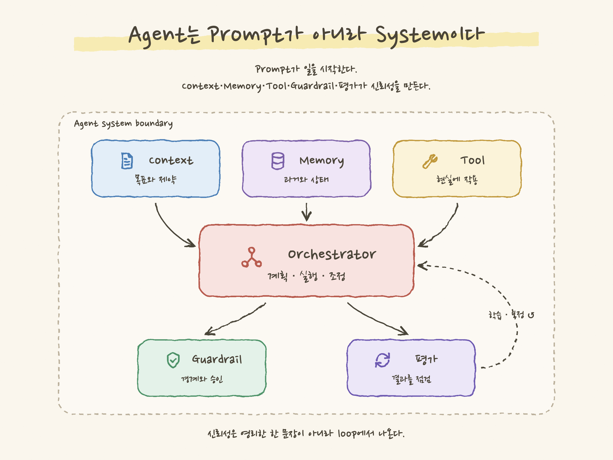

# 예제 — svg-infographic

[English](./README.md) · **한국어**

[`svg-infographic`](../../skills/svg-infographic)으로 직접 만든 결과물입니다. 각 예제는 평면형 구조 시각
자료이며, 영문판과 한국어판의 SVG 원본, 2× PNG와 제작에 사용한 프롬프트를 함께 제공합니다.

모든 내용은 실제 고객이나 기밀 자료와 무관하게 만든 가상 예제입니다. 전체 예제를 통해 스킬이 지원하는
여러 다이어그램 유형을 확인할 수 있습니다.

_위 이미지는 sketch 프리셋으로 만든 두 작품을 포함해 대표 예제 6개를 모았습니다. 전체 14개 예제는
아래에서 확인할 수 있습니다._

## 갤러리

### 1. 대표 기술 인포그래픽

중첩·온니언 모델과 아이콘 카드를 결합한 개념 인포그래픽입니다.

→ [`technical-infographic/`](./technical-infographic) · English + 한국어

### 2. 마이그레이션 전 / 후 비교

높이가 같은 두 패널, 의미에 따른 색상과 ✓/✕ 표시를 사용한 비교 예제입니다.

→ [`before-after-migration/`](./before-after-migration) · English + 한국어

### 3. 프로세스 / 데이터 플로우

아이콘과 화살표를 따라 왼쪽에서 오른쪽으로 읽는 RAG 질의 파이프라인입니다.

→ [`process-flow/`](./process-flow) · English + 한국어

### 4. 로드맵 / 타임라인

단계, 상태 표시점, "현재" 마커와 마일스톤 카드로 구성한 타임라인입니다.

→ [`roadmap/`](./roadmap) · English + 한국어

### 5. 클라우드 인프라 토폴로지

구역, 아이콘 배지가 있는 구성 요소와 요청 경로 화살표를 사용한 아키텍처·토폴로지 예제입니다.

→ [`cloud-infra-topology/`](./cloud-infra-topology) · English + 한국어

### 6. 스킬 자체 소개

스킬이 만들 수 있는 다이어그램, 동작 방식과 범위를 한 장에 소개합니다.

→ [`skill-overview/`](./skill-overview) · English + 한국어

### 7. AI 코드 리뷰 루프

강조된 핵심 단계, 범례와 점선 피드백 루프를 사용해 AI가 참여하는 PR 검토 과정을 왼쪽에서 오른쪽으로 보여줍니다.

→ [`ai-code-review-loop/`](./ai-code-review-loop) · English + 한국어

### 8. AI 에이전트 작업 선택 매트릭스

범위와 불확실성을 두 축으로 삼은 2×2 의사결정 매트릭스입니다. 각 사분면에 번호, 아이콘과 권장
방식을 배치하고 한 사분면을 강조합니다.

→ [`agent-task-matrix/`](./agent-task-matrix) · English + 한국어

### 9. CI/CD 아티팩트 승격

한 번 빌드한 동일 digest를 승격하는 릴리스 모델입니다. 빌드, 승인 게이트를 거치는
dev → test → prod 승격, test에서 버그를 발견했을 때 새 RC를 만드는 흐름을 세 영역으로 나눴습니다.

→ [`ci-cd-artifact-promotion/`](./ci-cd-artifact-promotion) · English + 한국어

### 10. 이슈 트래커 ↔ CI/CD 승인 연동 흐름

하나의 이슈 키가 커밋 → 빌드 → test → 승인 → prod 배포를 잇습니다. 옆에는
Open → In Progress → In Test → Approved → Deployed 상태 변화를 나란히 배치하고, 승인 게이트를
이슈 상태 전이로 표현했습니다.

→ [`issue-tracker-cicd-approval-flow/`](./issue-tracker-cicd-approval-flow) · English + 한국어

### 11. Zero Trust 온니언 모델

균일한 간격으로 계산한 동심 링 네 개, 바깥에서 안쪽으로 진해지는 색, 각 링 위쪽의 라벨과 강조된
최소 권한 데이터 코어로 구성했습니다.

→ [`zero-trust-onion/`](./zero-trust-onion) · English + 한국어

### 12. Agent 대기 알림 swimlane

에이전트 세션 상태와 사용자 행동을 두 swimlane에 배치했습니다. 각 단계를 같은 가로 위치에 맞추고,
"승인 대기"를 강조했으며, 점선 화살표로 알림과 원클릭 승인 흐름을 연결했습니다.

→ [`agent-waiting-swimlane/`](./agent-waiting-swimlane) · English + 한국어

### 13. 장애 대응 루프 — sketch 프리셋

첫 **sketch 프리셋** 예제입니다. 계산된 배치 위에 종이 배경, 일부 글자만 포함한 한국어 손글씨 폰트,
거친 선과 밑줄형 형광펜을 적용했습니다. 감지 → 분류 → 대응 → 복구 → 회고 흐름에서 경미한 이슈는
백로그로 분기됩니다.

→ [`incident-response-sketch/`](./incident-response-sketch) · English + 한국어

### 14. 에이전트 시스템 구성도 — sketch 프리셋

**Sketch 프리셋**으로 만든 구성도입니다. Context, Memory와 Tool이 중앙 Orchestrator에 연결되고,
아래에 배치한 Guardrail과 평가 중 평가 결과는 보정 흐름으로 되돌아갑니다. 정돈된 손그림 표현을
프로세스 흐름뿐 아니라 계산된 토폴로지에도 적용할 수 있음을 보여줍니다.

→ [`agent-system-sketch/`](./agent-system-sketch) · English + 한국어

## 품질 기준 (모든 예제 통과)

- [x] SVG와 PNG 크기 일치 (PNG는 SVG viewBox의 정확히 2×)
- [x] 텍스트 넘침 없음, 박스 안 세로 중앙 정렬
- [x] 한국어/CJK 글자가 네모 상자로 깨지지 않고 정상적으로 표시됨
- [x] 접근성용 `<title>` / `<desc>` 포함
- [x] 원본에 특정 컴퓨터나 고객의 경로가 없음
- [x] 아이콘이 정상적으로 표시되고 깨진 `<use>` 참조가 없으며, 나란한 박스 사이에 충분한 간격이 있음

## 운영체제별 렌더링 간이 검증

포함된 [`scripts/render.sh`](../../skills/svg-infographic/scripts/render.sh)는 macOS, Linux와 Windows Git Bash에서
Chromium 계열 브라우저를 찾아 PNG를 만들고 크기를 검증합니다. PowerShell을 포함한 운영체제별 수동 명령은
[`references/authoring.md`](../../skills/svg-infographic/references/authoring.md) §8에 있습니다. 현재 14개 예제의
PNG 출력은 macOS에서만 간이 검증을 마쳤고, Windows와 Linux 검증은 아직 진행하지 않았습니다.

| 환경 | 브라우저 | en/ko SVG → 2× PNG | 상태 |
| --- | --- | --- | --- |
| macOS 15 | Chrome (headless) | 14개 예제 전부 | ✅ 검증 — 정확한 2× 크기, tofu 없음 |
| Windows 10/11 | Chrome / Edge | script(Git Bash) + 문서화된 수동 경로 | ⏳ 예상, 렌더 검증 대기 |
| Linux / WSL | Chrome / Chromium | script + 문서화된 수동 경로 | ⏳ 예상, 렌더 검증 대기(한국어는 Noto Sans CJK/KR 설치) |

## 범위

평면형 구조 다이어그램과 선택형 **sketch 프리셋**을 지원합니다. sketch 프리셋은 계산한 배치를 유지하면서
정돈된 손그림 느낌을 더합니다. 마스코트, 캐릭터와 장면 일러스트는 계속 **범위 밖**이며, 이 경계를
유지해야 결과물의 성격도 일관되게 지킬 수 있습니다.
