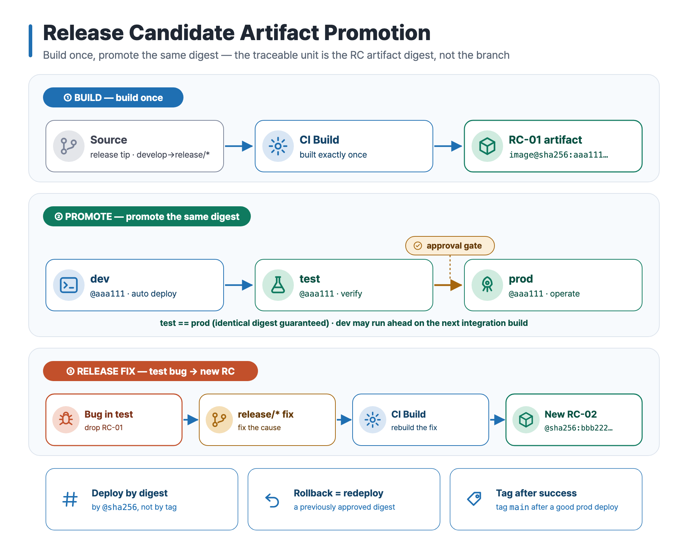
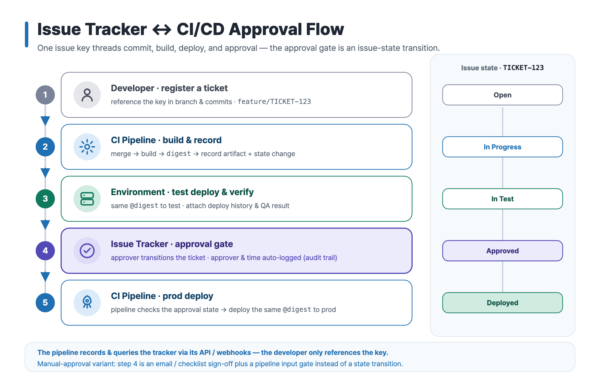
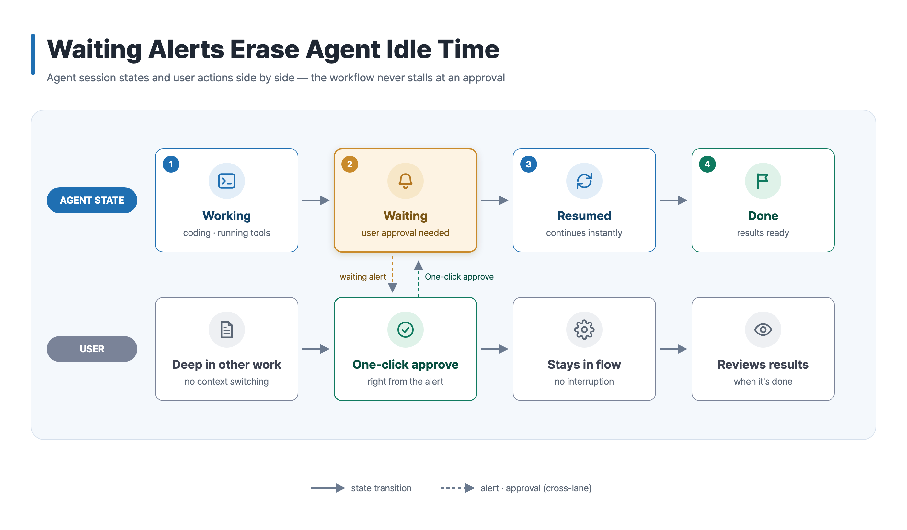
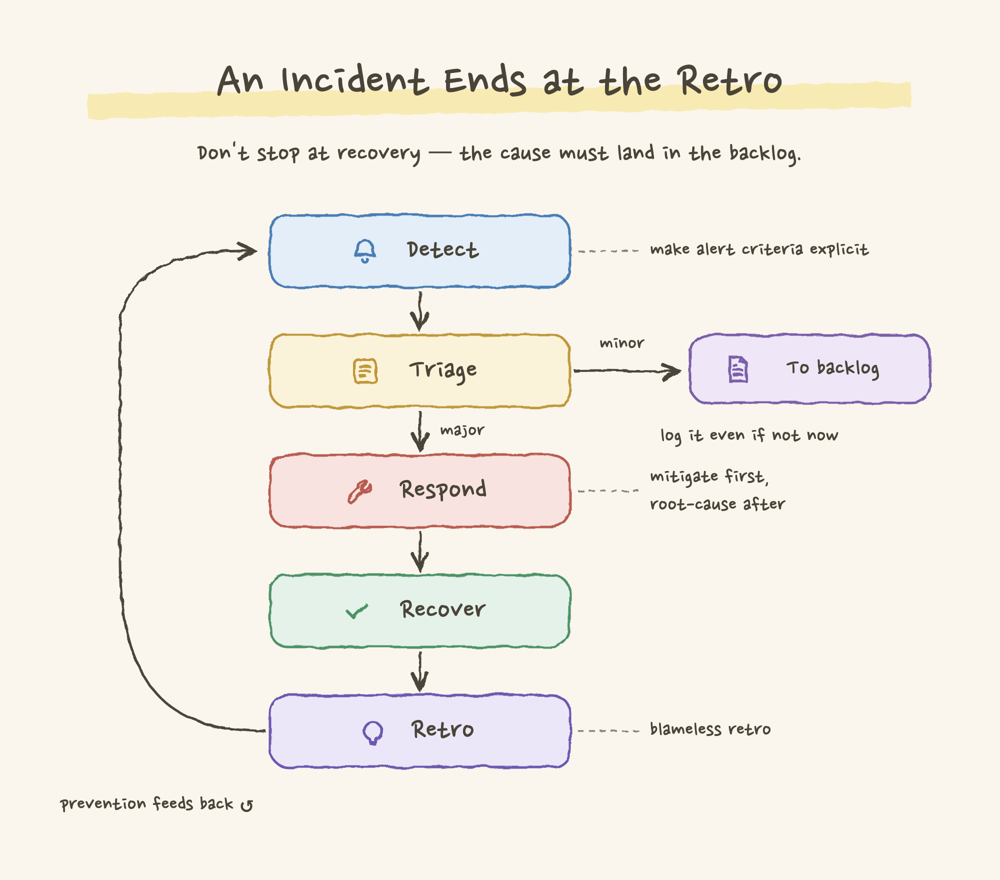
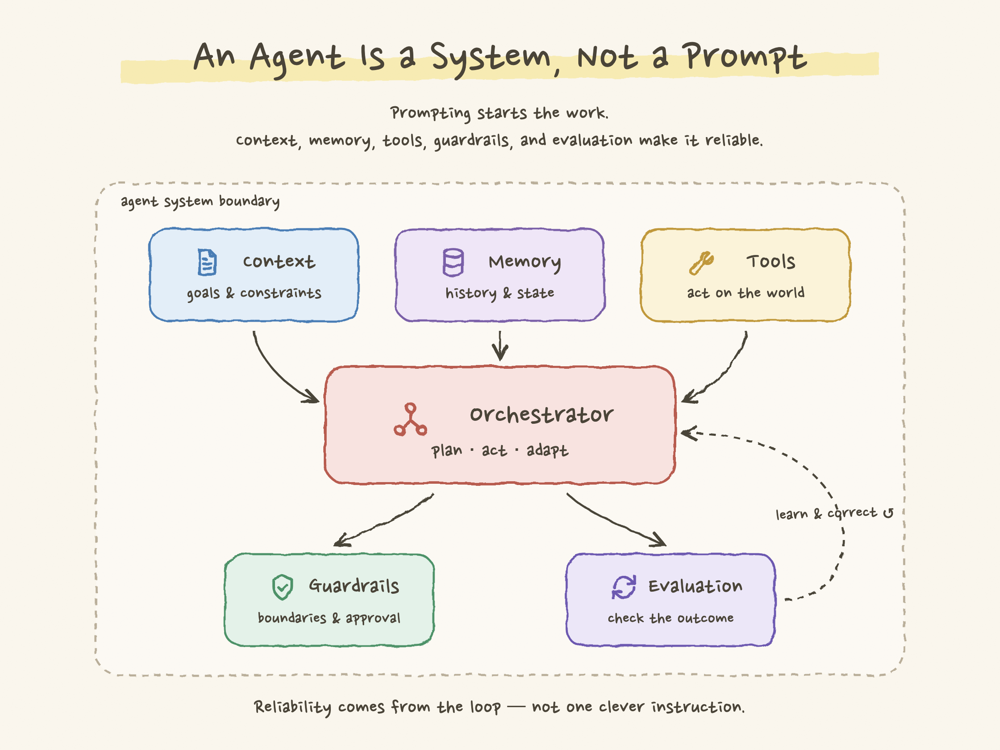

# Examples — svg-infographic

**English** · [한국어](./README.ko.md)

Real outputs from the [`svg-infographic`](../../skills/svg-infographic) skill. Each example is a flat, structural visual shipped as source SVG + 2× PNG, in English and Korean, with the prompt that generated it.

Every example was created for this repository using synthetic, non-client, non-confidential content. Together they cover several archetypes the skill supports.

_The preview above highlights six examples, including two made with the sketch preset. All fourteen examples are listed below._

## Gallery

### 1. Technical infographic — flagship

Concept infographics: nested/onion models + icon cards.

→ [`technical-infographic/`](./technical-infographic) · English + 한국어

### 2. Before / after migration

Comparison archetype: two equal panels, semantic colors, ✓/✕ points.

→ [`before-after-migration/`](./before-after-migration) · English + 한국어

### 3. Process / data flow

Flow archetype: left-to-right nodes with icons and arrows (a RAG query pipeline).

→ [`process-flow/`](./process-flow) · English + 한국어

### 4. Roadmap / timeline

Timeline archetype: phases, status dots, a "now" marker, milestone cards.

→ [`roadmap/`](./roadmap) · English + 한국어

### 5. Cloud infrastructure topology

Architecture/topology proof: zones, components with icon badges, request-path arrows.

→ [`cloud-infra-topology/`](./cloud-infra-topology) · English + 한국어

### 6. Skill overview — self-demo

The skill introducing itself: the diagram types it makes, how it works, scope.

→ [`skill-overview/`](./skill-overview) · English + 한국어

### 7. AI code review loop

Flow archetype (feature demo): left-to-right cards with an emphasized "key step",
a legend, and a dashed feedback loop — an AI-in-the-loop PR review cycle.

→ [`ai-code-review-loop/`](./ai-code-review-loop) · English + 한국어

### 8. AI agent task selection matrix

Decision-matrix archetype: a 2×2 quadrant grid with axis labels and direction
arrows, a number badge + icon per quadrant, recommendation pills, and one
emphasized quadrant — choosing an AI agent's execution mode by scope and
uncertainty.

→ [`agent-task-matrix/`](./agent-task-matrix) · English + 한국어

### 9. CI/CD artifact promotion

Pipeline archetype: a build-once / promote-the-same-digest release model across
three labelled bands — build, promote (dev → test → prod behind an approval
gate), and release fix (a test bug produces a new RC).

→ [`ci-cd-artifact-promotion/`](./ci-cd-artifact-promotion) · English + 한국어

### 10. Issue tracker ↔ CI/CD approval flow

Flow + state-rail archetype: an issue key threads commit → build → test →
approval → prod deploy, with a parallel issue-state rail (Open → In Progress →
In Test → Approved → Deployed) and the approval gate modelled as a state
transition.

→ [`issue-tracker-cicd-approval-flow/`](./issue-tracker-cicd-approval-flow) · English + 한국어

### 11. Zero trust onion model

Nested/onion archetype: four concentric rings with a uniform computed inset,
light-to-saturated color progression, ring labels in each ring's top strip, and
an emphasized least-privilege data core.

→ [`zero-trust-onion/`](./zero-trust-onion) · English + 한국어

### 12. Agent waiting-alert swimlane

Flow archetype, swimlane variant: agent session states and user actions in two
lanes with aligned stage columns, an emphasized "waiting" step, and labelled
dashed cross-lane arrows (alert down, one-click approval up).

→ [`agent-waiting-swimlane/`](./agent-waiting-swimlane) · English + 한국어

### 13. Incident response loop — sketch preset

The first **sketch preset** example ("tidy hand-drawn"): paper background,
subset-embedded Korean handwriting font, rough strokes, underline highlighter —
with the layout still computed. A detect → triage → respond → recover → retro
loop with a minor-issue branch to the backlog.

→ [`incident-response-sketch/`](./incident-response-sketch) · English + 한국어

### 14. Agent system map — sketch preset

A **sketch preset** component architecture: Context, Memory, and Tools feed a
central Orchestrator; Guardrails and Evaluation sit below, with evaluation
feeding corrections back into the loop. It shows that the tidy hand-drawn
surface works beyond process flows while the topology stays computed.

→ [`agent-system-sketch/`](./agent-system-sketch) · English + 한국어

## Quality bar (every example passes)

- [x] SVG and PNG dimensions match (PNG is exactly 2× the SVG viewBox)
- [x] No text overflow; text vertically centered in its box
- [x] No tofu — Korean/CJK glyphs render correctly
- [x] `<title>` / `<desc>` present for accessibility
- [x] No host-specific or client paths in the source
- [x] Icons render (no broken `<use>` references); paired boxes have visible gutters

## Render smoke test (per OS)

The bundled [`scripts/render.sh`](../../skills/svg-infographic/scripts/render.sh) discovers a Chromium-based browser (macOS, Linux, and Windows Git Bash paths) and verifies the exported PNG dimensions; manual per-OS commands, including native PowerShell, are in [`references/authoring.md`](../../skills/svg-infographic/references/authoring.md) §8. So far, PNG export has been smoke-tested on macOS (all fourteen examples); Windows/Linux render verification is still pending.

| Environment | Browser | en/ko SVG → 2× PNG | Status |
| --- | --- | --- | --- |
| macOS 15 | Chrome (headless) | all 14 examples | ✅ verified — correct 2× dimensions, no tofu |
| Windows 10/11 | Chrome / Edge | script (Git Bash) + documented manual path | ⏳ expected; render verification pending |
| Linux / WSL | Chrome / Chromium | script + documented manual path | ⏳ expected; render verification pending (install Noto Sans CJK/KR for Korean) |

## Scope

Flat, structural technical diagrams, plus the opt-in **sketch preset** ("tidy hand-drawn" — hand-drawn
appearance, computed layout). Mascots, character art, and scene illustration remain **out of scope**; keeping
that boundary is what makes the output consistent.
