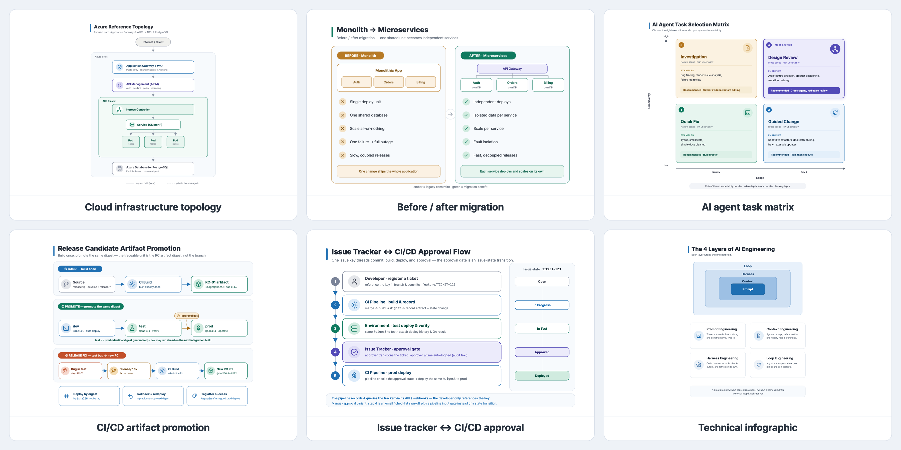
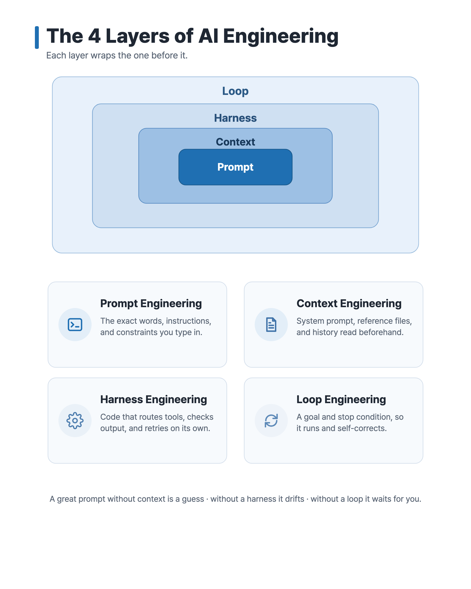
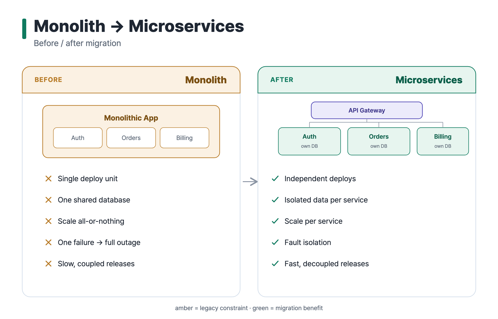
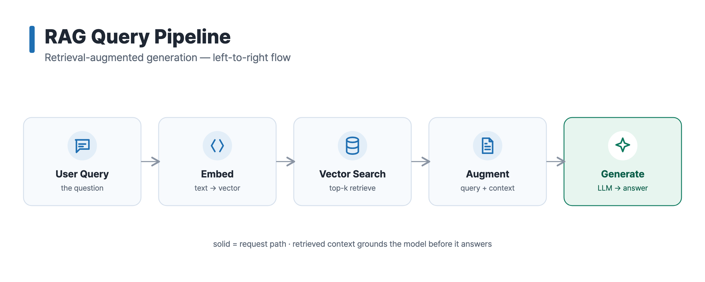
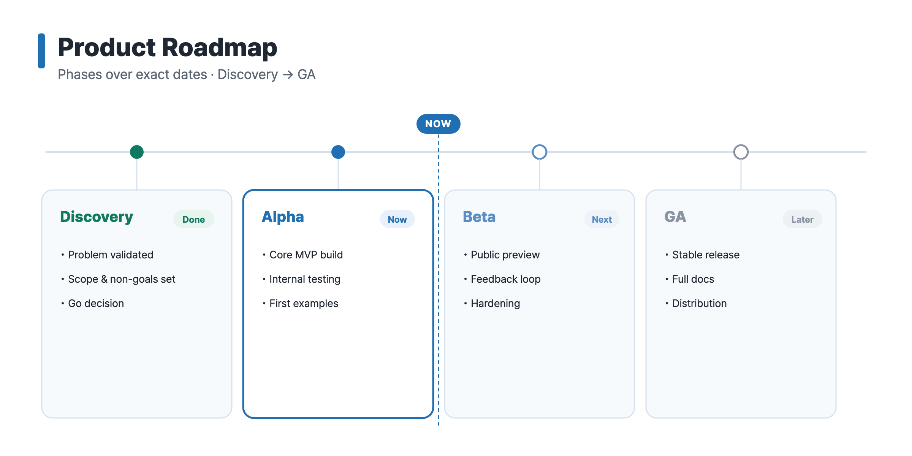
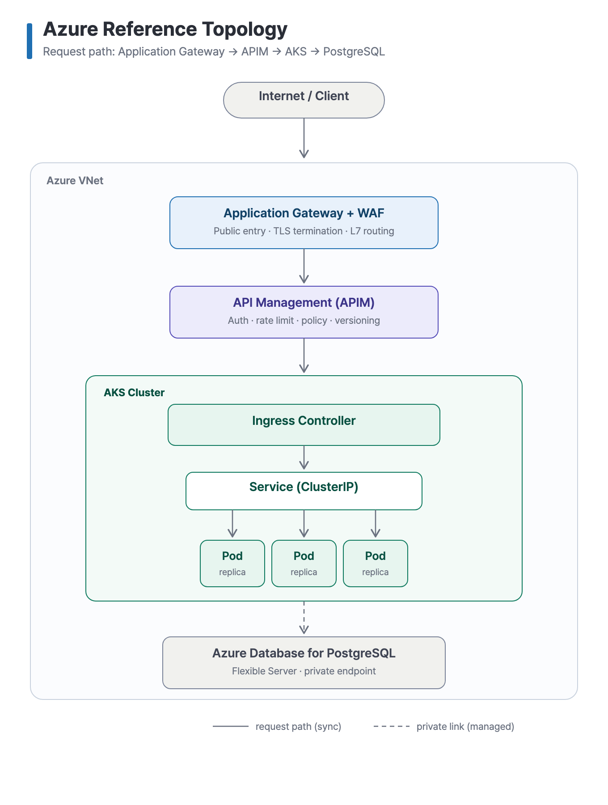
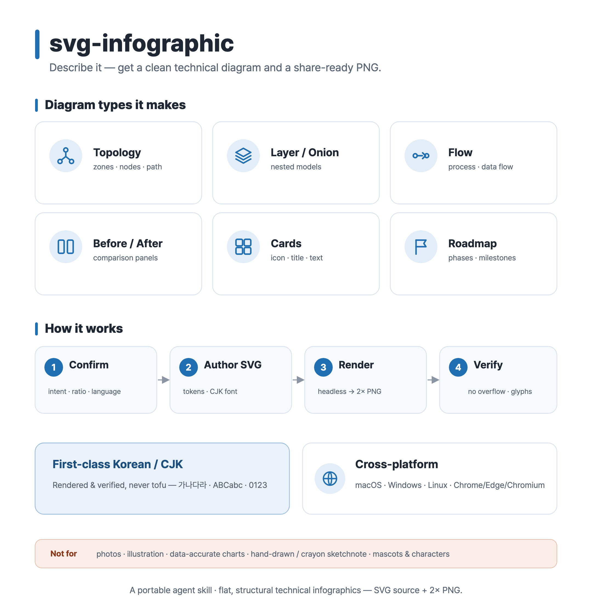
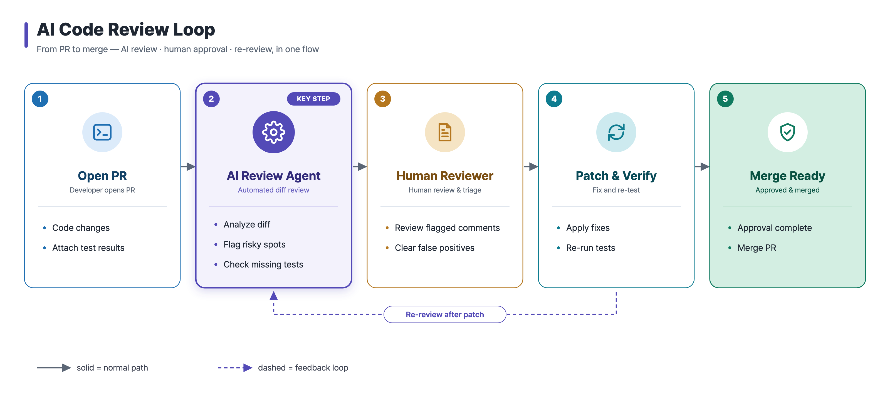
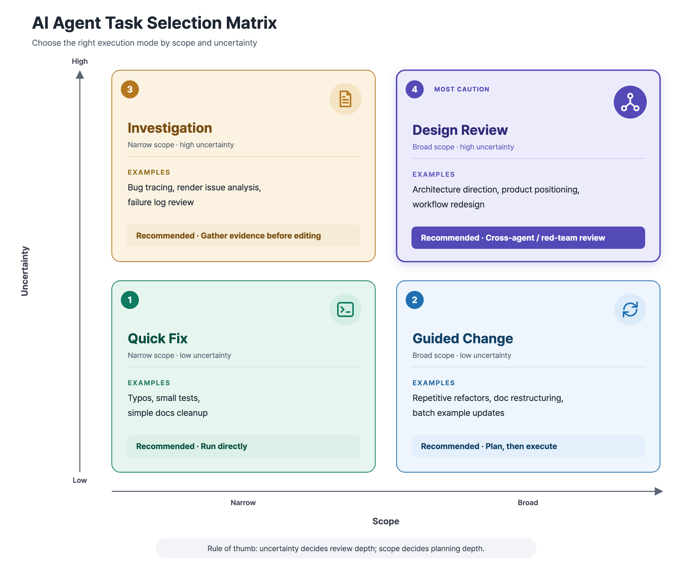

# Examples — svg-infographic

Real outputs from the [`svg-infographic`](../../skills/svg-infographic) skill. Each example is a flat, structural visual shipped as source SVG + 2× PNG, in English and Korean, with the prompt that generated it.

Every example is originally authored, synthetic, non-client, and non-confidential. Together they cover several archetypes the skill advertises.

## Gallery

### 1. Technical infographic — flagship

Concept infographics: nested/onion models + icon cards.

→ [`technical-infographic/`](./technical-infographic) · English + 한국어

### 2. Before / after migration

Comparison archetype: two equal panels, semantic colors, ✓/✕ points.

→ [`before-after-migration/`](./before-after-migration) · English + 한국어

### 3. Process / data flow

Flow archetype: left-to-right nodes with icons and arrows (a RAG query pipeline).

→ [`process-flow/`](./process-flow) · English + 한국어

### 4. Roadmap / timeline

Timeline archetype: phases, status dots, a "now" marker, milestone cards.

→ [`roadmap/`](./roadmap) · English + 한국어

### 5. Cloud infrastructure topology

Architecture/topology proof: zones, components with icon badges, request-path arrows.

→ [`cloud-infra-topology/`](./cloud-infra-topology) · English + 한국어

### 6. Skill overview — self-demo

The skill introducing itself: the diagram types it makes, how it works, scope.

→ [`skill-overview/`](./skill-overview) · English + 한국어

### 7. AI code review loop

Flow archetype (feature demo): left-to-right cards with an emphasized "key step",
a legend, and a dashed feedback loop — an AI-in-the-loop PR review cycle.

→ [`ai-code-review-loop/`](./ai-code-review-loop) · English + 한국어

### 8. AI agent task selection matrix

Decision-matrix archetype: a 2×2 quadrant grid with axis labels and direction
arrows, a number badge + icon per quadrant, recommendation pills, and one
emphasized quadrant — choosing an AI agent's execution mode by scope and
uncertainty.

→ [`agent-task-matrix/`](./agent-task-matrix) · English + 한국어

## Quality bar (every example passes)

- [x] SVG and PNG dimensions match (PNG is exactly 2× the SVG viewBox)
- [x] No text overflow; text vertically centered in its box
- [x] No tofu — Korean/CJK glyphs render correctly
- [x] `<title>` / `<desc>` present for accessibility
- [x] No host-specific or client paths in the source
- [x] Icons render (no broken `<use>` references); paired boxes have visible gutters

## Render smoke test (per OS)

Windows and Linux install paths are documented in [`SKILL.md`](../../skills/svg-infographic/SKILL.md) §6 and are expected to work with Chrome/Edge/Chromium. For v0.1.0, PNG export has been smoke-tested on macOS; Windows/Linux render verification is still pending.

| Environment | Browser | en/ko SVG → 2× PNG | Status |
| --- | --- | --- | --- |
| macOS 15 | Chrome (headless) | all 8 examples | ✅ verified — correct 2× dimensions, no tofu |
| Windows 10/11 | Chrome / Edge | documented path | ⏳ expected; render verification pending |
| Linux / WSL | Chrome / Chromium | documented path | ⏳ expected; render verification pending (install Noto Sans CJK/KR for Korean) |

## Scope

Flat, structural technical diagrams only. Hand-drawn / crayon "sketchnote" styles, mascots, and character illustration are **out of scope** — keeping that line is what keeps the output consistent.
