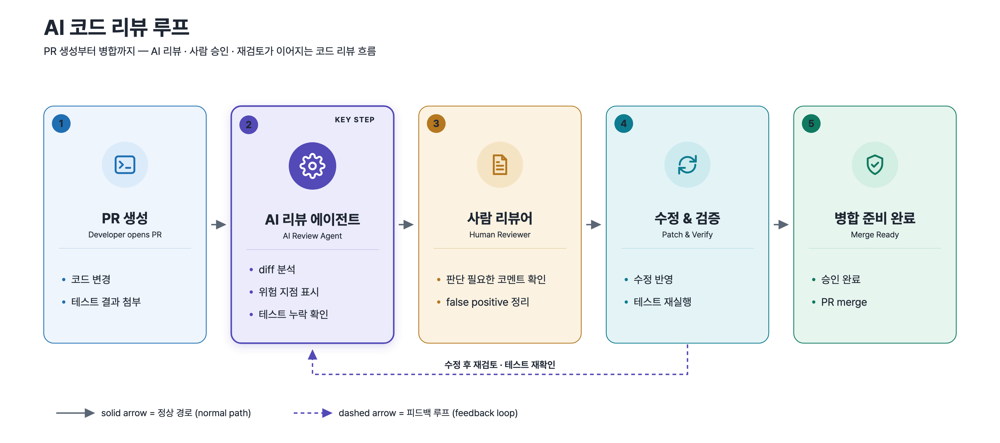

<!-- 한국어는 아래 -->

# Example: AI Code Review Loop

A left-to-right process flow showing an AI-assisted pull-request review cycle —
from opening a PR, through an AI review agent and a human reviewer, to patch &
verify and a merge-ready state — produced by `svg-infographic`, in English and
Korean. The AI review step is emphasized, and a dashed feedback loop shows
re-review after a patch.

| English | 한국어 |
| --- | --- |
|  |  |

## Output files

| File | Role |
| --- | --- |
| `ai-code-review-loop.en.svg` | English source (editable) |
| `ai-code-review-loop.en.png` | English 2× export (3200×1420) |
| `ai-code-review-loop.ko.svg` | Korean source (editable) |
| `ai-code-review-loop.ko.png` | Korean 2× export (3200×1420) |

SVG is the editable source of truth; PNG is the 2× export (exactly twice the SVG
`viewBox`) for slides, docs, and social.

## Provenance

Originally authored synthetic example. Non-client, non-confidential. A generic
illustration of an AI-in-the-loop code review workflow, not derived from any
engagement artifact.
(오리지널 합성 예제. 특정 고객·기밀과 무관하며 실제 프로젝트 산출물에서 파생하지 않았다.)

## Prompt (English)

```text
Use svg-infographic to make a clean flat technical infographic titled "AI Code
Review Loop": a left-to-right process flow with five rounded cards, each with a
line icon — Open PR → AI Review Agent → Human Reviewer → Patch & Verify → Merge
Ready. Emphasize the AI Review Agent card with an accent color. Connect the cards
with solid arrows for the normal path, and add a dashed feedback loop from Patch
& Verify back to AI Review Agent. Add a small legend: solid = normal path, dashed
= feedback loop. Export SVG + 2× PNG.
```

---

# 예제: AI 코드 리뷰 루프

개발자가 PR을 올린 뒤 AI 리뷰 에이전트가 검토하고, 사람이 승인하고, 수정이 다시
반영되는 흐름을 좌→우 프로세스 플로우로 그린 예제다. `svg-infographic`으로 영문·한글
두 본을 만들었다. AI 리뷰 단계는 accent 색으로 강조하고, 수정 후 재검토를 나타내는
점선 피드백 루프를 포함한다.

## 프롬프트 (한국어)

```text
svg-infographic으로 "AI 코드 리뷰 루프" 제목의 깔끔한 flat technical 인포그래픽을 만들어줘.
좌→우 프로세스 플로우로, 각 단계는 line 아이콘이 있는 둥근 카드 5개 —
PR 생성 → AI 리뷰 에이전트 → 사람 리뷰어 → 수정 & 검증 → 병합 준비 완료.
AI 리뷰 에이전트 카드는 강조 색으로 표시. 카드는 정상 경로를 나타내는 실선 화살표로 연결하고,
수정 & 검증에서 AI 리뷰 에이전트로 돌아가는 점선 피드백 루프를 추가. 작은 legend 추가:
실선 = 정상 경로, 점선 = 피드백 루프. SVG + 2x PNG로 export.
```
