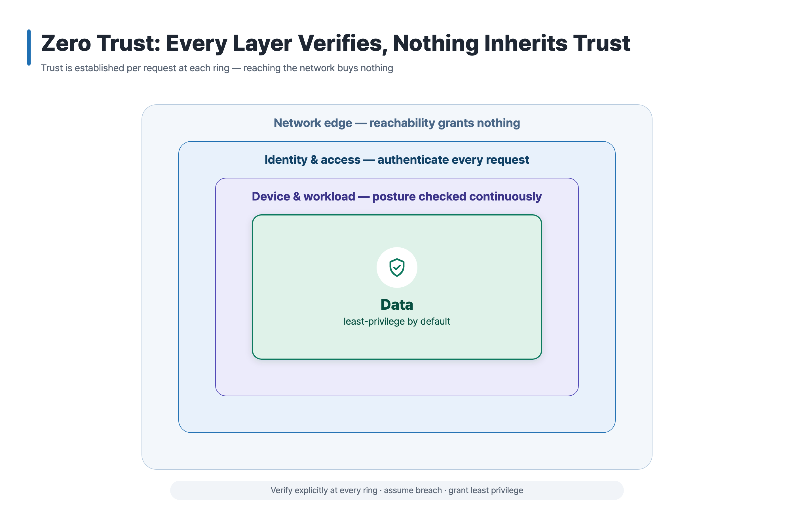
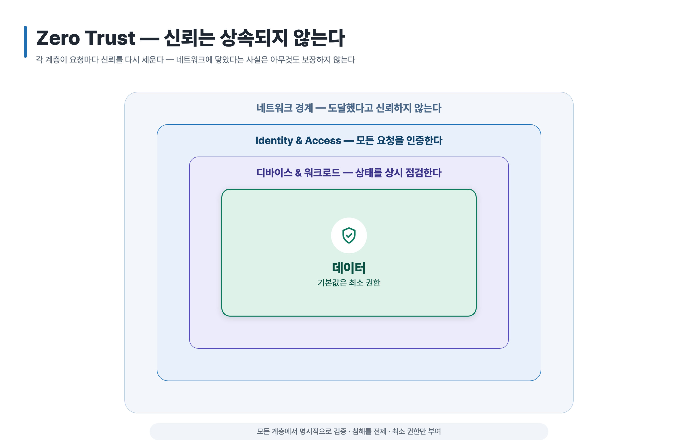

<!-- 한국어는 아래 -->

# Example: Zero Trust Onion Model

A nested "onion" model produced by `svg-infographic`, in English and Korean. Four
concentric rings — network edge, identity & access, device & workload, and a
least-privilege **data core** — show that in a zero-trust design, trust is
established per request at every ring and never inherited from the outer layer.

| English | 한국어 |
| --- | --- |
|  |  |

## What this example shows

- **Nested / onion archetype** — concentric rounded rings with a **uniform inset**
  (computed in the layout pass, not eyeballed)
- Ring labels centered in each ring's **visible top strip**, in that ring's own ink color
- **Light (outer) → saturated (inner)** color progression toward the emphasized core
- An emphasized **core card** (stroke + soft shadow + white icon circle + shield icon)
- A muted **rule-of-thumb footer strip** below the diagram
- A **conclusion-style title** ("nothing inherits trust") instead of a topic label

## Output files

| File | Role |
| --- | --- |
| `zero-trust-onion.en.svg` | English source (editable) |
| `zero-trust-onion.en.png` | English 2× export (2800×1800) |
| `zero-trust-onion.ko.svg` | Korean source (editable) |
| `zero-trust-onion.ko.png` | Korean 2× export (2800×1800) |

SVG is the editable source of truth; PNG is the 2× export (exactly twice the SVG
`viewBox`). Both language variants share identical geometry — only the text differs.

## Provenance

Sample content is synthetic. Names, identifiers, tools, and environments are
placeholders; no customer or confidential identifiers are included.
(샘플 내용은 합성 예제입니다. 이름, 식별자, 도구, 환경은 placeholder이며
고객·기밀 식별자는 포함하지 않습니다.)

## Prompt (English)

```text
Use svg-infographic to draw a nested onion model of zero-trust access.
Four rings, outside in: Network edge (reachability grants nothing) →
Identity & access (authenticate every request) → Device & workload
(posture checked continuously) → Data core (least-privilege by default).
Make the title a conclusion, not a topic — something like "Zero Trust:
Every Layer Verifies, Nothing Inherits Trust". Go light on the outer ring
and saturated on the core, emphasize the core with a shield icon, and add
a small rule-of-thumb strip at the bottom: verify explicitly · assume
breach · least privilege. Wide 1400×900 canvas. Export SVG + 2× PNG.
```

---

# 예제: Zero Trust 온니언 모델

zero-trust 접근 구조를 nested "onion" 모델로 표현한 예제입니다(영문·한글).
네트워크 경계 → Identity & Access → 디바이스 & 워크로드 → 최소 권한 **데이터
코어**의 동심 링 4개로, 신뢰가 바깥 계층에서 상속되지 않고 각 링에서 요청마다
다시 세워진다는 결론을 시각화합니다.

## 이 예제가 보여주는 것

- **Nested / onion archetype** — layout pass에서 **균일 inset**으로 계산된 동심 링
- 각 링의 **보이는 상단 strip** 중앙에, 그 링의 ink 색으로 배치한 링 라벨
- 강조 코어를 향한 **밝음(외곽) → 진함(코어)** 색 진행
- **코어 카드 강조**(stroke + soft shadow + 흰 아이콘 원 + shield 아이콘)
- 다이어그램 아래 차분한 **rule-of-thumb footer strip**
- 주제 라벨이 아닌 **결론형 제목**("신뢰는 상속되지 않는다")

## 프롬프트 (한국어)

```text
svg-infographic으로 zero-trust 접근을 nested onion 모델로 그려줘.
바깥부터 링 4개: 네트워크 경계(도달했다고 신뢰하지 않음) → Identity & Access
(모든 요청 인증) → 디바이스 & 워크로드(상태 상시 점검) → 데이터 코어(기본값은
최소 권한). 제목은 주제가 아니라 결론으로 — "Zero Trust — 신뢰는 상속되지
않는다" 같은 형태. 외곽 링은 밝게, 코어는 진하게 하고 코어를 shield 아이콘으로
강조해줘. 하단에 작은 rule-of-thumb strip: 명시적 검증 · 침해 전제 · 최소 권한.
wide 1400×900 캔버스. SVG + 2x PNG로 export.
```
