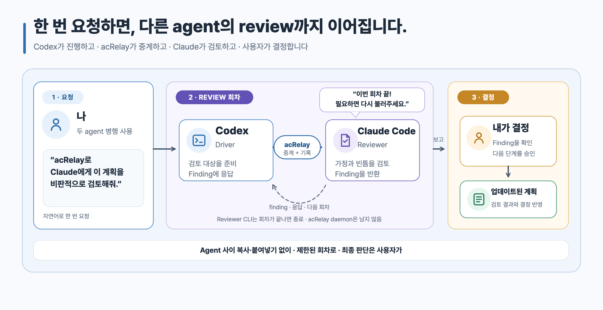

# acRelay Skill

[English](./README.md) · **한국어**

계획이나 구현 결과를 다른 coding agent와 함께 검토하면 방향을 더 정교하게
다듬고, driver가 놓친 결함을 찾고, 결과물의 완성도를 높일 수 있습니다. 이 Skill은
이런 review를 자연어로 쉽게 시작하도록 돕습니다.

이 문서에서는 지금 작업을 진행하는 agent를 **driver**, 별도로 검토하는 CLI를
**reviewer**, 최종 결정을 내리는 사용자를 **owner**라고 부릅니다.

독립된 [acRelay engine](https://github.com/kyungseo/acrelay)을 자연어로
사용하도록 안내하는 Skill입니다. Engine은 실행 파일 하나로 배포되며, 별도의
acRelay 전용 daemon, server 또는 database를 사용하지 않습니다. Engine과 이
Skill을 설치한 뒤 계획, 문서, 파일 하나, 선택한 구현 파일 또는 지정한 directory
tree를 review해 달라고 요청하면 됩니다. Skill은 별도 기능을 만들거나 Engine을
우회하지 않고, 지정된 Engine의 기능을 그대로 사용합니다.

두 구성요소가 맡는 일은 다릅니다.

- **Skill:** 자연어 요청을 acRelay에게 전달합니다.
- **Engine:** 파일을 확인하고 별도의 Claude Code 또는 Codex CLI reviewer를
  시작해 결과를 기록합니다.

> [!IMPORTANT]
> Skill과 engine을 모두 설치해야 합니다. Skill만으로는 review를 실행할 수
> 없습니다.

[](./assets/acrelay-review-flow.ko.svg)

## 어떤 수작업을 줄이는가

수동으로 진행하면 매 회차마다 요청을 reviewer에게 복사하고 결과를 다시 driver에게
복사해야 합니다. 3회차면 최대 6번을 복사·붙여넣게 됩니다.

| 사용 전 | acRelay Skill 사용 |
| --- | --- |
| Agent 사이에서 매 요청과 결과를 전달 | 자연어로 시작하면 Skill이 engine 호출 |
| 검토한 revision과 남은 finding을 직접 기억 | Revision, finding과 응답을 사용자 컴퓨터의 기록 하나에 보관 |
| 누군가 동의할 때까지 대화가 이어짐 | 1–5회(기본 3회) 안에서 검토하고 owner에게 결정 반환 |

한 번 호출하면 범위가 정해진 review objective 하나를 시작하며, review 회차는
1–5회(기본 3회) 진행할 수 있습니다. acRelay는 호출할 때만 실행하며 백그라운드
service로 계속 동작하지 않습니다.

## 공개 상태

이 Skill은 **Public Validation Preview**에 포함됩니다. 아직 **Experimental**
단계이고 더 넓은 검증은 **Validation pending**이며, Claude Code나 Codex에
일반적인 `Supported` 상태를 표시하지 않습니다. 작성자가 두 reviewer 경로에서
실제 review를 완료했지만, Skillstead가 일반적인 `Supported` 상태로 표시하기
전에 초대된 비작성자 검증이 더 필요합니다. Package는 Skillstead default
branch에서 제공하며 `v0.8.0` tag에는 포함되지 않습니다.

`검증 대기`는 package가 없다는 뜻이 아닙니다. 문서화된 preview를 평가할 수는
있지만 Skillstead가 아직 일반적인 runtime 지원을 주장하지 않는다는 뜻입니다.

## 시작 전 준비

Codex App, Codex CLI 또는 Claude Code를 이미 사용하고 있어야 합니다. Review는
Claude Code CLI나 Codex CLI를 통해 실행하므로 둘 중 하나는 미리 설치하고
로그인해 정상 실행되는 상태여야 합니다. Codex App은 driver가 될 수 있지만
reviewer는 CLI에서 실행됩니다.

여기서 **App**은 데스크톱 화면, **CLI**는 Terminal에서 실행하는 command를
뜻합니다. Skill과 engine은 reviewer 도구를 대신 설치하거나 로그인하지 않습니다.

## Engine 설치

Terminal에서 exact `v0.1.0-alpha.2` `acrelay` command를 바로 실행할 수 있어야
합니다(`PATH`에 있어야 합니다). 현재 미리 build해 제공하는 binary는 macOS Apple
Silicon(`darwin/arm64`)용입니다. Terminal에서 `uname -m`을 실행하고 결과가
`arm64`일 때만 이 installer를 사용하세요. Installer는 `latest`로 바꾸지
않습니다.

```sh
curl -fsSL https://raw.githubusercontent.com/kyungseo/acrelay/v0.1.0-alpha.2/scripts/install.sh | bash
```

Installer는 release에 고정돼 있으며 binary archive를 공개 checksum과 대조합니다.
실행 전에 installer 내용을 확인하거나 고정 version의 `go install`을 사용하려면
[acRelay 설치 안내](https://github.com/kyungseo/acrelay/blob/v0.1.0-alpha.2/docs/OPERATIONS.ko.md)를
따르세요.

다음 platform 지원 대상은 Windows입니다. Windows core runtime lane은 이미
검증했으며, 다음 단계에서 Claude Code·Codex review를 검증하고 필요한 patch를
반영합니다. Linux core runtime CI는 source test matrix에 유지하지만, 이번
preview에는 Linux artifact와 live-review 지원이 없습니다. 조합을 검증하기
전까지 engine은 파일을 보내기 전에 중단합니다.

## Skill preview 설치

Preview는 공개된 Skillstead `v0.8.0` tag에 포함되지 않습니다. Default branch에서
설치하고, `SKILL.md`만 복사하지 말고 `skills/acrelay` 폴더 전체를 복사합니다.

### Claude Code

```sh
git clone --depth 1 https://github.com/kyungseo/skillstead.git /tmp/skillstead
mkdir -p "$HOME/.claude/skills"
cp -R /tmp/skillstead/skills/acrelay "$HOME/.claude/skills/"
```

### Codex

```sh
git clone --depth 1 https://github.com/kyungseo/skillstead.git /tmp/skillstead
mkdir -p "$HOME/.agents/skills"
cp -R /tmp/skillstead/skills/acrelay "$HOME/.agents/skills/"
```

새로 복사한 Skill이 보이지 않으면 agent host를 재시작하세요. 프로젝트별 설치
경로, Windows 복사 명령, 깨끗한 update와 제거는
[Skillstead 설치 안내](../../docs/INSTALL.ko.md)를 참고하세요.

Skill은 engine을 자동으로 설치하거나 update하지 않습니다. Engine이 없거나
version이 다르면 이유를 설명하고 중단하며, acRelay를 우회해 reviewer를 직접
호출하지 않습니다.

## 요청 예시

### 계획에 반대 의견 받기

```text
acRelay로 Claude에게 이 계획을 비판적으로 검토해 달라고 해줘. 마지막에 내가 결정해야 할 내용만 정리해줘.
```

별도로 지정하지 않으면 최대 3회차로 진행합니다. 필요하면 1~5회 안에서 원하는
제한을 요청할 수 있습니다.

### 파일 하나 review

```text
acRelay로 Codex에게 이 파일을 검토하게 해줘. 확인한 근거와 발견한 문제를 정리해줘.
```

### 구현 결과 review

```text
acRelay로 현재 구현 결과가 승인된 계획과 맞는지 검토하고, 어긋난 점을 정리해줘.
```

acRelay v0.1.0-alpha.2는 파일 하나, 명시한 여러 파일 또는 지정한 subtree를
받습니다. PR URL, staged patch, commit range 또는 branch comparison을 직접
선택하는 기능은 아직 없습니다. 원하는 revision을 checkout한 뒤 파일이나 subtree를
지정하세요.

### Claude Code나 Codex 중 하나만 사용할 때

```text
지금 Claude Code에서 작업 중이야. 별도의 Claude Code CLI를 reviewer로 사용해서 이 작업을 검토해줘.
```

같은 도구의 별도 CLI session을 reviewer로 둘 수 있습니다. Claude Code나 Codex
중 하나만 쓸 때 유용하지만, driver와 reviewer가 같은 맹점을 공유할 수 있습니다.
이 preview는 CLI session을 통해 review하며, driver 도구의 내장 subagent 결과를
직접 받지는 않습니다.

### Driver와 reviewer 선택

| 사용 방식 | Driver | Reviewer |
| --- | --- | --- |
| Codex App에서 작업 | Codex App | Claude Code CLI 또는 Codex CLI |
| Claude Code에서 작업 | Claude Code CLI | Codex CLI 또는 별도의 Claude Code CLI session |
| Claude Code만 사용 | Claude Code CLI | 별도의 Claude Code CLI session |
| Codex만 사용 | Codex CLI | 별도의 Codex CLI session |

- Claude Code CLI와 Codex CLI는 이 preview에 적힌 조합에서 driver 또는
  reviewer가 될 수 있습니다.
- Codex App은 driver가 될 수 있지만 reviewer는 CLI여야 합니다.
- Claude App에는 acRelay를 직접 사용하는 경로가 없습니다.
- Antigravity는 이번 preview에 포함되지 않습니다.

다른 도구의 reviewer는 driver가 놓친 가정을 다른 관점에서 검토할 수 있습니다.
같은 도구의 별도 session도 유용하지만, acRelay는 두 context가 같은 맹점을
공유할 수 있다는 caution을 기록합니다.

### 현재 상태 확인

```text
진행 중인 acRelay review의 현재 상태와 내가 결정할 내용을 요약해줘.
```

## Review 전에 확인하는 내용

- Review할 정확한 파일, 파일 묶음 또는 subtree
- Review 질문
- Reviewer로 사용할 Claude Code 또는 Codex
- Owner가 누구인지
- 비공개 Markdown review 기록을 둘 위치
- Review 내용, 해석된 경로와 metadata를 선택한 reviewer service로 보내도 되는지
- Driver와 reviewer context의 관계
- 기본 3회차 제한을 사용할지

Reviewer CLI는 provider network와 model token을 사용할 수 있습니다. Review
기록이 로컬에 있다는 말은 model도 로컬에서 실행된다는 뜻이 아닙니다.

## 지켜지는 경계

- Review state, evidence, 복구, cleanup과 Close는 Skill이 아니라 binary가
  담당합니다.
- acRelay는 reviewer 실행만 자동화하며 driver 응답이나 owner 결정은 자동화하지
  않습니다.
- 별도의 context나 reviewer vendor를 사용해도 독립적인 판단이 증명되지는
  않습니다.
- 기록된 발췌문은 이해, 완전성 또는 정확성을 증명하지 않습니다.
- `briefing`은 현재 기록을 요약할 뿐 approval이 아닙니다.
- `UNKNOWN`으로 기록된 reviewer 실행은 자동으로 다시 시도하지 않습니다.
- Binary나 Skill을 제거해도 `~/.acrelay`, 비공개 review 기록 또는 reviewer
  vendor data는 삭제되지 않습니다.

정확한 command, format, platform 근거와 복구 규칙은
[acRelay engine 문서](https://github.com/kyungseo/acrelay)를 참고하세요.
