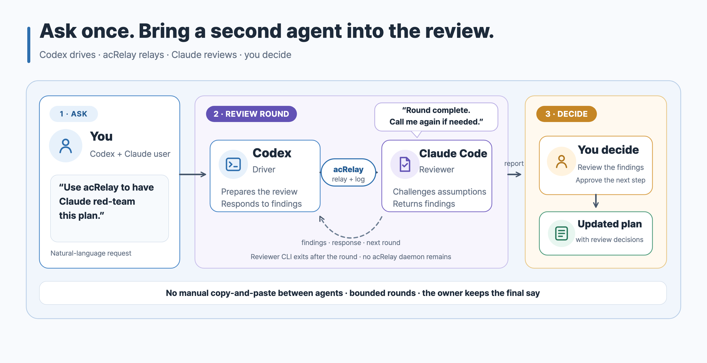

# acRelay Skill

**English** · [한국어](./README.ko.md)

Reviewing a plan or implementation with another coding agent can improve its
direction, reveal defects that the driver missed, and make the final result
more complete. This Skill makes those reviews easy to start in natural
language.

In this guide, the agent doing the work is the **driver**, the separate CLI
that challenges the work is the **reviewer**, and the person who makes the
final decision is the **owner**.

This Skill is a natural-language guide for the standalone
[acRelay engine](https://github.com/kyungseo/acrelay). The engine is distributed
as one executable and does not use a dedicated daemon, server, or database.
Install the engine, install this Skill, and ask for a review of a plan,
document, file, selected implementation files, or a declared directory tree.
The Skill uses the engine's provided capabilities as-is; it does not
reimplement or bypass the engine.

The two parts have different jobs:

- **Skill:** passes your natural-language request to acRelay.
- **Engine:** checks the files, starts a separate Claude Code or Codex CLI
  reviewer, and records the result.

> [!IMPORTANT]
> Install both the Skill and the engine. The Skill cannot run a review by
> itself.

[](./assets/acrelay-review-flow.svg)

## What It Replaces

For every manual round, someone normally copies the request to the reviewer and
copies the result back to the driver. Three rounds can require six
copy-and-paste handoffs.

| Before | With the acRelay Skill |
| --- | --- |
| Move each request and result between agents | Start in natural language; the Skill calls the engine |
| Remember the reviewed revision and open findings | Keep the revision, findings, and responses in one record on your computer |
| Let the conversation drift until someone agrees | Use 1–5 review rounds (default 3), then return the decision to the owner |

Each invocation starts one bounded review objective, which may use 1–5 review
rounds (default 3). acRelay runs only when invoked and never continues as a
background service.

## Publication Status

This Skill is part of the **Public Validation Preview**. It is
**Experimental**, broader validation is still **pending**, and neither Claude
Code nor Codex is presented as generally `Supported`. The author completed
live reviews through both reviewer paths, but an invited non-author still needs
to validate the experience before Skillstead presents it as generally
`Supported`. The package is available from Skillstead's default branch but is
not included in the `v0.8.0` tag.

`Pending` does not mean the package is missing. It means this documented
preview is available to evaluate, but Skillstead does not yet claim general
runtime support.

## Before You Start

You should already be using Codex App, Codex CLI, or Claude Code. A review
runs through Claude Code CLI or Codex CLI, so at least one of those reviewer
CLIs must already be installed, signed in, and working. Codex App can drive the
work, but the reviewer still runs through a CLI.

Here, **App** means the desktop interface and **CLI** means a command that runs
in Terminal. The Skill and engine do not install or sign in to reviewer tools.

## Install The Engine

The exact `v0.1.0-alpha.2` `acrelay` command must be available from Terminal
(on `PATH`). The current prebuilt binary is for macOS Apple Silicon
(`darwin/arm64`). In Terminal, run `uname -m` and continue with this installer
only when the result is `arm64`. The installer never substitutes `latest`.

```sh
curl -fsSL https://raw.githubusercontent.com/kyungseo/acrelay/v0.1.0-alpha.2/scripts/install.sh | bash
```

The installer is pinned to the release and checks the binary archive against
its published checksum. If you prefer to inspect the installer before running
it, or want the pinned `go install` alternative, follow the
[acRelay installation guide](https://github.com/kyungseo/acrelay/blob/v0.1.0-alpha.2/docs/OPERATIONS.md).

Windows is the next platform-support target. Its core runtime lane is already
verified; platform-specific Claude Code and Codex review validation comes next,
followed by any patches that evidence requires. Linux core runtime CI remains
in the source test matrix, but this preview provides no Linux artifact or
live-review support. Until a combination is verified, the engine stops before
sending files.

## Install The Skill Preview

The preview is not included in the published `v0.8.0` Skillstead tag. Install
it from the default branch and copy the complete `skills/acrelay` folder; do
not copy `SKILL.md` by itself.

### Claude Code

```sh
git clone --depth 1 https://github.com/kyungseo/skillstead.git /tmp/skillstead
mkdir -p "$HOME/.claude/skills"
cp -R /tmp/skillstead/skills/acrelay "$HOME/.claude/skills/"
```

### Codex

```sh
git clone --depth 1 https://github.com/kyungseo/skillstead.git /tmp/skillstead
mkdir -p "$HOME/.agents/skills"
cp -R /tmp/skillstead/skills/acrelay "$HOME/.agents/skills/"
```

Restart the agent host if it does not recognize the newly copied Skill. See the
[Skillstead install guide](../../docs/INSTALL.md) for project-local paths,
Windows copy commands, clean updates, and removal.

The Skill never installs or upgrades the engine automatically. A missing or
different engine version stops with an explanation; it never bypasses acRelay
by calling the reviewer directly.

## Example Requests

### Challenge a plan

```text
Use acRelay to have Claude challenge this plan. Summarize the decisions I need to make at the end.
```

If you do not specify a limit, acRelay allows up to three review rounds. You
may request any limit from one to five.

### Review one file

```text
Use acRelay to have Codex review this file. Summarize the evidence it checked and the problems it found.
```

### Review an implementation

```text
Use acRelay to check whether the current implementation matches the approved plan and summarize any gaps.
```

acRelay v0.1.0-alpha.2 accepts a file, explicit files, or a declared subtree.
It does not yet accept a PR URL, staged patch, commit range, or branch
comparison as a first-class selector. Check out the intended revision and name
the files or subtree instead.

### Use only Claude Code or only Codex

```text
I am working in Claude Code. Use a separate Claude Code CLI reviewer to review this work.
```

A separate CLI session of the same tool can act as reviewer. This is useful
when you use only Claude Code or only Codex, although the driver and reviewer
may share blind spots. This preview reviews through a CLI session; it does not
take a result from the driver tool's built-in subagent directly.

### Choose a driver and reviewer

| How you work | Driver | Reviewer |
| --- | --- | --- |
| Drive from Codex App | Codex App | Claude Code CLI or Codex CLI |
| Drive from Claude Code | Claude Code CLI | Codex CLI or a separate Claude Code CLI session |
| Use only Claude Code | Claude Code CLI | A separate Claude Code CLI session |
| Use only Codex | Codex CLI | A separate Codex CLI session |

- Claude Code CLI and Codex CLI can be the driver or reviewer in the
  combinations listed for this preview.
- Codex App can be the driver, but the reviewer must be a CLI.
- Claude App has no direct acRelay path.
- Antigravity is not part of this preview.

A reviewer from another tool can challenge assumptions that the driver may
not notice. A same-tool reviewer is still useful, but acRelay records that the
two contexts may share blind spots.

### Check the current status

```text
Summarize the current state of this acRelay review and the decisions I need to make.
```

## What The Skill Asks Before Review

- the exact file, files, or subtree to review,
- the review question,
- Claude Code or Codex as reviewer,
- who the owner is,
- where to keep the private Markdown review record,
- whether review content, resolved paths, and metadata may be sent to the
  selected reviewer service,
- how the driver and reviewer contexts are related,
- and whether the default three-round limit is acceptable.

The reviewer CLI may use its provider’s network and model tokens. A local
review record does not mean local model inference.

## Boundaries

- The binary—not the Skill—owns review state, evidence, recovery, cleanup, and
  Close.
- acRelay automates the reviewer run, not the driver’s response or the owner’s
  decision.
- A separate context or reviewer vendor does not prove independent judgment.
- Recorded excerpts do not prove understanding, completeness, or correctness.
- `briefing` only summarizes the current record; it is never approval.
- A reviewer run recorded as `UNKNOWN` is never retried automatically.
- Removing the binary or Skill does not remove `~/.acrelay`, private review
  records, or reviewer-vendor data.

For exact commands, formats, platform evidence, and recovery rules, use the
[acRelay engine documentation](https://github.com/kyungseo/acrelay).
