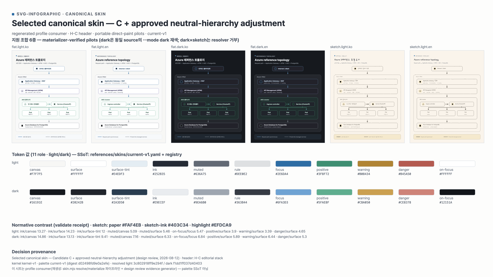

# Design Kernel & Canonical Skin

Canonical design contract for every svg-infographic output. Layout math, text budgets
and connector rules stay in `authoring.md`; archetype recipes stay in `archetypes.md`.
This file owns **identity**: what makes any two outputs read as one product.

Approved canonical skin (decision provenance: *Selected canonical skin — Candidate C +
approved neutral-hierarchy adjustment*, design review 2026-08-12):



[Editable SVG](media/canonical-skin-contact-sheet.svg) — both files are an **approved
snapshot, synchronized with the `current-v1` profile**. They are not the palette
source of truth (§3), and they become regenerated profile consumers once the recolor
pipeline (`skin.mjs contact-sheet`, reserved) lands. In the snapshot SVG the sketch
slots embed the canonical handwriting subset as an `@font-face` data URI (per the
typography profile contract); the PNG carries the approved rendering.

## 1. Design kernel

```text
svg-infographic design kernel
├─ CJK-first sans typography + conclusion-led title
├─ blue focus anchor + soft tinted icon circles
├─ computed layout + generous technical-card spacing
├─ adaptive connectors
│  ├─ aligned: straight
│  ├─ off-axis narrative: gentle single-bend curve
│  ├─ dense topology: rounded orthogonal
│  └─ stage-only: transition glyph
└─ sub-treatments: flat / sketch (overlay, not a second palette)
```

Principles (owner-approved, 2026-08-12):

- **Structure and typography must read before color.** Neutral hierarchy
  (canvas → surface → rule → muted → ink) carries the page; color carries meaning.
- **Pastel only on small semantic surfaces** — icon circles, status callouts, limited
  bands. Never as wide background fills.
- **Status colors lead with markers, borders and labels**, not area fills.
- **One editorial emphasis color** (`--focus`). There is no separate "accent" role;
  text on focus uses `--on-focus`.

## 2. Token contract

Foundation (11 roles — base 7 + status 3 + on-role 1):

| Role | Meaning |
| --- | --- |
| `--canvas` | page background |
| `--surface` | card / panel background |
| `--surface-tint` | icon circles, limited semantic bands |
| `--ink` | body text, primary strokes |
| `--muted` | secondary text, de-emphasized strokes |
| `--rule` | dividers, borders |
| `--focus` | the single editorial emphasis color |
| `--positive` / `--warning` / `--danger` | status meaning (markers/borders/labels first) |
| `--on-focus` | text on focus or saturated status fills |

Domain aliases (6): `edge`, `api`, `compute`, `data`, `external`, `icon` — mapped to
semantic sources and derived deterministically (`skins/derivation-v1.yaml`).
**Canonical authoring SVG is itself the portable resolved form**: every
paint-bearing shape carries direct `fill`/`stroke` values plus role annotations
(`data-fill-role`/`data-stroke-role`) that keep the semantics recolorable. Roles and
aliases are the vocabulary of those annotations — hand-typed hex without an
annotation is a lint violation (§5).

Contrast gates (validated by the resolver, fail-closed): ink/canvas·surface ≥ 7:1,
ink/surface-tint ≥ 4.5, muted/canvas·surface ≥ 4.5, on-focus/focus ≥ 4.5,
status/surface ≥ 3:1 (icon·line), status pairwise hue gap ≥ 30° (discrimination is
carried together by lightness, shape and labels).

## 3. Palette SSoT: versioned profiles + single resolver

Color values live in exactly one place: **versioned skin profiles** under
`references/skins/`, interpreted by the **single resolver** `scripts/skin.mjs`.

- `skins/registry.yaml` — selects the CURRENT palette/derivation/overlay; switching
  to an approved candidate edits only this file (version files stay immutable).
- `skins/current-v1.yaml` — the approved palette (light + dark, 11 roles + the
  bounded `anchors.secondary-*` hue consumed by the api alias).
- `skins/legacy-v0.8.yaml` — frozen hex allowlist for the preserved v0.8.0 release
  graphic (predates the role kernel; palette validation only).
- `skins/sketch-overlay-v1.yaml` — sketch surface-treatment overlay (paper/ink/
  highlight + rough-stroke treatment). Sketch is an orthogonal overlay, not a palette.
- `skins/derivation-v1.yaml` — alias mapping and derivation ratios. Generators must
  not re-own hex values or mix ratios.

```bash
node scripts/skin.mjs validate references/skins/current-v1.yaml
node scripts/skin.mjs resolve  references/skins/current-v1.yaml --mode light --treatment sketch --json
node scripts/skin.mjs registry
```

Resolution model: `palette × mode × treatment` without duplicate definitions, with
a receipt (profile digests, resolved-token digest, selected-mode contrast matrix).
Supported combinations — anything else is rejected fail-closed:

| treatment | light | dark |
| --- | --- | --- |
| flat | ✓ | ✓ |
| sketch | ✓ | ✗ (needs a mode-aware overlay + contact-sheet approval) |

Candidate palettes use `status: candidate` and a single shallow `extends`; the
`current` pointer moves only in `registry.yaml` after owner approval. Role
add/remove is a kernel migration, not a profile edit.

## 4. Typography (canonical — SSoT: `references/typography/typography-v1.yaml`)

Typography는 palette/treatment와 독립된 축으로, family/face/weight/style·fallback·
synthetic 정책·asset/embed 정책·license를 **typography profile**이 단일 소유한다
(registry `current.typography` 선택; 크기·행간은 PageFrame scale band 소유 유지).
sketch face는 audition으로 **Hi Melody**가 선정됐다(design review, 2026-08-13) — regular
단일 face, role weight 400 정규화, shipped sketch 산출물은 glyph subset embed
(`assets/fonts/` 원본 + license). `skin.mjs typography-check`가 최종 산출물(단독·
composite 모두)의 effective font cascade를 fail-closed 검증하고, `font-probe.mjs`가
runtime receipt(computed family + FontFaceSet load check — rendered-face 증명 아님을
명시)를 남긴다.

- **flat** (KO/EN 공용): **Pretendard**, fallback `Inter, -apple-system,
  BlinkMacSystemFont, "Segoe UI", sans-serif` (system fonts — no embed).
- **sketch** (KO/EN 공용): **embedded Hi Melody subset**, weight **400** 고정,
  fallback `Pretendard, sans-serif` (명시적 secondary role에서만).
- No remote font loading (Google Fonts included) — outputs stay self-contained.
- The fallback chain carries no dedicated CJK entry: when Pretendard is unavailable,
  KO glyphs resolve through the OS cascade (flat treatment only — sketch embeds its
  subset). Effective-font verification is implemented: `skin.mjs typography-check`
  (static cascade, renderer hard gate) and `scripts/font-probe.mjs` (runtime
  FontFaceSet load + computed family receipt — not rendered-face proof). Verify
  tofu visually in the 2× PNG as the glyph-level complement. KO/EN fixtures verify
  wrapping, containment and geometry parity.
- A locally bundled Inter may later become an *optional typography profile*, kept
  separate from palette profiles. Until then typography does not fork.
- Shipped sketch artifacts subset-embed an OFL handwriting font (`sketch.md`); review
  snapshots must embed the profile subset — a snapshot that merely references a
  locally installed font is nonconforming and must be regenerated.

## 5. Portable resolved output (PPT-oriented)

Canonical authoring SVG **is** the portable resolved SVG — there is no separate
variable-based source that could accidentally be shipped:

```text
skin profile (registry-selected) + geometry/role annotations
                 ↓ resolver/materializer (skin.mjs) — fills/updates paint IN PLACE,
                 ↓ verifying role/value parity against the resolved profile
canonical SVG (direct per-shape fill/stroke + data-*-role annotations)
          ├─ canonical PNG render          (same SVG)
          ├─ HTML raw inline               (identical bytes, digest parity)
          └─ PPT import                    (PPT-oriented portable subset)
```

**Rationale (owner-observed historical failure, 2026-08-12):** CSS-variable paint
broke when an SVG was imported into PowerPoint; per-shape direct `fill`/`stroke`
avoided it. The exact PowerPoint version/fixture was not preserved, so this is
recorded as an observed regression guard — claim **"PPT-oriented portable subset"**,
never "PPT compatible", until a real import verification exists.

Contract for distributed canonical SVG:

- Every paint-bearing shape carries **direct `fill`/`stroke` attributes from the
  moment it is authored**. Semantic recolor information stays in non-rendering
  annotations, e.g. `<rect data-fill-role="surface" data-stroke-role="rule"
  fill="#FFFFFF" stroke="#DEE0E2"/>`.
- Portable paint must NOT use: `var(--…)`, `currentColor`, class-dependent
  fill/stroke, external stylesheets or remote fonts, or core paint that exists only
  via group inheritance.
- `skin.mjs` is not a transformer producing a second artifact: it fills or updates
  the same SVG's paint from the annotations and verifies role/value parity — every
  annotation role exists in resolver output; every direct paint matches the current
  resolved role value; a profile switch replaces all annotated paints
  deterministically; `fill="none"` and explicitly allowed non-token paints
  (annotated `data-paint-static`) are preserved. Annotated direct paint matching the
  profile is never a palette-lint violation; hand-typed hex without a role
  annotation is. CSS-variable/`currentColor`/paint-class examples survive only in
  baseline-red fixtures.
- **Dark mode is a separate resolved artifact** (`diagram.light.svg` /
  `diagram.dark.svg`) — never a `prefers-color-scheme` media query inside one SVG.
- PNG and HTML consume this canonical SVG directly (no separate template). If an HTML artifact
  exists it inlines the identical bytes; a `<svg>…</svg>` byte/digest parity fixture
  guards re-serialization drift.
- Beyond CSS paint, these need their own portability fixtures before any import
  claim: `<use>`/`<symbol>` icons, marker arrowheads, SVG filters, embedded fonts,
  transform/text geometry. Prefer expanding per-instance-colored `<use>` into
  concrete paths in portable output. Sketch filters and embedded handwriting fonts
  may stay on the PNG-recommended path until PPT verification.
- Minimum regression fixture pair: **baseline-red** (paint via CSS variables /
  `currentColor`) vs **positive** (same geometry, per-shape direct paint) —
  canonical artifacts use the positive form.

Delivery: the contract and annotation schema land first (this section); then the
direct-paint lint/materializer with negative fixtures; then portable pilot
generation with PNG parity. If real PPT import verification is not possible
there, it is recorded as **unverified** and queued as follow-up work.

## 6. PageFrame & layout contract

**Page regions come before header decoration.** Every output derives from PageFrame —
machine profile: `skins/pageframe-v1.yaml` (preset registry), computed by
`node scripts/skin.mjs pageframe <preset> [--h1-lines 1|2] [--eyebrow on|off]
[--subtitle on|off] [--support none|bottom|side] [--footer on|off] --json`:

```text
Canvas → Safe area
  ├─ Header region (optional eyebrow row → H1 (1–2 lines) → optional subtitle)
  ├─ Header–content gap (breathing room)
  ├─ Content region  = the TypePack contentBox
  ├─ Optional support region (legend·caption·source·annotation — inline/side/bottom)
  ├─ Content–footer gap
  └─ Optional footer region (attribution·date·page — safe-area aligned on fixed canvases)
```

- Independent tokens: `outer-margin`, `header-internal-gap`, `breathing`,
  `content-gap`, `content-footer-gap`, `footer-safe`. Presets never reuse each
  other's px values; `output preset × density × language × header/footer options`
  selects a scale profile. Presets form a registry (4:5 social, 16:9 presentation,
  compact document now; 9:16 is smoke-level/follow-up).
- **Absent elements collapse with their gaps** (no eyebrow → no locator, row or gap;
  no subtitle/footer → their rows and gaps disappear).
- **TypePacks never own absolute canvas coordinates** — they lay out inside the
  PageFrame contentBox and declare: supported presets/orientation, minimum content
  bounds, reading direction, used bounds, connector/label anchors, optional-region
  use, and the chosen degrade/reflow on overflow.
- **Support ≠ footer**, and both are **optional and off by default** in real output;
  provenance belongs to invisible metadata/receipts, never a forced visible footer.
  With **side** support placement the content area splits into `contentBox +
  supportBox`: the contentBox width shrinks by the support width plus its gap
  token — TypePacks always receive the already-reduced contentBox. On **fixed
  canvases** the footer aligns to the bottom safe area; in **fluid-height document
  formats** the footer flows naturally after the content (no bottom pinning).
- **Responsive = reflow, not proportional shrink.** Priority: decoration reduction →
  gap tuning → orientation switch → grid/lane reflow → leaf merging → artifact
  split. Never resolve overflow by dropping font/stroke/arrowhead below the
  target-display minimums.

### Header composition (owner-approved 2026-08-12)

- **Canonical: H-C refined** — editorial stack. Optional eyebrow row with a small
  blue locator (square, `rx 2`, size ≈ 0.6 × eyebrow font-size, `--focus`; eyebrow
  text itself is `--muted`), then H1 (Pretendard, 1–2 lines), then optional muted
  subtitle, then generous breathing room before the diagram. The locator exists
  **only when the eyebrow exists**. No box, no wash, no full-width underline.
- **Minimal variant: H-B** — the same stack without the locator.
- **Rejected: the vertical accent rail** (unstable length/boundary across 1–2-line
  titles; ambiguous representative scope). Never regenerate it in new output;
  legacy examples keep it only until the catalog regeneration. H-D open-callout
  variants live in review evidence only.
- Decoration derives from the computed header cluster bounds — it never owns its
  own coordinates.

### Scale bands (B anchor for headers, C anchor for primary arrows)

- Header band (per preset, anchor **B** = balanced): 4:5 base 720w → eyebrow 14 /
  H1 28 / subtitle 14; 16:9 base 1400w → 16 / 42 / 18. Band ×0.88–×1.14 around the
  anchor; density and archetype adjust **within the band only**.
- Arrow band (anchor **C** = expressive, primary flow): 4:5 → shaft 2.5,
  markerWidth 11.2; 16:9 → shaft 2.8, markerWidth 12.6 (visible head = markerWidth
  × 8/12 ≈ 3 × shaft). Secondary/async/feedback connectors may sit one bounded step
  lower (≈ the B values) but never below the absolute target-display minimum
  (4:5 base: shaft ≥ 2.2, visible head ≥ 6.6). Narrow corridors degrade to compact
  arrow → transition glyph → reflow — never by shrinking the marker.

### Primitive grammar & restraint budgets

Primitives carry meaning: node · container/boundary · lane · panel ·
callout/annotation · label/badge · connector · legend · plot-area (chart, gated).
Icon circles are optional — never forced onto dense topology, timeline, matrix or
chart. Radius/border/shadow derive from the semantic layer. Per page keep bounded
budgets for focal emphasis and wide tinted surfaces so added types don't converge
into one rounded-card look.

### Language parity & reading order

- KO/EN: semantic topology and reading order identical; layout formulas and scale
  profiles identical; final geometry identical when both languages fit; translation
  overflow allows bounded text reflow recorded as a receipt delta. No per-language
  manual nudging — one formula fed by measured text budgets.
- SVG DOM order matches visual reading order; sections carry accessible labels;
  state/path/difference never rely on color alone (shape·line style·label too).
  Ambiguous-order types (matrix/radial/nested/multi-panel) must spec an explicit
  reading-order rule.

## 7. Container & distribution layout contracts (machine guard: `check-layout.mjs`)

Two generic contracts close the recurring failure family "a local coordinate fix
breaks a layout invariant elsewhere" (tight right/bottom insets, edge-touching
children, unequal repeated gaps). They apply to canonical output through a
**provable subset** — annotation-declared participants with numeric rect/circle
geometry, translate-only transforms, and feDropShadow/feDisplacementMap filters.
Anything a guard cannot prove on a declared participant is an **error** unless
explicitly classified `data-layout-unverified="<reason>"` — never a silent pass.

**7a. Padded / nested container contract.** A container (`data-layout-container` +
`data-min-pad`, optional `data-reserve-top` for a title row, `data-symmetry` +
tolerance) is judged against each annotated child (`data-layout-parent`) on two
tiers: the **geometric** inset (rect bounds) must meet the declared min padding,
and the **visual** bounds (rect + stroke/2 + conservative shadow range:
`abs(offset) + 3×stdDeviation`, displacement scale) must never touch the parent
edge and must keep the visual clearance floor (`data-min-visual-pad`, default 8).
Titled containers (declared by `data-title-gap`) verify the vertical axis as two
separate regions, not one symmetric pair: the **title region** (title line-box
fits the reservation; measured title→content visual gap ≥ the preset
`data-title-gap`) and the **content region** (`contentTop → first content`
geometric inset ≥ the required `data-content-pad-top`, replacing the raw-frame
top min-pad check; `last content → frame bottom` still meets min-pad). The
receipt records both honestly — `contentInsets.topFromContentTop` and
`contentInsets.bottomFromFrame` alongside the raw-frame binding insets.
y-symmetry is **not applicable** to a titled container (declaring it is a schema
error, not a silent downgrade): the title intentionally fills the top, so the
vertical contract is reserve + title-gap + content-pad-top + bottom min-pad.
Untitled containers keep the full x/y symmetry contract. Declared symmetry axes
must balance within tolerance; `data-layout-count` pins the child count
fail-closed. Containers nest: a nested container is checked twice — as a child of
its parent and as a parent of its own children — and any level failing fails the
whole artifact.

**7b. Repeated row/column distribution contract.** Repeated items are one layout
group (`data-layout-group` + `data-distribution` + `data-axis` +
`data-group-count` + `data-gap-tol`; members carry `data-layout-item`), not a set
of independent coordinates. Default distribution is `equal-gap`: adjacent visual
gaps must stay within the gap tolerance, item sizes within 1px, and the first/last
outer insets must balance. A request to "move only the third card" on an equal-gap
group is answered by **reflowing the whole group** (start/gap/size) or by
surfacing the intent change — never by nudging one member.

**7c. Atomic layout items (clusters).** A card is not one rect: it is its frame plus
its components — icon background circle, glyph anchor, text anchors. The frame
declares `data-cluster-id` + `data-cluster-count` (+ optional `data-cluster-tol`,
default 1px); components declare `data-cluster` **and** `data-cluster-at="dx,dy"`
— the expected offset from the frame origin (bounds center for rect/circle,
anchor point for text/g/use). Atomicity is enforced on three axes, fail-closed:
containment (component inside the frame), completeness (declared member count
matches), and **relative binding** (measured offset within tolerance of the
declared offset) — so a frame that moves 8px while its components stay behind
fails even though everything is still "inside". A component without a declared
offset is a schema error: containment alone is never claimed as atomicity.
Titled containers additionally declare the title as a participant
(`data-layout-title="<container-id>"` on a text with numeric x/y/font-size): the
guard computes the title line-box (±0.6×font-size around a central baseline),
requires it to fit the reservation, and enforces the preset minimum
`data-title-gap` between the measured title bottom and the first content visual
top — the receipt reports both the real `titleGapVisual` and the
`reserveBoundaryGap`. A titled container's y-axis is intentionally asymmetric
(the title fills the top), so it declares `data-symmetry="x"`; y-symmetry stays
available for untitled containers. Annotation schema is strict: single/double quotes are
equivalent, required fields (`data-min-pad`, `data-layout-count`,
`data-group-count`, `data-axis`, `data-distribution`) are enforced, invalid
numbers are schema errors (never NaN-silenced), and duplicate container/group/
cluster ids are rejected. Symmetry and receipts carry **both** geometric and
visual values; the canonical visual-spacing judgement uses the visual safe inset.

**7d. Hard-gate integration.** The canonical renderer runs `check-svg →
check-layout → browser` fail-closed on any SVG carrying layout annotations; a
layout-negative source is refused before the browser starts.
`data-layout-unverified` yields exit 3 — an explicit review state that hard gates
must never treat as success.

**7e. No local coordinate patching.** Canonical generators derive geometry from
inputs — parent contentBox (PageFrame receipt), child count/sizes, outer insets,
gaps, distribution mode, title reservation, connector corridors — and fail closed
when the budget does not match the contentBox exactly. `check-layout.mjs --json`
emits the layout receipt (content bounds, child visual bounds, per-side safe
padding, adjacent gap list, gap spread, distribution mode, nested results);
comparing receipts before/after an edit exposes any invariant the edit broke.
Generalizing the guard beyond annotated rect geometry to semantic region
annotations is a named follow-up (`svg-infographic-semantic-region-annotation`).

## 8. Regeneration & provenance

- The contact sheet above is a **generated composite evidence artifact**: it mixes
  light/dark/sketch profiles on one canvas for review, so it is *not* an ordinary
  canonical-output surface and is not linted under a single `--palette-profile`
  (its pilots are linted individually under their own profiles). It is regenerated
  from resolver output + materializer-verified pilots (generator lineage: design review
  evidence); package-local automatic regeneration
  (`skin.mjs contact-sheet`) stays **reserved** and the recolor/contact-sheet
  contract items stay **partial** until it lands.
- Resolver receipts reserve the provenance identity shared by future SVG
  `<metadata>`, sidecar receipts and PNG `iTXt`: kernel version, palette id/version,
  mode, treatment, source digest, resolved-token digest.
